# Entrega 2 — Público-alvo e análise de concorrência

**Data:** 19/08/2026  
**Status:** `🟨 em andamento`
**Responsabilidade mínima:** cada integrante analisa pelo menos 1 concorrente/interface representativa; a equipe produz síntese comparativa.

## Objetivo da atividade

Compreender soluções do mesmo domínio **e também interfaces familiares ao público-alvo**. O objetivo não é copiar telas, mas identificar convenções, padrões, affordances percebidas, problemas recorrentes, expectativas e oportunidades de design.

> **Concorrente não precisa ser idêntico ao produto.** Pode atuar na mesma área, resolver objetivo semelhante ou disputar a mesma necessidade. Quando não houver concorrente direto, use produtos análogos e softwares que o público já utiliza.

### Para TCCs que não previam interface

Não procure apenas um “concorrente do algoritmo”. Investigue **interfaces profissionais que materializam atividades semelhantes** às que o usuário escolhido precisaria realizar.

Exemplos:

- TCC de banco de dados → consoles de administração, ferramentas para DBA, monitoramento e análise de consultas;
- TCC de LLM/ML → painéis de experimentos, gestão de modelos/datasets, comparação de métricas, revisão de resultados;
- TCC de análise de dados → dashboards, ferramentas de BI, filtros, relatórios e exploração;
- TCC de infraestrutura/API → portais administrativos, observabilidade, logs, gestão de credenciais e uso;
- TCC de cibersegurança → consoles de alertas, triagem, histórico e auditoria.

A pergunta é: **“que convenções esse perfil já conhece para executar tarefas equivalentes?”**

## Entrada obrigatória da Entrega 1

> softwares pra olhar: capcut, davinci resolve, premiere pro, fina cut pro, cap.so, sony vegas

Retome o mapa inicial de alternativas e produtos citado na Entrega 1. Aqui a equipe deixa de trabalhar apenas com impressão inicial e passa a **investigar sistematicamente** cada solução.

| Item citado na Entrega 1 | Tipo                 | Por que foi citado                                                         | Status inicial                                                          | Decisão nesta entrega |
| ------------------------ | -------------------- | -------------------------------------------------------------------------- | ----------------------------------------------------------------------- | --------------------- |
| Adobe Premiere Pro       | ferramenta cotidiana | Editar manualmente vídeos de melhores momentos                             | [F] Citado na Entrega 1 como editor profissional conhecido pelo público | analisar              |
| DaVinci Resolve          | ferramenta cotidiana | Importar, assistir, marcar, recortar, organizar e exportar trechos         | [F] Alternativa de edição manual documentada na Entrega 1               | analisar              |
| CapCut                   | ferramenta cotidiana | Editar manualmente vídeos                                                  | [F] Citado na Entrega 1 como alternativa indireta para edição manual    | analisar              |
| Final Cut Pro            | ferramenta cotidiana | Editar manualmente vídeos                                                  | [F] Citado na Entrega 1 como alternativa indireta para edição manual    | analisar              |
| cap.so                   | ferramenta cotidiana | Editar manualmente vídeos                                                  | [F] Citado na Entrega 1 como alternativa indireta para edição manual    | analisar              |
| WSC Sports               | concorrente direto   | Analisar eventos, criar conteúdo, gerenciar ativos e distribuir resultados | [F] Página oficial da plataforma citada na Entrega 1                    | analisar              |
| Magnifi                  | concorrente direto   | Gerar, etiquetar, baixar e distribuir cortes de vídeos esportivos          | [F] Página oficial do produto e FAQ citados na Entrega 1                | analisar              |

Se uma hipótese da Entrega 1 for confirmada ou refutada durante esta análise, atualize `H01`, `H02`... em [`../RASTREABILIDADE.md`](../RASTREABILIDADE.md).

## 1. Público-alvo desta análise

O público-alvo principal é formado por profissionais responsáveis pelo corte e pela produção de vídeos de melhores momentos de partidas de futebol, como editores de vídeo esportivo. Na pós-produção, eles precisam processar gravações, acompanhar os resultados e acessar os cortes e metadados gerados. Empresas de mídia esportiva, ligas, emissoras, produtoras e clubes são stakeholders desse processo. Conforme a Entrega 1, esse público utiliza principalmente computadores e pode estar familiarizado com softwares de edição de vídeo, o que orienta a análise das interfaces selecionadas.

## 2. Concorrentes diretos/indiretos

### Análise C01 — Adobe Premiere Pro

**Autor(a):** Giovanni Chahin Morassi — 22.123.025-3  
**Tipo:** concorrente indireto / ferramenta cotidiana  
**Link oficial:** {{URL}}  
**Data de acesso:** {{dd/mm/aaaa}}

#### Contexto e proposta

Analisar como o Adobe Premiere Pro apoia a edição manual de vídeos de melhores momentos, incluindo importação, marcação, organização, recorte e exportação.

#### Funcionalidades relevantes

| Funcionalidade | Como é realizada | Evidência/print                              | Observação de IHC |
| -------------- | ---------------- | -------------------------------------------- | ----------------- |
| Abrir video        | O usuario pode abrir uma pasta do computador, selecionar os arquivos e importar para o projeto, o software entende isso e consegue utilizar para visualização do conteudo           | `../assets/02_concorrencia/premiere-pro/...` | {{...}}           |
| Adicionar na timeline      | pela interface do sistema é possivel o usuario arrastar os videos importados para a area da timeline          | `../assets/02_concorrencia/premiere-pro/...` | {{...}}           |
| cortar um clipe        | a timeline possui um cursor, no qual pode navegar por toda duração do video, ao colocar o cursor em determinado momento existe um botão com o icone de tesoura, é possivel clickar, e ao clickar os clips onde estão por baixo do cursor serão divididos em 2          | `../assets/02_concorrencia/premiere-pro/...` | {{...}}           |
| adicionar musica ao video        | a timeline é dividida em visual e audio, é possivel da mesma forma que adicionar um video ao projeto é possivel adicionar uma musica, e da mesma foram que ao adicionar o video na timeline é possivel adicionar a musica, porem no setor da timeline da musica          | `../assets/02_concorrencia/premiere-pro/...` | {{...}}           |

#### Experiência do usuário e opiniões

{{...}}

#### Padrões e tendências percebidos

{{...}}

#### Pontos positivos, limitações e lições

| Ponto   | Evidência | Implicação para nosso projeto |
| ------- | --------- | ----------------------------- |
| {{...}} | {{...}}   | {{...}}                       |

### Análise C02 — DaVinci Resolve

**Autor(a):** Giovanni Chahin Morassi — 22.123.025-3  
**Tipo:** concorrente indireto / ferramenta cotidiana  
**Link oficial:** [Página oficial](https://www.blackmagicdesign.com/products/davinciresolve/media)  
**Data de acesso:** {{dd/mm/aaaa}}

#### Contexto e proposta

Analisar como o DaVinci Resolve apoia a importação, organização, marcação, edição e exportação de vídeos.

#### Funcionalidades relevantes

| Funcionalidade | Como é realizada | Evidência/print                                 | Observação de IHC |
| -------------- | ---------------- | ----------------------------------------------- | ----------------- |
| {{...}}        | {{...}}          | `../assets/02_concorrencia/davinci-resolve/...` | {{...}}           |

#### Experiência do usuário e opiniões

{{...}}

#### Padrões e tendências percebidos

{{...}}

#### Pontos positivos, limitações e lições

| Ponto   | Evidência | Implicação para nosso projeto |
| ------- | --------- | ----------------------------- |
| {{...}} | {{...}}   | {{...}}                       |

### Análise C03: CapCut

**Autor(a):** Pedro Alexandre Custodio Silva, 22.123.049-3\
**Tipo:** concorrente indireto / ferramenta cotidiana\
**Link oficial:** https://www.capcut.com/\
**Data de acesso:** 01/09/2026

#### Contexto e proposta

O CapCut entra nesta análise como ferramenta cotidiana e concorrente indireto. Ele resolve manualmente parte do problema registrado na [Entrega 1](./01_conhecendo_o_problema.md). Localizar melhores momentos em gravações extensas exige tempo e atenção, e ainda deixa margem para omissões e recortes inadequados, como apontam H01, H09 e H11.

O teste percorreu importação, seleção, recorte, organização e exportação. Também observou o player, a linha do tempo e os marcadores, elementos que já fazem parte do repertório de quem edita vídeo. A comparação se concentrou nas tarefas do projeto: enviar vídeos, acompanhar o processamento, consultar resultados e baixar cortes e metadados, conforme H17 a H19 e H27 a H28.

#### Funcionalidades relevantes

| Funcionalidade                           | Como é realizada                                                                                                                                                                               | Evidência/print                                                                                                                                      | Observação de IHC                                                                                                                                                             |
| ---------------------------------------- | ---------------------------------------------------------------------------------------------------------------------------------------------------------------------------------------------- | ---------------------------------------------------------------------------------------------------------------------------------------------------- | ----------------------------------------------------------------------------------------------------------------------------------------------------------------------------- |
| Importação local                         | O usuário pode clicar em "Carregar" no painel de mídia ou na área central. A interface também aceita arrastar e soltar e oferece Google Drive e Dropbox.                                       | 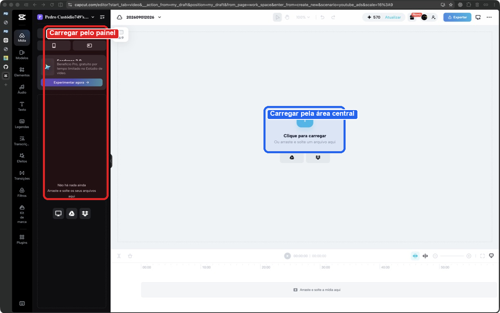                                                                                     | Duas entradas visíveis levam à mesma tarefa. A área vazia já indica o próximo passo, sem obrigar o usuário a procurar um comando nos menus.                                  |
| Biblioteca de mídia                      | Após o envio, cada vídeo aparece como miniatura com nome e duração. O estado "Adicionado" confirma quais arquivos já entraram na edição.                                                       | 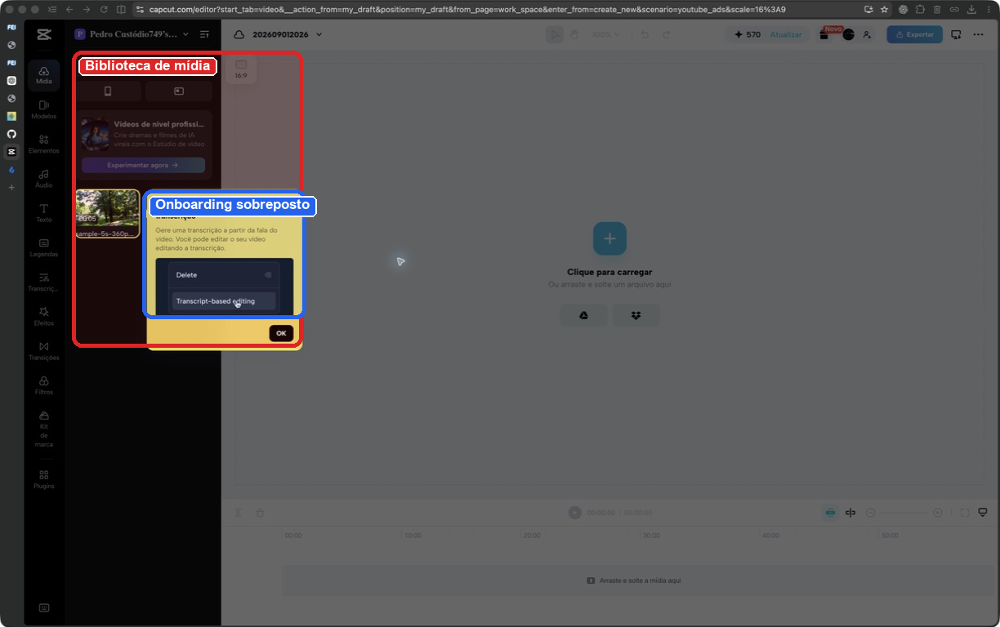 e 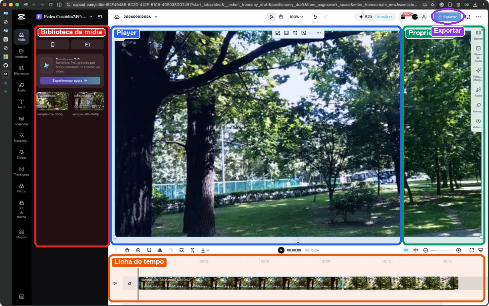 | Miniatura, nome, duração e estado confirmam a importação. O painel estreito corta nomes longos e dificulta a distinção entre arquivos parecidos.                              |
| Montagem na linha do tempo               | O usuário arrasta os clipes da biblioteca para a faixa inferior. No teste, os vídeos de 5 e 10 segundos ficaram em sequência.                                                                  |                                                                          | Arrastar e ordenar trechos corresponde à maneira como a tarefa costuma ser imaginada. As miniaturas contínuas ajudam a reconhecer o conteúdo e o tamanho de cada clipe.      |
| Pré-visualização e controles contextuais | Ao selecionar um clipe, o quadro atual aparece no player. Controles de transformação ficam sobre o vídeo, e propriedades como "Básico", "Áudio", "Animação" e "Velocidade" aparecem à direita. |                                                                          | O clipe, a prévia e os ajustes ficam próximos. Isso evita idas e voltas entre telas, mas deixa o editor carregado e exige que o usuário interprete muitos ícones.              |
| Exportação                               | O botão "Exportar" permanece no canto superior direito durante a edição.                                                                                                                       |                                                                          | "Exportar" fica no mesmo lugar e usa texto, não apenas um ícone. O usuário sabe onde concluir a edição.                                                                      |

Os vídeos usados no teste foram `sample-5s-360p.mp4` e `sample-10s-360p.mp4`, baixados da página [Sample MP4 video files](https://samplelib.com/sample-mp4.html), que os apresenta como arquivos de amostra sem restrições de licença.

#### Evidências de interface

_Figura 1. Estado inicial do editor. "Carregar" aparece no painel lateral e no centro da área de pré-visualização._

_Figura 2. Biblioteca após a importação. Um balão sobre edição por transcrição cobre parte do painel e precisa ser fechado para continuar._

_Figura 3. Projeto com os dois vídeos na linha do tempo. O editor reúne biblioteca, player, propriedades e faixa temporal na mesma tela._

#### Experiência do usuário e opiniões

Nas avaliações da [App Store](https://apps.apple.com/us/app/capcut-photo-video-editor/id1500855883?platform=iphone&see-all=reviews), iniciantes dizem que conseguiram produzir vídeos sem experiência prévia. Eles atribuem essa facilidade à interface e aos templates prontos.

Também aparecem críticas recorrentes:

- Parte dos efeitos e recursos passou a exigir a assinatura Pro, o que empobreceu a versão gratuita.
- Há relatos de travamentos na reprodução, falhas na busca de efeitos e dificuldade para importar vídeos longos.
- Alguns usuários encontraram templates ou resultados de busca inadequados. Outros citam restrições regionais a comentários e templates.
- Quando o aplicativo funciona bem, os templates e controles simples encurtam a edição de vídeos para redes sociais.

Esses pontos foram resumidos a partir de avaliações públicas da [App Store](https://apps.apple.com/us/app/capcut-photo-video-editor/id1500855883?platform=iphone&see-all=reviews) e do [Google Play](https://play.google.com/store/apps/details/CapCut?hl=en_AU&id=com.lemon.lvoverseas), consultadas em 01/09/2026. São opiniões de usuários das lojas, não entrevistas realizadas para este projeto.

#### Padrões e tendências percebidos

- Arrastar uma miniatura até a linha do tempo cria uma relação clara entre origem e destino. O player e a faixa mostram o resultado na hora.
- Miniaturas, durações, nomes de arquivos e rótulos deixam as opções visíveis. Não é preciso memorizar comandos para começar.
- A tela vazia pede poucas decisões. Os controles contextuais e o painel de propriedades só aparecem depois que um clipe entra na linha do tempo.
- O rótulo "Adicionado", a nova duração total e a atualização do player confirmam cada ação. Durante o segundo arraste, a faixa mostrou "Carregando..." e deixou claro que ainda havia processamento.
- A distribuição da tela segue uma convenção conhecida. A biblioteca fica à esquerda, o player no centro, as propriedades à direita e a linha do tempo embaixo.
- Anúncios de recursos de IA e um balão de apresentação entram no meio da importação. Em vez de ajudar naquele momento, cobrem parte da biblioteca e disputam atenção com a tarefa principal.
- Vários controles e objetos da linha do tempo aparecem sem nome na árvore de acessibilidade do navegador. Isso dificulta o uso por leitor de tela e por automações baseadas em rótulos.

#### Pontos positivos, limitações e lições

| Ponto                                   | Evidência                                                                                                          | Implicação para nosso projeto                                                                                                                                      |
| --------------------------------------- | ------------------------------------------------------------------------------------------------------------------ | ------------------------------------------------------------------------------------------------------------------------------------------------------------------ |
| Entrada clara para a tarefa             | O estado vazio repete "Carregar" e explica que também é possível arrastar e soltar.                                | Na tela de envio, oferecer um botão principal e uma área de soltura ampla, com formatos e limites visíveis.                                                        |
| Feedback após o envio                   | A biblioteca mostra miniatura, duração, nome e depois o estado "Adicionado".                                       | Exibir progresso por arquivo e estados inequívocos, como "enviando", "processando", "pronto" e "erro". Não depender apenas de cor.                                 |
| Relação entre conteúdo e tempo          | A linha do tempo usa quadros do próprio vídeo e mostra os clipes em sequência.                                     | Na consulta de melhores momentos, combinar miniatura, instante inicial, duração e posição na gravação original. Isso ajuda a conferir o corte antes do download.   |
| Boa correspondência com o modelo mental | Arrastar, ordenar e visualizar clipes reproduz o gesto de organizar trechos.                                        | Permitir reordenar resultados quando houver uma montagem, mas manter um fluxo mais simples para quem só precisa consultar e baixar cortes.                         |
| Controles contextuais densos            | A seleção de um clipe abre ferramentas sobre o player e categorias no painel direito.                              | Mostrar primeiro as ações frequentes. Colocar ajustes avançados em uma camada secundária para evitar uma tela carregada.                                           |
| Interrupção promocional                 | O balão de edição por transcrição cobre parte da biblioteca logo após a importação.                                | Não interromper a primeira tarefa com dicas ou ofertas. Se houver uma apresentação inicial, usar uma dica discreta, adiável e que não bloqueie o conteúdo.         |
| Dependência de ícones e arraste         | Muitos botões não têm rótulo visível, e objetos importantes não receberam nomes úteis na árvore de acessibilidade. | Dar nome acessível a todos os controles, manter foco de teclado visível e oferecer alternativas a arrastar, como "Adicionar à seleção" ou "Mover para depois".     |
| Conclusão previsível                    | "Exportar" fica sempre no canto superior direito.                                                                  | Manter a ação final estável e nomeá-la conforme o objetivo do usuário, por exemplo "Baixar cortes", evitando termos genéricos quando o resultado já está definido. |

O que vale aproveitar do CapCut é o começo do fluxo. O carregamento é óbvio, cada arquivo recebe feedback e as miniaturas mantêm a relação entre conteúdo e tempo. O restante pesa para o nosso caso. Quem só quer conferir e baixar melhores momentos não precisa de tantos painéis, anúncios e ferramentas de edição completa.

### Análise C04: Final Cut Pro

**Autor(a):** Pedro Alexandre Custodio Silva, 22.123.049-3\
**Tipo:** concorrente indireto / ferramenta cotidiana\
**Link oficial:** https://www.apple.com/final-cut-pro/\
**Data de acesso:** 01/09/2026

#### Contexto e proposta

O Final Cut Pro resolve uma tarefa maior e mais especializada que o nosso projeto, por isso entra como concorrente indireto. Ainda assim, trabalha com o mesmo material de origem e enfrenta problemas registrados na [Entrega 1](./01_conhecendo_o_problema.md). Entre eles estão localizar acontecimentos em gravações extensas, conferir o instante correto e reunir trechos dispersos em um vídeo utilizável.

O aplicativo não estava disponível no computador usado para o trabalho. Portanto, não houve teste prático nem importação dos vídeos usados no CapCut e no Cap. Esta análise usa o [guia atual do Final Cut Pro para Mac](https://support.apple.com/guide/final-cut-pro/welcome/mac), imagens oficiais da Apple, uma avaliação editorial e opiniões públicas de usuários. As figuras mostram a interface divulgada pela Apple, não uma sessão realizada para o projeto.

A análise cobre importação, organização, busca, seleção, linha do tempo e exportação. São tarefas próximas do nosso recorte de IHC, que inclui enviar partidas, acompanhar o processamento, encontrar melhores momentos, conferir sua posição na gravação e baixar os cortes.

#### Funcionalidades relevantes

| Funcionalidade | Como é realizada | Evidência/print | Observação de IHC |
| -------------- | ---------------- | --------------- | ----------------- |
| Estrutura do espaço de trabalho | A janela reúne bibliotecas e eventos à esquerda, navegador de mídia, viewer central, inspector de propriedades e linha do tempo na parte inferior. | 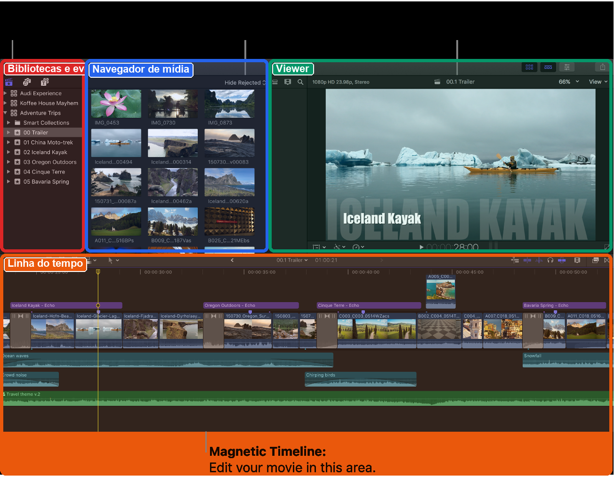 | A fonte, a prévia e a sequência temporal permanecem visíveis. A disposição dos painéis ajuda o usuário a se orientar, mas a quantidade de ícones e faixas pode intimidar quem quer apenas obter alguns cortes. |
| Importação e preparação de mídia | Na janela de importação, o usuário escolhe copiar arquivos para a biblioteca ou mantê-los no local original. Também pode criar mídia otimizada ou proxy, aplicar palavras-chave e iniciar análises de vídeo e áudio. A importação continua em segundo plano. | [Guia de importação](https://support.apple.com/guide/final-cut-pro/organize-files-during-import-ver392f50c2/mac) | As decisões antecipam desempenho e organização de projetos grandes, mas expõem conceitos técnicos antes de o usuário editar. A possibilidade de continuar trabalhando reduz espera; o progresso precisa continuar visível para evitar a impressão de que o processo terminou. |
| Organização e pré-seleção | O Final Cut organiza o conteúdo em bibliotecas, eventos e projetos. No navegador, o usuário percorre filmstrips, seleciona intervalos, marca trechos como favoritos ou rejeitados e acrescenta palavras-chave e notas. |  | A seleção de intervalos aproxima a organização do problema de melhores momentos. Miniaturas e filmstrips ajudam a reconhecer o conteúdo, mas a hierarquia de biblioteca, evento e projeto obriga o usuário a aprender o vocabulário do aplicativo. |
| Linha do tempo magnética | Clipes entram na história principal por arraste ou comandos de inserção. Ao mover, aparar ou remover um item, os vizinhos se ajustam para evitar lacunas e colisões. B-roll, títulos e áudio ficam conectados ao trecho correspondente. | 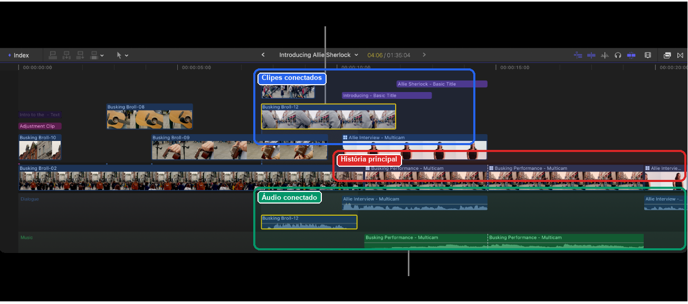 | O sistema evita lacunas e mantém os elementos sincronizados. Esse comportamento previne erros mecânicos, mas contraria o hábito de usar pistas fixas. Uma ação no clipe principal também pode deslocar elementos conectados. |
| Busca visual | O usuário descreve objetos ou ações em linguagem natural, e o filtro retorna os momentos relacionados. Na demonstração, a busca por "climbing stairs" reduz a coleção aos planos correspondentes. | 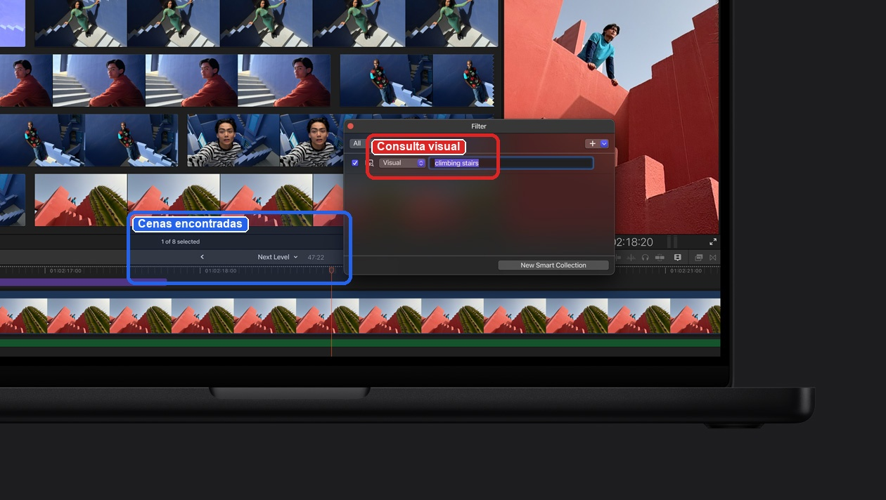 | Em vez de percorrer todo o vídeo, o usuário procura a cena que deseja. Para funcionar no nosso projeto, cada resultado precisa explicar por que apareceu e oferecer acesso ao trecho original. |
| Busca por transcrição | O sistema analisa a fala e encontra ocorrências exatas ou relacionadas pelo sentido. Os resultados incluem nome, relevância, início, fim e duração do trecho. | 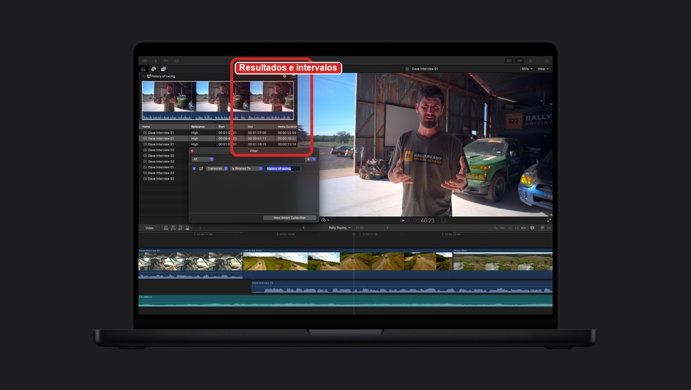 | O texto e os tempos aparecem juntos, o que poupa a inspeção de horas de vídeo. O [guia de busca](https://support.apple.com/en-euro/guide/final-cut-pro/ver65764b45/mac) informa que a busca por fala só aceita inglês e não analisa alguns tipos de clipe. O usuário precisa conhecer esses limites antes de depender do recurso. |
| Processamento em segundo plano | Importação, transcodificação, análise, renderização e compartilhamento aparecem como tarefas com percentuais. Algumas pausam durante o uso intenso e retomam quando o sistema fica ocioso. | [Guia de tarefas em segundo plano](https://support.apple.com/en-ae/guide/final-cut-pro/ver64e71609/mac) | O usuário pode continuar editando, mas precisa distinguir "pausado", "em fila" e "processando". Um único indicador esconderia a causa da demora. |
| Exportação | A janela de compartilhamento oferece prévia navegável, metadados, configurações e papéis. Antes de salvar, mostra resolução, taxa de quadros, canais de áudio, duração, formato e tamanho estimado. A transcodificação continua em segundo plano. | 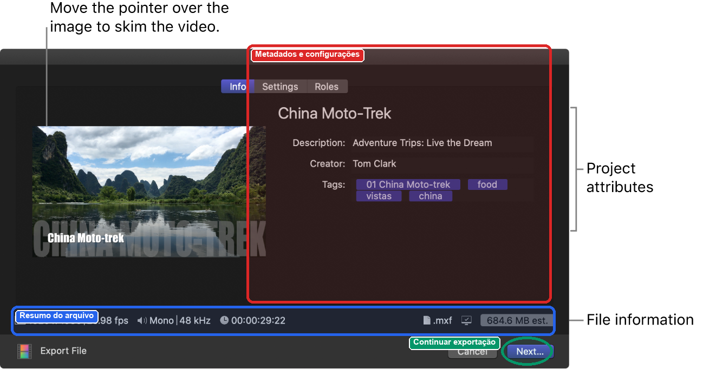 | O resumo sustenta uma decisão informada e reduz surpresa sobre o arquivo final. Para nosso projeto, a mesma lógica pode ser simplificada para duração, formato, tamanho aproximado e origem do corte. |

#### Evidências de interface

*Figura 4. Visão geral da interface para Mac. A imagem oficial identifica a divisão entre biblioteca, navegador, viewer e linha do tempo. Fonte: [Apple, interface do Final Cut Pro](https://support.apple.com/guide/final-cut-pro/final-cut-pro-interface-ver92bd100a/mac).*

*Figura 5. História principal em azul, elementos conectados acima e áudio organizado abaixo. Fonte: [Apple, introdução à Magnetic Timeline](https://support.apple.com/guide/final-cut-pro/intro-to-the-magnetic-timeline-verb8fcfc133/mac).*

*Figura 6. Busca visual por "climbing stairs". O filtro e o resultado permanecem no navegador e na linha do tempo. Fonte: [Apple, Final Cut Pro](https://www.apple.com/final-cut-pro/).*

*Figura 7. Busca por um assunto falado. A tabela associa o texto encontrado aos intervalos temporais. Fonte: [Apple, Final Cut Pro](https://www.apple.com/final-cut-pro/).*

*Figura 8. Confirmação de exportação com prévia, atributos e estimativa de tamanho. Fonte: [Apple, exportar arquivos finais](https://support.apple.com/en-ca/guide/final-cut-pro/ver0192a47b8/mac).*

#### Experiência do usuário e opiniões

A avaliação do [TechRadar](https://www.techradar.com/pro/apple-final-cut-pro-review) chama a interface de rígida. Os painéis podem ser redimensionados, mas não rearranjados livremente. O limite reduz a personalização e mantém a mesma configuração entre computadores. A linha do tempo magnética também divide opiniões. Elementos conectados se movem junto com o clipe principal, algo que exige adaptação, mas pode acelerar a edição depois que o usuário entende a lógica. O texto ainda elogia a fluidez, a organização e as ferramentas recentes. Entre as críticas estão a exclusividade do Mac e a exigência de hardware recente para alguns recursos.

Na [Mac App Store](https://apps.apple.com/us/app/final-cut-pro/id424389933?mt=12&platform=mac&see-all=reviews), há relatos de navegação clara, boa otimização, exportação rápida e economia de tempo em comparação com outros editores. Outros usuários, sobretudo profissionais acostumados a pistas fixas, consideram a linha do tempo contraintuitiva. Também aparecem reclamações sobre pouco espaço vertical, dificuldade para separar áudio e vídeo, travamentos e perda de compatibilidade com fluxos antigos. As avaliações tratam de versões diferentes e registram experiências individuais, não testes controlados.

Em duas discussões da comunidade, iniciantes dizem que a quantidade de controles desorienta na primeira abertura. Os obstáculos mais citados são descobrir onde o aplicativo guarda a mídia e deixar para trás o hábito das pistas fixas. Parte dos participantes afirma que o fluxo fica simples e rápido depois de um ou dois projetos. [Discussão sobre aprendizado](https://www.reddit.com/r/finalcutpro/comments/1qxosq3/i_just_started_using_final_cut_pro_and_im_lowkey/) e [discussão sobre primeiros passos](https://www.reddit.com/r/finalcutpro/comments/1vzpys3/what_would_you_recommend_based_on_your_experience/)

#### Padrões e tendências percebidos

- Biblioteca, navegador, viewer, inspector e linha do tempo mantêm posições previsíveis. Isso facilita a transferência do aprendizado entre computadores, mas limita a personalização e concentra muita informação na primeira tela.
- O usuário move e apara representações do próprio vídeo. A Magnetic Timeline impede lacunas e conserva relações entre os elementos, incorporando a prevenção de erros ao comportamento da linha do tempo.
- Favoritos, rejeitados, palavras-chave, notas, intervalos e coleções inteligentes formam uma etapa própria de triagem. O aplicativo separa a tarefa de encontrar material da tarefa de montá-lo.
- Visual Search e Transcript Search devolvem trechos dentro do navegador, com acesso ao contexto temporal. A IA filtra o material, mas o editor ainda decide o que usar.
- Nome, relevância, início, fim, duração, papéis e palavras-chave ajudam a localizar e agrupar o material. Esses dados continuam disponíveis na exportação.
- Operações demoradas rodam em segundo plano e aparecem em uma janela própria. O usuário pode continuar trabalhando, embora precise procurar o andamento em outro painel.
- O inspector mostra os parâmetros do objeto selecionado. Mesmo assim, a janela inicial ainda traz muitos ícones e conceitos. A interface organiza a complexidade, mas não a elimina.
- Arraste, menus e atalhos de teclado coexistem. Essa redundância atende usuários com níveis diferentes de experiência, desde que os menus e a ajuda revelem os atalhos.
- Sem acesso ao aplicativo, não foi possível testar navegação por teclado, VoiceOver, foco ou nomes acessíveis. As imagens mostram controles compactos, muitos ícones e uso de cor para diferenciar papéis, mas isso não substitui um teste de acessibilidade.

#### Pontos positivos, limitações e lições

| Ponto | Evidência | Implicação para nosso projeto |
| ----- | --------- | ----------------------------- |
| Triagem separada da edição | O navegador permite selecionar intervalos, classificar e buscar antes de inserir qualquer coisa na linha do tempo. | Tratar a consulta de melhores momentos como tarefa principal. O usuário deve poder revisar e aceitar trechos sem construir uma edição completa. |
| Busca retorna coordenadas temporais | A busca por transcrição mostra relevância, início, fim e duração ao lado do conteúdo encontrado. | Cada resultado deve indicar evento detectado, instante inicial, duração e confiança, com acesso ao contexto anterior e posterior. |
| Resultado permanece verificável | Buscas filtram a biblioteca, mas preservam viewer e linha do tempo para inspeção. | Nunca apresentar um "melhor momento" como caixa-preta. Incluir miniatura, player e ligação com a gravação original. |
| Restrições previnem erros | A Magnetic Timeline fecha lacunas e mantém elementos conectados sincronizados. | Se houver montagem de cortes, preservar relações automaticamente e sinalizar qualquer alteração de ordem ou duração causada pelo sistema. |
| Hierarquia atende escala, mas cobra aprendizado | Bibliotecas contêm eventos, que reúnem clipes e projetos. Usuários citam a gestão de mídia como dificuldade inicial. | Para uma partida, usar termos do próprio domínio, como partida, vídeo enviado e melhores momentos. Evitar o vocabulário genérico de um editor. |
| Processos demorados não bloqueiam tudo | Importação, análise e exportação continuam em segundo plano e expõem progresso. | Permitir que o usuário saia e retorne. Mostrar estado por vídeo, porcentagem quando confiável, etapa atual e uma previsão apenas quando houver base para calculá-la. |
| Estados assíncronos podem ser ambíguos | A própria documentação informa que certas tarefas pausam durante uso intenso e retomam quando o sistema fica ocioso. | Diferenciar "aguardando", "pausado", "processando", "pronto" e "erro". Explicar o que o usuário pode fazer em cada estado. |
| Exportação antecipa o resultado | A janela mostra prévia e características do arquivo antes de salvar. | Antes do download, exibir duração total, formato, tamanho estimado e quais momentos serão incluídos. |
| Modelo novo acelera especialistas, mas rompe hábitos | Avaliações elogiam a velocidade depois da adaptação e criticam a divergência em relação a editores baseados em pistas. | Aproveitar convenções já conhecidas de player e miniaturas. Introduzir qualquer comportamento novo com exemplo curto, feedback imediato e forma clara de desfazer. |
| Recursos inteligentes têm limites | A busca por fala depende do idioma e a análise não cobre todos os tipos de clipe. | Exibir cobertura, idioma aceito e falhas de análise junto ao resultado. Ausência de detecção não deve parecer ausência de acontecimentos. |
| Ecossistema fechado | O aplicativo para desktop exige macOS; recursos recentes privilegiam Apple silicon. | Manter o fluxo principal acessível pelo navegador e não condicionar consulta ou download a um dispositivo específico. |

Entre os três concorrentes, o Final Cut Pro é o que melhor separa triagem e montagem. Essa separação importa mais para o nosso projeto do que o editor profissional em si. Visual Search e Transcript Search encurtam a procura, enquanto filmstrips, intervalos e metadados permitem conferir cada resultado. Já a hierarquia profunda, o inspector e a linha do tempo completa só acrescentariam trabalho. Nosso fluxo precisa ser curto, mostrar o estado do processamento e ligar cada corte ao instante original.

### Análise C05: cap.so

**Autor(a):** Pedro Alexandre Custodio Silva, 22.123.049-3\
**Tipo:** concorrente indireto / ferramenta cotidiana\
**Link oficial:** https://cap.so/\
**Data de acesso:** 01/09/2026

#### Contexto e proposta

O Cap grava e edita vídeos curtos de telas, demonstrações e mensagens assíncronas. Esse foco difere do nosso, que é localizar melhores momentos em gravações de partidas, mas os dois produtos lidam com captura, processamento e revisão de vídeo. Por isso, o Cap entra na análise como concorrente indireto.

O teste começou na captura e terminou na exportação. No caminho, passou pelo projeto local, pela importação de outros vídeos e pelos controles de clipe, enquadramento, zoom e cursor. Essas etapas se aproximam das tarefas descritas na [Entrega 1](./01_conhecendo_o_problema.md). O usuário precisa enviar vídeos, acompanhar o processamento, reconhecer trechos e obter um arquivo final sem perder a ligação com a gravação original.

Foi usada a [CLI oficial do Cap](https://cap.so/docs/agents) na versão 0.1.0, distribuída com o Cap Desktop 0.5.9. A gravação ocorreu em modo Studio, sem câmera, microfone, áudio do sistema ou envio para a nuvem. O projeto local resultante passou pela validação da própria CLI. Depois, os arquivos `sample-10s-360p.mp4` e `sample-5s-360p.mp4`, já usados no teste do CapCut, foram importados no Studio.

A análise também considerou o uso convencional pelo Cap Desktop, com base na [documentação de gravação](https://cap.so/docs/recording/instant-mode) e na [página do produto](https://cap.so/home). Nesse fluxo, a pessoa escolhe o modo, a fonte da imagem e os dispositivos de áudio e vídeo antes de iniciar a captura. Essa etapa não teve um segundo teste prático. As observações sobre ela vêm da documentação.

#### Funcionalidades relevantes

| Funcionalidade | Como é realizada | Evidência/print | Observação de IHC |
| -------------- | ---------------- | --------------- | ----------------- |
| Gravação pelo Cap Desktop | O usuário abre o seletor, escolhe Instant ou Studio e define a fonte: tela, janela, área ou somente câmera. Em seguida, pode ligar câmera, microfone e áudio do sistema, conferir a prévia e iniciar a contagem regressiva. Durante a captura, há ações para pausar, retomar, reiniciar ou parar. | [Documentação do modo Instant](https://cap.so/docs/recording/instant-mode) e [documentação do modo Studio](https://cap.so/docs/recording/studio-mode) | O fluxo visual evita identificadores técnicos e deixa as fontes disponíveis para reconhecimento. A prévia da câmera e o medidor do microfone ajudam a detectar uma escolha errada antes da gravação. A quantidade de decisões cresce quando há vários monitores e dispositivos. |
| Escolha entre Instant e Studio | No Instant, o Cap envia os dados durante a captura e prepara um link depois que ela termina. No Studio, grava um projeto `.cap` local, abre o editor após a parada e só envia o vídeo quando o usuário escolhe um link compartilhável na exportação. | [Página inicial do Cap](https://cap.so/home) e [comparação dos modos](https://cap.so/docs/recording/studio-mode#instant-compared-with-studio) | Uma única escolha altera destino, privacidade e possibilidade de edição. Os rótulos são curtos, mas não explicam sozinhos que o Instant começa a enviar durante a gravação. Essa consequência precisa aparecer no seletor, antes do botão "Record". |
| Gravação pela CLI | `cap doctor --json` verifica permissões e dispositivos. `cap targets --json` lista telas, janelas, câmeras e microfones. A captura foi iniciada com `cap record start` em modo Studio e duração definida. | 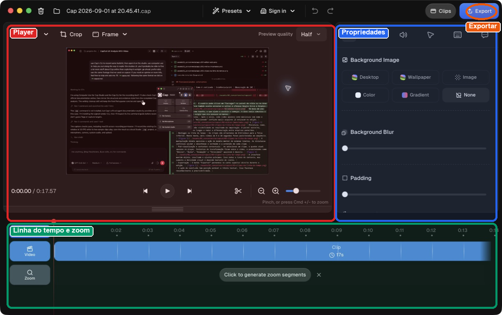 | O fluxo pode ser verificado e automatizado, mas exige identificadores numéricos e conhecimento de linha de comando. A CLI confirma a validade técnica, não o conteúdo. Neste teste, o projeto passou na validação, mas a imagem não correspondia à janela Helium pretendida. |
| Projeto Studio local | Ao abrir o arquivo `.cap`, o editor mostra player, duração total, faixa de vídeo, faixa de zoom e controles de aparência. |  | A divisão entre player, propriedades e linha do tempo segue o modelo de editores conhecidos. O botão azul "Export" deixa clara a saída do fluxo. |
| Importação e gestão de clipes | O painel "Clips" permite gravar outro trecho ou importar um MP4 ou projeto Cap. Cada item recebe miniatura, número e duração. | 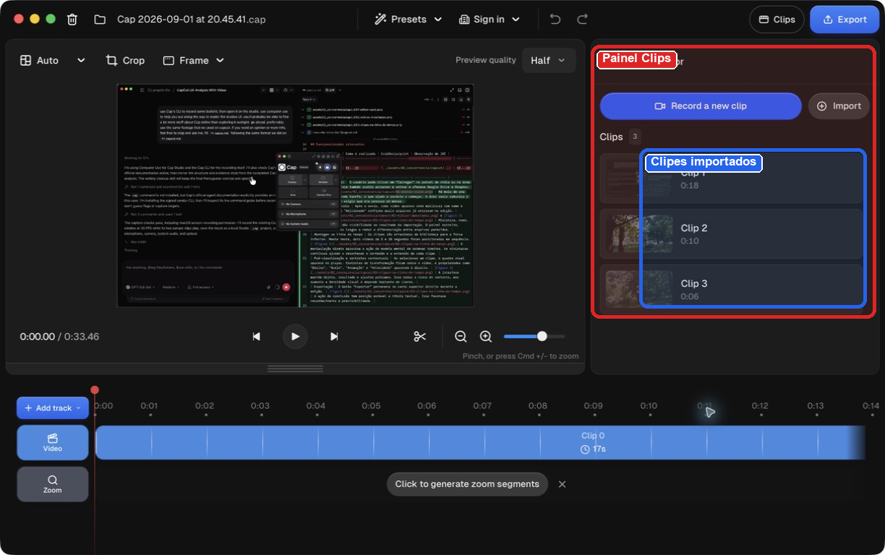 | A lista torna a composição visível sem sobrecarregar a linha do tempo. Os nomes automáticos "Clip 1", "Clip 2" e "Clip 3" são pouco informativos, embora exista uma ação de renomear. |
| Enquadramento da gravação | O menu de moldura oferece nenhuma moldura, janela do macOS, janela do Windows, navegador ou MacBook. A opção de navegador adiciona tema e URL editável. | 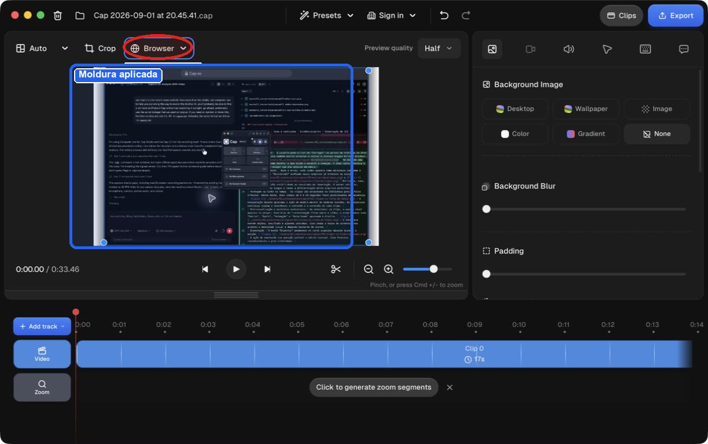 | Escolher uma moldura muda o resultado na hora. É fácil testar e desfazer, embora a moldura ocupe espaço e possa deixar o conteúdo gravado menor. |
| Tratamento do cursor | O painel permite mostrar ou ocultar o cursor, usar o cursor original ou um círculo, mudar tamanho e inclinação, ocultá-lo quando parado e escolher estilos de movimento. | 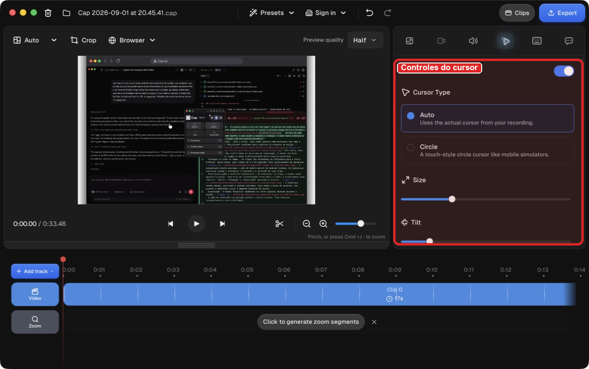 | As opções usam exemplos curtos, como "Slow", "Smooth", "Mellow" e "Fast". Isso ajuda na escolha, embora os ajustes avançados de tensão, atrito e massa exijam experimentação. |
| Zoom automático | A faixa "Zoom" oferece "Click to generate zoom segments" quando a gravação contém dados de cursor e cliques. O teste gerou um segmento automático de 2x. | 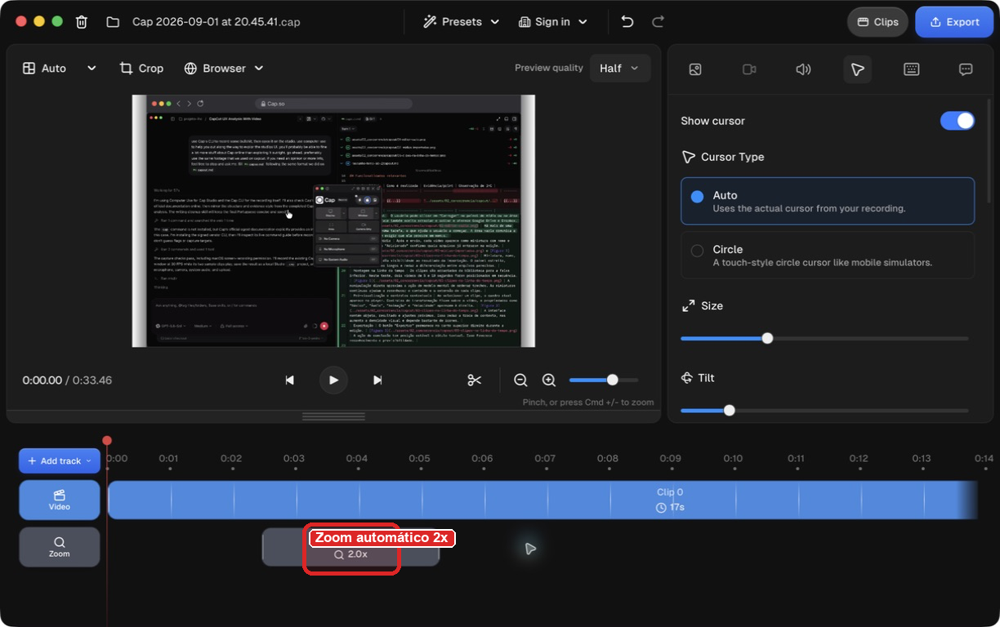 | Um clique transforma os metadados da captura em um segmento visível na linha do tempo. O usuário consegue localizar e remover esse segmento. MP4s importados não recebem os mesmos dados. |
| Exportação | A tela reúne destino, formato, resolução, taxa de quadros, estimativa de tamanho e estimativa de tempo. Os destinos incluem arquivo, área de transferência e link compartilhável. | 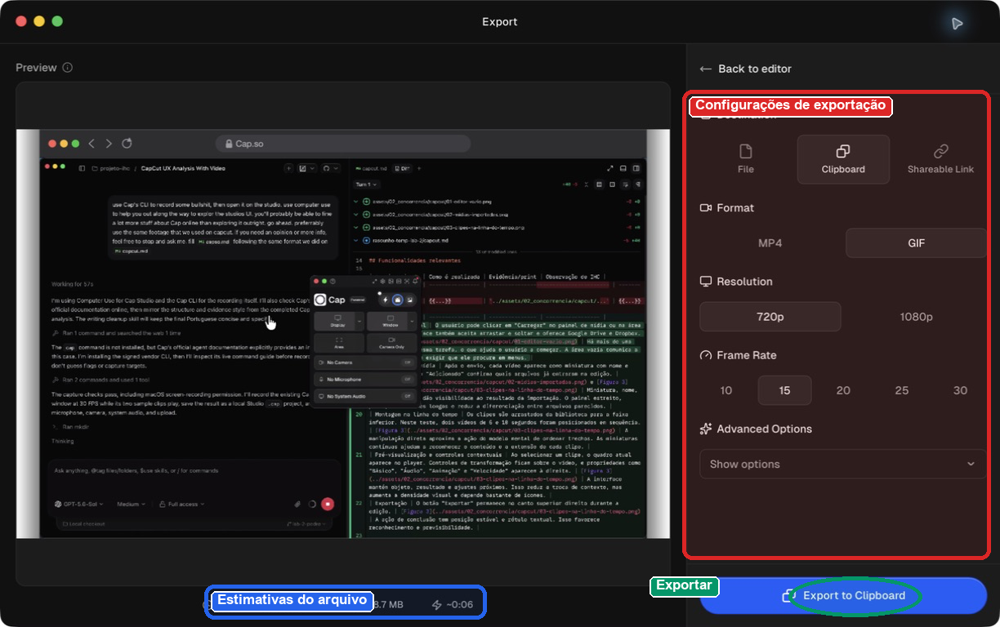 | O resumo antes da ação reduz surpresa. As opções mudam conforme o formato. Na configuração registrada, 34 segundos em GIF, 720p e 15 FPS foram estimados em 8,7 MB e cerca de 6 segundos de processamento. |

O projeto bruto gravado pela CLI está em [`capcut-footage.cap`](../assets/02_concorrencia/cap-so/capcut-footage.cap/). A CLI informou `recordingType: studio`, duração de aproximadamente 18 segundos e presença dos arquivos obrigatórios de metadados e vídeo.

#### Evidências de interface

*Figura 9. Projeto local aberto no Studio. O editor concentra prévia, propriedades, faixa de vídeo e zoom na mesma janela.*

*Figura 10. Painel com três clipes. Os dois últimos usam a mesma filmagem de parque do teste do CapCut.*

*Figura 11. Moldura de navegador aplicada por um menu de presets. A mudança aparece imediatamente no player.*

*Figura 12. Controles do cursor com tipo, tamanho, inclinação e suavização de movimento.*

*Figura 13. Segmento "Automatic Zoom" de 2x gerado a partir dos dados de clique da captura.*

*Figura 14. Exportação com prévia, destino, formato, resolução, taxa de quadros, tamanho e tempo estimados.*

#### Experiência do usuário e opiniões

A documentação oficial apresenta dois modelos de uso. O [modo Instant](https://cap.so/docs/recording/instant-mode) envia dados durante a sessão e entrega um link pouco depois. O [modo Studio](https://cap.so/docs/recording/studio-mode) guarda um projeto local editável e só envia o conteúdo quando o usuário pede um link compartilhável. A escolha afeta a edição e a privacidade. Errar aqui custa caro, e os nomes "Instant" e "Studio" não explicam o destino dos dados. O seletor deveria dizer "envia durante a gravação" ou "permanece local".

No aplicativo, o usuário começa escolhendo tela, janela, área ou câmera. Câmera, microfone e áudio do sistema podem ser ligados separadamente. Segundo a [documentação de câmera e microfone](https://cap.so/docs/recording/camera-and-mic), a prévia mostra a câmera e um medidor reage ao som antes do início. Isso permite corrigir o enquadramento e o microfone antes de gravar um arquivo inútil. Depois da contagem regressiva, os controles permitem pausar, retomar, reiniciar ou parar. [Atalhos globais](https://cap.so/docs/recording/keyboard-shortcuts) também executam essas ações, mas não vêm configurados. O usuário precisa defini-los em Settings > Shortcuts.

No teste, o Studio foi mais simples que o CapCut para produzir uma apresentação visual. Presets de moldura, fundo, cursor e zoom evitam tarefas manuais comuns. O painel "Clips" também aceita MP4s sem exigir uma biblioteca complexa. A desvantagem é a dispersão. As decisões ficam no seletor de gravação, no painel de clipes, nos ícones de propriedades e na tela separada de exportação.

Na [página do Cap no Product Hunt](https://www.producthunt.com/products/cap-3), a nota é 3,9 de 5, com apenas oito avaliações. Os elogios citam a rapidez para começar e compartilhar, a edição após a captura, as páginas de visualização e o código aberto. As críticas tratam de travamentos, falhas de abertura, câmera instável, captura com várias telas e exportação lenta no Studio. O número de avaliações é pequeno e mistura versões diferentes. Ele ajuda a identificar problemas recorrentes, mas não representa o conjunto de usuários.

O próprio repositório público expõe problemas recentes. Um [relato de crescimento contínuo de memória no macOS](https://github.com/CapSoftware/Cap/issues/2023) descreveu lentidão do sistema após sessões do Studio. Outro [relato sobre importação de projetos `.cap` no Windows](https://github.com/CapSoftware/Cap/issues/2018) mostrou conflito entre o modelo de pasta usado pelo projeto e o seletor de arquivos. Esses registros ajudam a explicar por que usuários elogiam a proposta, mas ainda questionam a estabilidade.

A página de [depoimentos do próprio Cap](https://cap.so/testimonials) reúne comentários positivos sobre a facilidade para começar, a passagem da gravação para o editor, o compartilhamento, o zoom, a interface e o controle dos dados. A própria empresa seleciona esses relatos. Eles mostram o que a marca quer valorizar, mas não substituem avaliações independentes.

#### Padrões e tendências percebidos

- O Instant encurta o caminho até um link. O Studio guarda um projeto local para revisão e exportação. A escolha também define quando o envio acontece, portanto é uma decisão de privacidade.
- Fonte da imagem, câmera, microfone e áudio do sistema aparecem antes da captura. A prévia e o medidor de nível permitem corrigir o enquadramento ou a entrada de áudio antes de gravar.
- O usuário escolhe uma categoria no painel direito e ajusta o resultado com botões e controles deslizantes. Há menos ferramentas soltas sobre a imagem que no CapCut.
- Cursor, cliques e teclado ficam registrados fora do vídeo. O Studio usa esses dados para suavizar o movimento, criar zooms e exibir teclas. Um MP4 importado não oferece as mesmas opções.
- A linha do tempo localiza os segmentos, enquanto molduras e estilos aplicam mudanças visuais inteiras de uma vez.
- Antes de processar a exportação, a tela mostra duração, resolução, tamanho e tempo aproximados.
- O projeto Studio permanece local até que o usuário escolha "Shareable Link". Também é possível exportar para um arquivo ou para a área de transferência sem criar uma conta.
- Termos simples, como "Clips" e "Export", convivem com tensão, atrito, massa, BPP e outras opções técnicas. O aplicativo esconde parte desses ajustes até que sejam necessários, mas ainda exige aprendizado.
- Botões, campos, estados e controles deslizantes têm nomes úteis na árvore de acessibilidade. Alguns ícones principais e elementos da linha do tempo continuam sem rótulo.

#### Pontos positivos, limitações e lições

| Ponto | Evidência | Implicação para nosso projeto |
| ----- | --------- | ----------------------------- |
| Fluxo visual de gravação | O Cap Desktop oferece tela, janela, área e câmera, além de prévia e seleção independente de áudio e vídeo. | Antes do envio ou processamento, mostrar uma prévia clara do arquivo ou fonte escolhida e permitir a troca sem reiniciar o fluxo. |
| O modo muda o destino dos dados | O Instant envia durante a gravação; o Studio permanece local até uma exportação por link. | Explicar antes da ação quando os dados saem do dispositivo, onde serão armazenados e se o usuário ainda poderá revisar o conteúdo. |
| Prevenção de captura sem áudio | O seletor mostra um medidor de nível para o microfone e uma prévia da câmera. | Validar o vídeo antes de iniciar uma análise longa. Alertar sobre arquivo sem áudio, imagem ausente ou duração inesperada sem impedir um envio intencional. |
| Projeto local editável | O modo Studio cria um `.cap` e não envia o vídeo durante a gravação ou edição. | Informar claramente quando um vídeo está apenas no dispositivo, quando está sendo enviado e quando ficou disponível no servidor. |
| Verificação do fluxo automatizado | A CLI separa diagnóstico, descoberta de alvos, gravação e validação em comandos com saída JSON. | Fornecer estados verificáveis para envio e processamento, com identificadores estáveis e mensagens que permitam automação sem depender da tela. |
| Validação técnica não garante conteúdo correto | O projeto passou na validação, mas a prévia revelou uma captura diferente da janela pedida. | Incluir uma miniatura ou confirmação visual do vídeo recebido antes de iniciar um processamento longo. Validar formato não basta. |
| Importação recuperável | Dois MP4s foram adicionados ao projeto após a captura inicial. O painel atualizou a contagem e a duração total. | Permitir substituir ou acrescentar arquivos sem reiniciar toda a tarefa. Mostrar o efeito da mudança no total processado. |
| Metadados enriquecem a edição | A gravação nativa preservou cursor e cliques, usados para gerar um zoom de 2x. Os MP4s importados não ganharam esses dados. | Preservar metadados dos melhores momentos, como instante, origem e confiança. Deixar claro quais recursos dependem desses dados. |
| Presets reduzem trabalho | Uma escolha aplicou moldura de navegador, e um botão gerou zoom automático. | Oferecer boas configurações iniciais para download e apresentação. Manter ajustes avançados disponíveis sem colocá-los no caminho principal. |
| Exportação previsível | A tela apresentou estimativas de tamanho e tempo antes de processar. | Mostrar formato, duração, tamanho aproximado e custo de espera antes do download dos cortes. |
| Separação entre arquivo e compartilhamento | "File", "Clipboard" e "Shareable Link" são destinos distintos. | Separar "Baixar" de "Compartilhar". Cada ação deve explicar onde o conteúdo ficará e quem poderá acessá-lo. |
| Nomes genéricos dos clipes | Os itens importados aparecem como "Clip 2" e "Clip 3", apesar de terem arquivos de origem distintos. | Usar nomes reconhecíveis, miniaturas, duração e instante de origem. Evitar depender de números sequenciais. |
| Estabilidade ainda pesa na confiança | Avaliações e issues citam travamentos, exportação lenta e problemas de importação. | Salvar progresso, permitir retomada e mostrar falhas por etapa. Em processamento de partidas longas, perder o trabalho é um risco central. |

O Cap se aproxima do nosso problema quando transforma uma captura em algo que o usuário pode revisar. A parte mais útil acontece antes do editor. O usuário escolhe a fonte, confere câmera e áudio e decide se os dados serão enviados ou ficarão no computador. Nosso projeto deveria oferecer a mesma confirmação antes do processamento e explicar cada mudança de estado. Já a edição visual completa, os ajustes físicos do cursor e as opções de apresentação só atrapalhariam quem quer encontrar e baixar melhores momentos.

### Análise C06 — WSC Sports

**Autor(a):** Lucas Roberto Boccia dos Santos — 22.123.012-1  
**Tipo:** concorrente direto  
**Link oficial:** [Página da plataforma](https://wsc-sports.com/platform/)  
**Data de acesso:** {{dd/mm/aaaa}}

#### Contexto e proposta

A WSC Sports provê uma plataforma com algorítmos especializados de IA para analisar, classificar, avaliar, criar e gerenciar conteúdo de eventos de esporte. O principal objetivo do serviço é acelerar e aprimorar o fluxo de produção e personalização do conteúdo.

#### Funcionalidades relevantes

| Funcionalidade | Como é realizada | Evidência/print                            | Observação de IHC |
| -------------- | ---------------- | ------------------------------------------ | ----------------- |
| Identificar e classificar objetos em vídeos      | O usuário seleciona um vídeo e um algorítmo de visão computacional realiza a identificação e classificação dos objetos na tela | 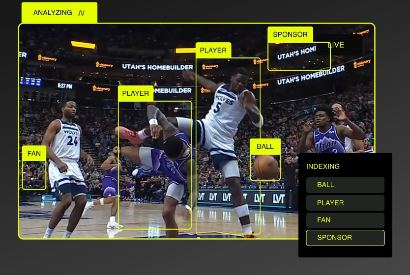 | O site não nos dá uma preview do processo para realizar essa análise, mas a interface que mostra os objetos na tela destaca e classifica os objetos na tela de forma muito sólida, com bounding boxes e tags contrastantes e fáceis de serem lidas e um índice de objetos identificados        |
| Criação de vídeos automática | O usuário seleciona um conjunto de cenas, clica em "Criar Video" e o sistema cria um ou mais vídeos personalizados com o conjunto de cenas | [Criar Vídeos](../assets/02_concorrencia/wsc-sports/wsc_create.jpeg) | A preview de interface que o site nos fornece é bem direta ao ponto, o usuário seleciona o conjunto de cenas e clica em um botão "Create Video", e os vídeos são gerados na tela para ele |
| Estúdio de edição de vídeos | O usuário possui, dentro da plataforma, um serviço completo de edição de vídeos, com opções para gerenciar vídeo, aúdio, legendas, gráficos, tudo com preview em tempo real e uma opção de publicação automática | [Estúdio de Edição](../assets/02_concorrencia/wsc-sports/wsc_studio.jpeg) | A preview simplificada da interface no site representa uma UI clássica de programas famosos de edição, com uma tela de preview, e os atributos (áudio, vídeo, legendas, gráficos) na parte inferior em um sistema de barras |
| Pesquisa por Conteúdo Existente | O usuário dispõe da funcionalidade de gerenciar o contéudo já gravado na plataforma, podendo pesquisar por mídias específicas, seja por nome, seja por classificação | [Gerenciamento de Vídeos](../assets/02_concorrencia/wsc-sports/wsc_manage.jpeg) |  A preview do sistema de pesquisa mostra uma interface de busca organizada e direta ao ponto, sem muitos elementos na tela além do essencial |
| Monitoramento de Performance dos Vídeos | O usuário consegue visualizar a "performance" do vídeo nas mídias sociais, podendo acessar dados como número de visualizações, número de compartilhamentos, número de vezes que o app foi instalado e até a renda estimada | [Monitoramento](../assets/02_concorrencia/wsc-sports/wsc_engage.jpeg) | Os indicadores de performance são diretos e fáceis de entender, o sistema indica ao usuário as informações de forma bem clara e explícita, acompanhado de uma preview do vídeo |

#### Experiência do usuário e opiniões

Os relatos foram traduzidos da página oficial de clientes da WSC Sports

"A confiabilidade da plataforma da WSC Sports é algo que nunca nos deixou na mão. É algo em que pudemos confiar desde que começamos a usá-la em 2015." - Brandon Jirousek, VP Digital, Cleveland Cavaliers.

"A WSC Sports nos permite investir de verdade na personalização e na localização do nosso conteúdo, o que é fundamental para ampliar o nível de personalização que oferecemos aos nossos torcedores." - Chris Foster, VP Digital Business Development - NHL.

"Em colaboração com a WCS Sports, poderemos oferecer aos nossos torcedores conteúdos cada vez mais envolventes e inovadores, assim como oferecer aos 20 clubes da Lega Serie A um produto de ponta para ampliar suas ofertas nas redes sociais" - Lorenzo Dallari, Editorial & Social Director - Lega Serie A.

"Nossa parceria com a WSC nos permite liderar a criação e a entrega de conteúdo altamente relevante e personalizado — aquele que é mais importante para o nosso público — em tempo real." - Olek Lowenstein, President of Global Sports - TelevisaUnivision.

"A ATP Media busca constantemente formas de aumentar o engajamento e oferecer um atendimento excepcional aos nossos fãs. Por meio da parceria com a WSC Sports, podemos levar momentos ainda mais emocionantes dos nossos torneios a milhões de fãs de tênis em todo o mundo, com rapidez e em grande escala." - Stuart Watts, COO - ATP Media.

"Nós sabemos o que os fãs querem. Em parceria com a WSC Sports, conseguimos maximizar o impacto dos nossos direitos e transformar a nossa forma de entrega nesse segmento; estamos alcançando mais fãs ao criar clipes e melhores momentos empolgantes, adaptados aos locais e plataformas de onde eles consomem o conteúdo." - Sarah Beattie, Chief of Marketing Officer - Six Nations Rugby.

#### Padrões e tendências percebidos

Com base nas previews que temos acesso no site da WSC_Sports, a plataforma utiliza um padrão de interface que mistura elementos comuns de interfaces web com o visual clássico de outros softwares populares de edição de vídeo. Os mecanismos de busca e gerenciamento de conteúdo usam um layout com elementos visuais semelhantes aos de muitos webapps, com botões responsivos, animações, emojis e navegação rápida. O layout do estúdio de edição, por sua vez, segue o padrão de fundo escuro, cores contrastantes e divisão de elementos de edição (como áudio, vídeo, legendas e gráficos) por meio de um sistema de barras.

#### Pontos positivos, limitações e lições

| Ponto   | Evidência | Implicação para nosso projeto |
| ------- | --------- | ----------------------------- |
| Ponto positivo: Interfaces modernas e que seguem o padrão dos outros softwares observados | Prints da pasta assets e os pontos discutidos anteriormente. Essas informações estão disponíveis no site da WSC Sports   | Valida o tipo de interface comum entre os softwares da área, nos dando uma ideia do que a indústria usa e de qual é o padrão que estão mais acostumados, fatores que devemos levar em consideração no desenvolvimento da nossa interface |
| Ponto positivo: Plataforma completa que condensa diversos tipos de serviços diferentes e úteis da área (automação de cortes, edição de vídeo, detecção de objetos, análise de performance...) | Tabela de funcionalidades acima e relatos dos clientes. Informações estão disponíveis no site da WSC Sports | Nos dá uma ideia de que tipo de software já existe e é adotado e validado pela indústria hoje, nos permitindo ter uma visão melhor de quais elementos adotar para a nossa interface e de onde a contribuição científica da nossa pesquisa se posiciona na área |
| Limitação: Pouco acesso a informações técnicas mais aprofundadas e à interface completa do produto | A WSC Sports divulga informações técnicas e imagens da plataforma de forma muito limitada no seu website e nas suas mídias sociais | Por não termos acesso à interface completa da plataforma, nem a detalhes técnicos mais aprofundados sobre o seu funcionamento, a plataforma da WSC Sports serve como um exemplo muito mais limitado do que outros softwares tradicionais do meio, em que o acesso e conhecimento sobre a operação e a interface são muito mais difundidos e facilmente accessíveis |

### Análise C07 — Magnifi

**Autor(a):** Lucas Roberto Boccia dos Santos — 22.123.012-1  
**Tipo:** concorrente direto  
**Link oficial:** [Página do produto](https://www.magnifi.ai/product)  
**Data de acesso:** {{dd/mm/aaaa}}

#### Contexto e proposta

Analisar como a Magnifi recebe vídeos, gera e etiqueta cortes esportivos e permite baixar ou distribuir os resultados.

#### Funcionalidades relevantes

| Funcionalidade | Como é realizada | Evidência/print                         | Observação de IHC |
| -------------- | ---------------- | --------------------------------------- | ----------------- |
| {{...}}        | {{...}}          | `../assets/02_concorrencia/magnifi/...` | {{...}}           |

#### Experiência do usuário e opiniões

{{avaliações, relatos, estudos ou teste próprio com fonte identificável}}

#### Padrões e tendências percebidos

{{...}}

#### Pontos positivos, limitações e lições

| Ponto   | Evidência | Implicação para nosso projeto |
| ------- | --------- | ----------------------------- |
| {{...}} | {{...}}   | {{...}}                       |

> Preencha cada análise com evidências próprias, fontes identificáveis e prints legíveis antes de transformar os templates em conclusões.

## 3. Softwares que o público-alvo usa no cotidiano

Analise interfaces que moldam a expectativa do público, mesmo que não sejam concorrentes.

| Software           | Por que o público usa                           | Padrões relevantes                                                   | Prints   | O que aprender                                                                |
| ------------------ | ----------------------------------------------- | -------------------------------------------------------------------- | -------- | ----------------------------------------------------------------------------- |
| Adobe Premiere Pro | Importar, organizar, recortar e exportar vídeos | Player, biblioteca de mídia, marcadores, linha do tempo e exportação | Pendente | Empregar termos e controles familiares aos editores de vídeo                  |
| DaVinci Resolve    | Organizar, editar e exportar vídeos             | Player, biblioteca de mídia, metadados, linha do tempo e exportação  | Pendente | Apresentar arquivos e resultados de forma visual e organizada                 |
| CapCut             | Realizar edições e exportações de vídeo         | Player, miniaturas, linha do tempo e exportação                      | Figuras 1 a 3  | Manter as tarefas principais acessíveis e reduzir a complexidade da interface |
| Final Cut Pro      | Organizar, editar e exportar vídeos             | Player, biblioteca de mídia, marcadores, linha do tempo e exportação | Figuras 4 a 8  | Facilitar a localização, seleção e manipulação de trechos                     |
| cap.so             | Editar e apresentar vídeos                      | Player, pré-visualização e exportação                                | Figuras 9 a 14 | Oferecer pré-visualização clara antes de baixar ou exportar resultados        |

> A familiaridade do público com esses softwares e padrões ainda deve ser validada, conforme a hipótese H17 da Entrega 1.

## 3.1 Padrões de interface relevantes ao escopo de IHC

Registre somente padrões encontrados nas soluções analisadas e que possam ter relação com objetivos reais da equipe.

| Padrão observado         | Produto(s) | Para qual tarefa serve | Vantagem percebida | Risco/limitação | Aplicável ao nosso escopo? |
| ------------------------ | ---------- | ---------------------- | ------------------ | --------------- | -------------------------- |
| dashboard                | {{...}}    | {{...}}                | {{...}}            | {{...}}         | sim/não/talvez             |
| relatório                | {{...}}    | {{...}}                | {{...}}            | {{...}}         | {{...}}                    |
| histórico + filtros      | {{...}}    | {{...}}                | {{...}}            | {{...}}         | {{...}}                    |
| administração/CRUD       | {{...}}    | {{...}}                | {{...}}            | {{...}}         | {{...}}                    |
| comparação de resultados | {{...}}    | {{...}}                | {{...}}            | {{...}}         | {{...}}                    |

> O objetivo não é concluir “todo concorrente tem dashboard, então teremos um”. O padrão só será adotado se apoiar uma tarefa rastreável.

## 4. Síntese comparativa da equipe

| Critério                      | C01 | C02 | C03 | Oportunidade para o projeto |
| ----------------------------- | --- | --- | --- | --------------------------- |
| Navegação                     |     |     |     |                             |
| Feedback/estado               |     |     |     |                             |
| Prevenção/recuperação de erro |     |     |     |                             |
| Terminologia                  |     |     |     |                             |
| Acessibilidade                |     |     |     |                             |
| Eficiência                    |     |     |     |                             |

## 5. Recomendações derivadas

Liste recomendações com origem explícita.

- **RC01:** {{recomendação}} — derivada de {{C01/C02/evidência}}.
- **RC02:** {{...}}

## Referências

{{fontes dos produtos, avaliações e literatura}}

## Checklist

- [ ] O mapa inicial de alternativas da Entrega 1 foi revisitado e aprofundado.
- [ ] Hipóteses relevantes sobre mercado/padrões foram atualizadas na rastreabilidade quando surgiram evidências.
- [ ] Há pelo menos uma análise completa por integrante.
- [ ] Cada análise contém prints legíveis da interface.
- [ ] Prints mostram telas/estados relevantes, não apenas logos/homepage.
- [ ] Foram analisados concorrentes e/ou interfaces representativas ao público.
- [ ] Em TCC sem interface original, foram investigadas ferramentas profissionais análogas às atividades do usuário escolhido.
- [ ] Padrões como dashboard, relatório, filtros e CRUD foram analisados como soluções para tarefas, não como requisitos automáticos.
- [ ] Opiniões de UX têm fonte.
- [ ] A síntese compara critérios comuns e produz recomendações.
- [ ] Não há “copiar porque o concorrente faz”; há justificativa de adequação ao público/contexto.
