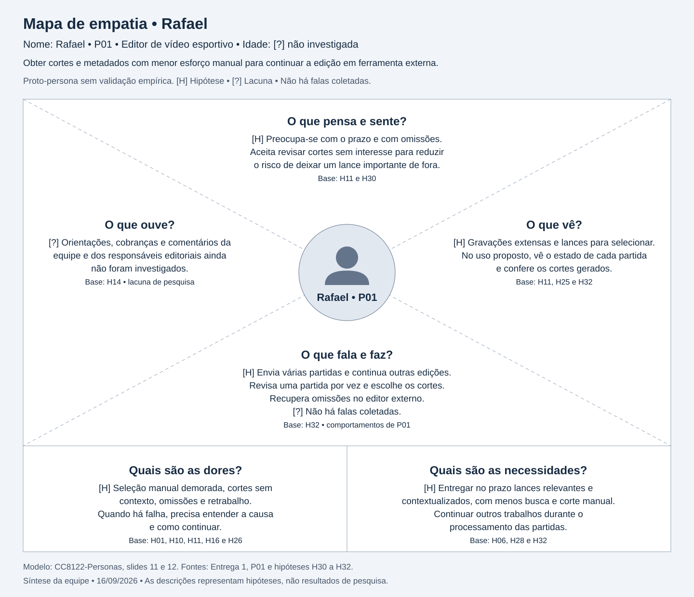

# Entrega 3 — Personas, mapa de empatia, contexto de uso e jornada

**Data:** 9/9/2026  
**Status:** 🟨 em andamento  
**Responsabilidade:** 1 persona por integrante; 1 mapa de empatia, 1 contexto de uso consolidado e 1 jornada por equipe (salvo orientação diferente do docente).

## Objetivo da atividade

Representar grupos de usuários de forma útil para decisões de design. Persona não é personagem decorativo: suas características devem alterar requisitos, prioridades, linguagem, fluxos ou critérios de avaliação.

## Atenção a projetos técnicos

Em TCCs sem interface original, a persona pode representar um **profissional que se apropria da contribuição técnica**: DBA, analista, cientista de dados, administrador, pesquisador, técnico, operador, gestor ou especialista de domínio.

Não escolha um perfil apenas porque “parece combinar” com a tecnologia. Explique **qual objetivo esse perfil teria e qual parte da contribuição do TCC produziria valor para ele**. Se ainda for hipótese, mantenha como hipótese/proto-persona a validar.

Também considere papéis diferentes quando houver tarefas distintas, por exemplo:

- operador que executa análises;
- administrador que configura e gerencia permissões;
- especialista que interpreta resultados;
- gestor que consulta relatórios e decide;
- auditor que revisa histórico.

## Entradas da Entrega 1

Antes de criar personas, retome os tipos de usuários, características relevantes, objetivos e hipóteses registradas na Entrega 1. A persona **não deve transformar uma hipótese inicial em fato por meio de uma história fictícia**.

| Item da Entrega 1 | Status inicial | Evidência disponível agora | Como será tratado nesta entrega |
|---|---|---|---|
| Editor de vídeo esportivo como usuário prioritário, H03, H21 e H27 | H | Entrega 1, seções 2.2 e 7.2; adequação do perfil ainda sem validação com usuários | Incorporar como base de proto-persona; manter como hipótese |
| Obter cortes e metadados com menor esforço manual, H06 e H28 | H | Entrega 1, seções 3.1 e 7.3 | Incorporar como objetivo a validar |
| Selecionar/exportar resultados e processar vídeos em lote, H07 e H08 | H | Atividades A01 a A04 da Entrega 1, seção 3.2; frequência e criticidade não confirmadas | Incorporar atividades; investigar frequência e criticidade |
| Esforço manual, omissões e retrabalho sob pressão de prazo, H01, H09, H10 e H11 | H | Situação hipotética da Entrega 1, seção 4.5 | Manter como dores hipotéticas, sem atribuir relatos a participantes |
| Baixo conhecimento de computação e familiaridade com editores de vídeo, H05, H17 e H19 | H | Entrega 2, seção 3, identifica padrões nas ferramentas, mas não comprova familiaridade do público | Manter como hipótese; investigar experiência e vocabulário |
| Pós-produção, arquivos extensos e pressão de prazo, H12 e H13 | H | Entrega 1, seções 5.1 a 5.3 | Incorporar ao contexto provisório |
| Entrega a responsáveis editoriais e decisões sobre resultados, H14, H22 e H23 | H | Entrega 1, seções 5.4 e 7.1; divisão de responsabilidades não investigada | Manter como hipótese; não criar papéis adicionais sem tarefas distintas |
| Histórico e consequências de falhas, H15, H16 e H26 | H | Entrega 1, seções 5.5, 5.6 e 7.1; recomendações RC03 e RC10 da Entrega 2 | Investigar necessidade de histórico e formas de recuperação |
| Equipamentos, local, acessibilidade, permissões e retenção | ? | Lacunas registradas na Entrega 1, seções 2.4 e 5 | Manter em aberto para coleta de dados |

Fontes: [Entrega 1](01_conhecendo_o_problema.md), [Entrega 2](02_analise_concorrencia.md) e [registro de hipóteses](../RASTREABILIDADE.md). As referências às outras entregas recuperam o conhecimento da equipe; não constituem nova validação com usuários.

## 1. Personas

### Persona P01 — {{nome fictício}}

**Autor(a):** Pedro Alexandre Custódio Silva  
**Tipo:** primária  
**Base de evidências:** hipóteses da [entrega 1](01_conhecendo_o_problema.md), ainda não confirmadas com usuários, e análise de ferramentas da [entrega 2](02_analise_concorrencia.md) (decisões de interface).  
**Hipóteses da Entrega 1 relacionadas:** H01, H03, H05, H06, H09, H10, H11, H12, H13, H16, H17, H19, H21, H27 e H28

| Campo | Descrição |
|---|---|
| Faixa etária / contexto relevante | [?] Faixa etária não investigada. [H] Atuação na pós-produção de partidas encerradas, H12. |
| Ocupação/papel | [H] Editor de vídeo esportivo responsável por obter material de melhores momentos, H03, H21 e H27. |
| Conhecimento do domínio | [H] Identifica lances como gols, defesas, finalizações perigosas e ocorrências disciplinares, conforme a situação de H11. [?] Nível de experiência não investigado. |
| Experiência tecnológica | [H] Baixo conhecimento técnico de software e computação, H05, com possível familiaridade com editores de vídeo, H17. Essa combinação ainda precisa ser validada. |
| Objetivos | [H] Obter cortes e metadados com menor esforço manual para continuar a produção de uma compilação em ferramentas externas, H06 e H28. |
| Necessidades | [H] Reduzir o esforço de seleção e corte, preservar o contexto dos lances e revisar o material antes de utilizá-lo, H01, H10, H11, H16 e H28. |
| Dores/frustrações | [H] Seleção manual demorada, risco de omitir lances ou recortá-los sem contexto, retrabalho e atraso sob pressão de prazo, H01, H09, H10 e H11. |
| Motivadores | [H] Produzir melhores momentos com eficiência e consistência, H06. Outros motivadores ainda não foram investigados. |
| Restrições/acessibilidade | [H] Arquivos extensos, tempo de processamento e pressão de prazo, H13. [?] Necessidades individuais de acessibilidade não investigadas. |
| Ambiente típico de uso | [H] Pós-produção de partidas gravadas, H12. [?] Local exato e equipamentos não definidos; computador com tela ampla é hipótese de trabalho. |
| Comportamentos relevantes | [H] Percorre a gravação, identifica lances, determina os limites dos trechos e os organiza para uso posterior, conforme H11. Familiaridade com ferramentas externas permanece hipótese, H17. |

**Decisões de design influenciadas por P01:**

- Priorizar envio, acompanhamento, revisão e download, conforme RC01 da Entrega 2 e H28.
- Oferecer prévia dos cortes e contexto temporal para apoiar a revisão humana, conforme RC04 e RC05, H10, H11 e H16.
- Manter parâmetros técnicos fora do fluxo principal e testar vocabulário do domínio com usuários, conforme RC06 e RC07, H05 e H19.
- Comunicar progresso e falhas em texto e permitir operação por teclado, conforme RC03 e RC11. A acessibilidade é uma recomendação de design da Entrega 2, não uma característica já observada de P01.

Essas decisões são iniciais e deverão ser revistas com a coleta de dados. Nome, autoria e diferenciação das demais personas continuam pendentes.

> Repita para P02, P03... Cada integrante deve produzir ao menos uma persona.

### Síntese das personas

O perfil prioritário é o editor de vídeo esportivo, conforme H27 e a seção 7.2 da [Entrega 1](01_conhecendo_o_problema.md). A síntese das diferenças entre personas depende da elaboração dos perfis individuais pelos integrantes.

## 2. Mapa de empatia — equipe

**Persona escolhida:** {{P01}}  
**Justificativa:** {{por que esse perfil é relevante}}

Documente também em texto: o que vê; ouve; diz/faz; pensa/sente; dores; ganhos. Diferencie **evidência** de **hipótese**.

## 3. Contexto de uso — consolidação

| Dimensão | Descrição | Implicação de design |
|---|---|---|
| Usuários | [H] Editor de vídeo esportivo, H03, H21 e H27. | Priorizar obtenção e revisão de cortes e metadados; testar linguagem com o público, RC01 e RC07. |
| Tarefas | [H] Enviar vídeos em lote, acompanhar processamento, consultar histórico e revisar, selecionar e baixar resultados, A01 a A04. | Organizar o fluxo de enviar, acompanhar, revisar e baixar, RC01; validar a necessidade de histórico, RC10. |
| Equipamentos | [H] Computador com tela ampla. [?] Equipamentos e escolha entre aplicação web e nativa ainda em aberto, Entrega 1, seção 5.2. | Projetar para inspeção visual de vídeos em computador e considerar arquivos extensos na escolha da plataforma, RC12. |
| Ambiente físico | [H] Pós-produção após a partida, com possível pressão de prazo e interrupções, H12 e H13. [?] Local, iluminação, ruído e compartilhamento não investigados. | Exibir estados claros de envio e processamento e permitir retomar a compreensão do trabalho após interrupções, RC03. |
| Ambiente social/organizacional | [H] O editor pode entregar material a produtores ou responsáveis editoriais para aprovação e publicação, H14, H22 e H23. | Permitir revisar e baixar material para continuidade em ferramentas externas; publicação está fora do recorte, RC05 e RC09. |
| Papéis/permissões/governança | [?] Papéis, permissões, aprovação e retenção não definidos. Parâmetros técnicos ficam com a equipe técnica no recorte inicial, Entrega 1, seções 5.4 e 7.1. | Manter administração de usuários fora do escopo e parâmetros técnicos fora do fluxo principal, conforme delimitação da Entrega 1 e RC06. |
| Volume de dados/histórico | [H] Vídeos extensos e possível processamento em lote, H08 e H13; utilidade de histórico a validar, H15. [?] Volume, formatos, limites e retenção não definidos. | Representar estado por vídeo, validar entradas e investigar histórico para localizar resultados e evitar reprocessamento, RC02, RC03 e RC10. |

Fontes: [Entrega 1](01_conhecendo_o_problema.md), seções 3, 5, 7 e 11, e [Entrega 2](02_analise_concorrencia.md), seção 5. As implicações são recomendações iniciais de design.

## 4. Jornada do usuário — equipe

**Persona:** {{P01}}  
**Objetivo da jornada:** [H] Obter cortes e metadados de uma partida gravada para continuar a produção em ferramentas externas, H28.  
**Início e fim da jornada:** [H] Começa com o recebimento da gravação integral após a partida, H11 e H12, e termina com a obtenção do material para continuar a edição em ferramenta externa, H28. Base: [Entrega 1](01_conhecendo_o_problema.md), seções 4.5 e 7.3.

| Etapa | Situação/ação | Objetivo | Pensamento/emoção | Dor | Oportunidade de design | Evidência |
|---|---|---|---|---|---|---|
| 1 | {{...}} | {{...}} | {{...}} | {{...}} | {{...}} | {{...}} |

> A jornada pode incluir etapas **antes, durante e depois** do uso do produto. Não transforme a jornada em lista de telas.

## Síntese

A partir da [Entrega 1](01_conhecendo_o_problema.md), os cenários e as tarefas seguintes devem contemplar:

- O esforço de localizar e recortar lances em gravações extensas e o risco de omissão ou perda de contexto, H01, H09, H10 e H11.
- A obtenção de cortes e metadados para continuar a produção em ferramentas externas, H06 e H28.
- O envio em lote e a compreensão de progresso, falhas e possibilidades de recuperação, A01 e A02, H08, H13 e H26.
- A revisão, seleção e download dos resultados, A04, H16 e H25, mantendo a decisão editorial com o usuário.
- A investigação da necessidade de recuperar resultados anteriores, A03 e H15.

Esses pontos mantêm o status de hipótese. Ainda faltam os perfis individuais completos, o mapa de empatia e o detalhamento das etapas da jornada. Edição detalhada, publicação e administração de usuários permanecem fora do escopo definido na Entrega 1.

## Checklist

- [ ] Existe pelo menos uma persona por integrante.
- [ ] As personas não são apenas diferenças demográficas superficiais.
- [ ] Está claro o que é dado real e o que é hipótese/proto-persona.
- [ ] A persona não “validou por ficção” uma hipótese da Entrega 1; afirmações continuam marcadas como hipótese quando não há evidência.
- [ ] Objetivos e dores têm consequência para o design.
- [x] Contexto de uso está coerente com a Entrega 1.
- [ ] Em TCC sem interface original, a persona possui relação explícita com a contribuição técnica.
- [ ] Papéis administrativos, técnicos e decisórios só foram criados quando possuem objetivos/tarefas diferentes.
- [ ] Jornada possui etapas, dores e oportunidades e não é apenas wireflow.
- [ ] IDs das personas foram adicionados à rastreabilidade.
