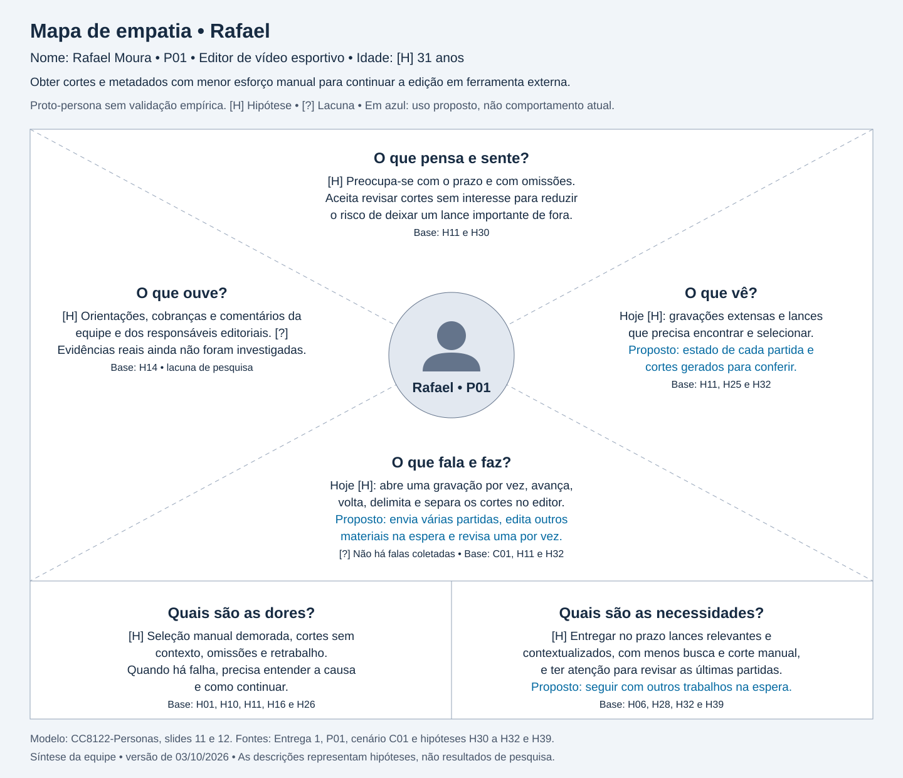
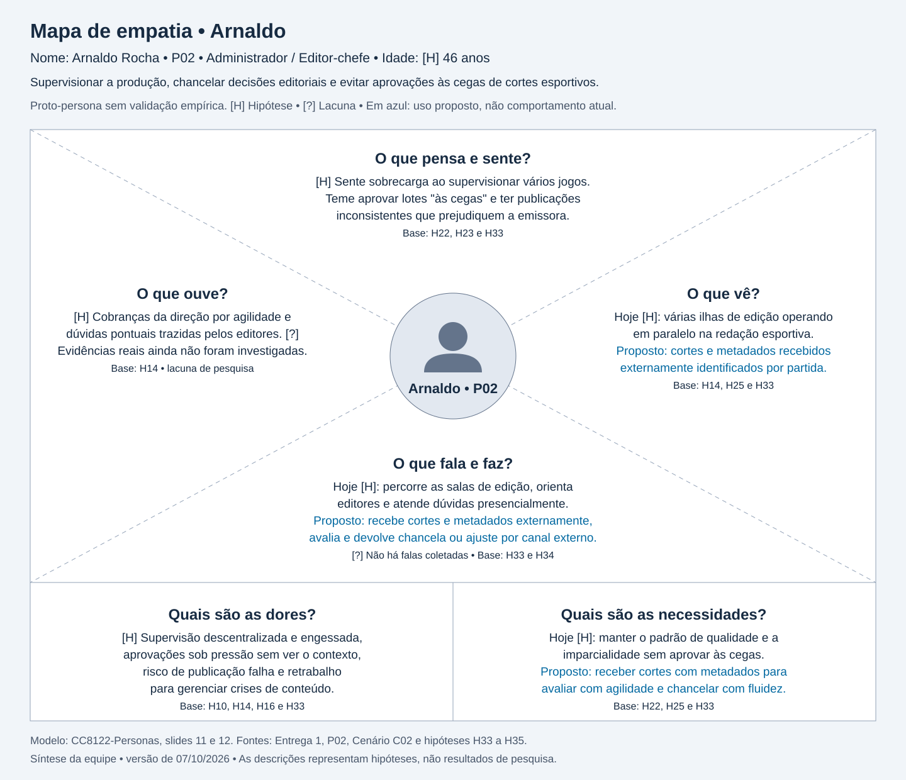
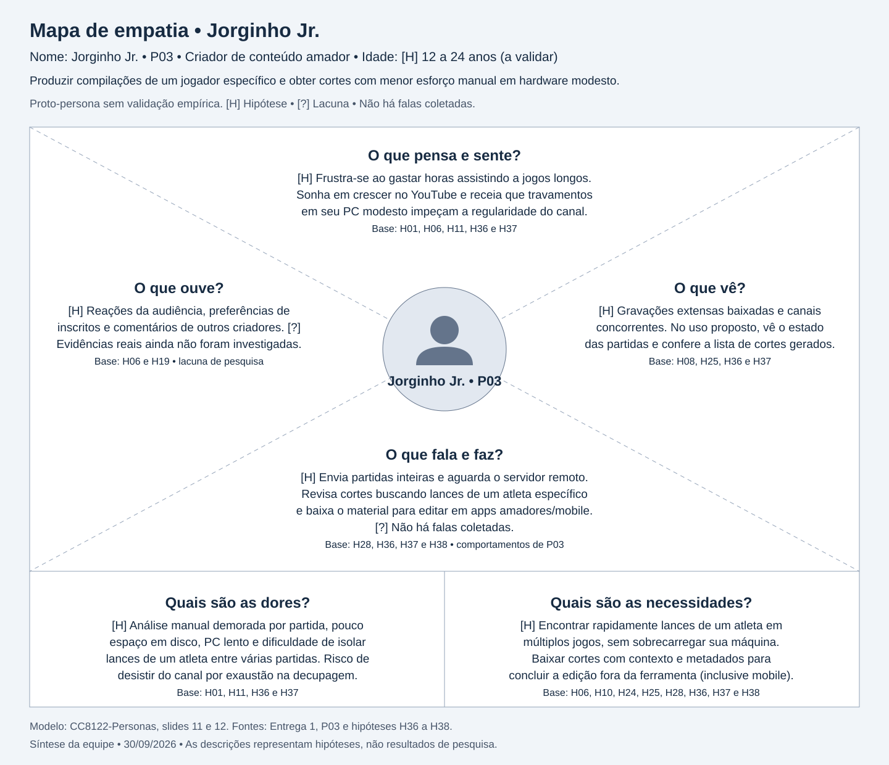

# Entrega 3 — Personas, mapa de empatia, contexto de uso e jornada

**Data:** 16/9/2026 (versão original)  
**Revisão:** 03/10/2026, aplicação do [feedback do professor](../feedbacks_professor/Feedback_Professor_Entrega03_Equipe16.md)  
**Status:** 🟩 preenchida como proto-personas; validação com usuários pendente

**Responsabilidade:** 1 persona por integrante; 1 mapa de empatia, 1 contexto de uso consolidado e 1 jornada por equipe (salvo orientação diferente do docente).

## Objetivo da atividade

Representar grupos de usuários de forma útil para decisões de design. Persona não é personagem decorativo: suas características devem alterar requisitos, prioridades, linguagem, fluxos ou critérios de avaliação.

## Atenção a projetos técnicos

Em TCCs sem interface original, a persona pode representar um **profissional que se apropria da contribuição técnica**: DBA, analista, cientista de dados, administrador, pesquisador, técnico, operador, gestor ou especialista de domínio.

Não escolha um perfil apenas porque “parece combinar” com a tecnologia. Explique **qual objetivo esse perfil teria e qual parte da contribuição do TCC produziria valor para ele**. Se ainda for hipótese, mantenha como hipótese/proto-persona a validar.

Também considere papéis diferentes quando houver tarefas distintas, por exemplo:

- operador que executa análises;
- administrador que configura e gerencia permissões;
- especialista que interpreta resultados;
- gestor que consulta relatórios e decide;
- auditor que revisa histórico.

## Entradas da Entrega 1

Antes de criar personas, retome os tipos de usuários, características relevantes, objetivos e hipóteses registradas na Entrega 1. A persona **não deve transformar uma hipótese inicial em fato por meio de uma história fictícia**.

| Item da Entrega 1                                                                      | Status inicial | Evidência disponível agora                                                                        | Como será tratado nesta entrega                                          |
| -------------------------------------------------------------------------------------- | -------------- | ------------------------------------------------------------------------------------------------- | ------------------------------------------------------------------------ |
| Editor de vídeo esportivo como usuário prioritário, H03, H21 e H27                     | H              | Entrega 1, seções 2.2 e 7.2; adequação do perfil ainda sem validação com usuários                 | Incorporar como base de proto-persona; manter como hipótese              |
| Obter cortes e metadados com menor esforço manual, H06 e H28                           | H              | Entrega 1, seções 3.1 e 7.3                                                                       | Incorporar como objetivo a validar                                       |
| Selecionar/exportar resultados e processar vídeos em lote, H07 e H08                   | H              | Atividades A01 a A04 da Entrega 1, seção 3.2; frequência e criticidade não confirmadas            | Incorporar atividades; investigar frequência e criticidade               |
| Esforço manual, omissões e retrabalho sob pressão de prazo, H01, H09, H10 e H11        | H              | Situação hipotética da Entrega 1, seção 4.5                                                       | Manter como dores hipotéticas, sem atribuir relatos a participantes      |
| Domínio de ferramentas de edição, com pouco conhecimento de programação e IA, H05, H17 e H19 | H              | Entrega 2, seção 3, identifica padrões nas ferramentas, mas não comprova familiaridade do público | Manter como hipótese; investigar experiência e vocabulário               |
| Pós-produção, arquivos extensos e pressão de prazo, H12 e H13                          | H              | Entrega 1, seções 5.1 a 5.3                                                                       | Incorporar ao contexto provisório                                        |
| Entrega a responsáveis editoriais e decisões sobre resultados, H14, H22 e H23          | H              | Entrega 1, seções 5.4 e 7.1; divisão de responsabilidades não investigada                         | Manter como hipótese; não criar papéis adicionais sem tarefas distintas |
| Histórico e consequências de falhas, H15, H16 e H26                                    | H              | Entrega 1, seções 5.5, 5.6 e 7.1; recomendações RC03 e RC10 da Entrega 2                          | Investigar necessidade de histórico e formas de recuperação              |
| Equipamentos, local, acessibilidade, permissões e retenção                             | ?              | Lacunas registradas na Entrega 1, seções 2.4 e 5                                                  | Manter em aberto para coleta de dados                                    |

Fontes: [Entrega 1](01_conhecendo_o_problema.md), [Entrega 2](02_analise_concorrencia.md) e [registro de hipóteses](../RASTREABILIDADE.md). As referências às outras entregas recuperam o conhecimento da equipe; não constituem nova validação com usuários.

## 1. Personas

### Composição e prioridade das personas

P01 e P03 são personas primárias. As duas usam a interface do envio ao download, e as necessidades de cada uma mudam decisões essenciais do fluxo de enviar, acompanhar, revisar e baixar. P02 não usa a interface no recorte adotado: recebe por canal externo o material que o editor baixa e decide sobre ele. Por isso P02 deixa de ser classificada como persona secundária de uso e passa a ser uma **persona atendida**, categoria de Cooper para quem não opera o produto, mas depende do que ele produz.

| Persona | Classificação | Atividades apoiadas pela interface | Por que essa prioridade | Consequência prática no projeto |
|---|---|---|---|---|
| P01, Rafael | Primária | A01, A02 e A04; A03 a validar | Revisa várias partidas sob prazo e precisa conferir os cortes antes de baixar, H30 e H32. Essas necessidades definem a fila de partidas, o aviso de conclusão e a revisão com contexto, que formam o fluxo principal. | A interface precisa aceitar várias partidas, mostrar o estado de cada uma e permitir assistir a todos os cortes antes do download. Falhas de uma partida não podem bloquear as outras, H16. |
| P03, Jorginho Jr. | Primária | A01, A02 e A04 | Percorre o mesmo fluxo de P01, mas com computador pouco potente, pouco armazenamento, H37, e experiência em editores mobile, H38. Essas diferenças não são necessidades adicionais que se atendem à parte: restringem o próprio fluxo principal, por isso P03 não cabe como secundária. | O fluxo não pode depender de hardware local potente, e o download deve trazer só os cortes selecionados. Rótulos e mensagens não podem exigir vocabulário de editor profissional e devem ser testados também com criadores amadores, RC07. O filtro por jogador continua necessidade a investigar, H36, e não requisito. |
| P02, Arnaldo | Atendida, não usuária da interface | Nenhuma no recorte; recebe o resultado de A04 por canal externo, H33 | Não opera o produto e por isso não orienta decisões de tela. Sua decisão editorial depende da qualidade do material que P01 baixa. | As necessidades de P02 recaem sobre o que P01 baixa: partida de origem identificável, timecodes e metadados legíveis fora da interface, RC05 e RC09. Não se cria área administrativa nem tela de supervisão; o acompanhamento direto continua alternativa a investigar em H33. |

Quando as necessidades das duas primárias divergirem, a decisão deve atender às duas antes de favorecer uma delas. O caso mais provável é o vocabulário: P01 conhece editores profissionais, H17, e P03 conhece editores mobile, H38. Termos que só P01 entende não servem ao fluxo principal.

### Persona P01 — Rafael

**Autor(a):** Pedro Alexandre Custódio Silva — 22.123.049-3  
**Tipo:** primária  
**Por que primária:** Rafael usa a interface em todas as atividades do recorte, A01, A02 e A04, e suas necessidades de revisar várias partidas sob prazo sem perder lances, H30 e H32, definem o fluxo principal. A importância do cargo não entra nessa classificação. Ver [composição e prioridade das personas](#composição-e-prioridade-das-personas).  
**Base de evidências:** hipóteses da [entrega 1](01_conhecendo_o_problema.md), ainda não confirmadas com usuários, e análise de ferramentas da [entrega 2](02_analise_concorrencia.md) (decisões de interface).  
**Hipóteses da Entrega 1 relacionadas:** H01, H03, H05, H06, H09, H10, H11, H12, H13, H16, H17, H19, H21, H27 e H28

**Hipóteses novas da Entrega 3:** H30, H31, H32 e H39, acompanhadas no [registro de hipóteses](../RASTREABILIDADE.md#21-hipóteses-acrescentadas-na-entrega-3).

**Biografia [H]:** Rafael Moura tem 31 anos e edita vídeo há oito. Começou cortando gols de campeonatos amadores para uma emissora comunitária, onde montava sozinho o compacto inteiro, da gravação bruta ao arquivo final. Há cinco anos trabalha em uma produtora que faz conteúdo esportivo para clubes e canais digitais. Em dia de rodada recebe as gravações de quatro a seis partidas encerradas e precisa entregar a seleção de lances de cada uma no mesmo dia, para que a supervisão editorial decida o que segue para montagem, H39.

A experiência deixa Rafael rápido nas ferramentas de edição, mas não reduz o tempo de assistir a cada partida. O esforço vem da quantidade de gravações: a atenção cai a partir da terceira ou quarta partida do dia, ele passa a delimitar os cortes com menos cuidado e a reabrir decisões já tomadas, como descreve o [cenário C01](04_cenarios_problema.md#cenário-c01--seleção-manual-de-melhores-momentos-sob-pressão-de-prazo). Por isso a revisão de várias partidas é o centro do seu dia, e não uma tarefa ocasional.

Rafael responde pela seleção e pelo corte; a decisão de publicar fica com a supervisão editorial. Já recebeu reclamação de um clube por um gol que ficou fora do compacto e, desde então, prefere revisar candidatos a mais a correr esse risco de novo, H30. Fora das rodadas, edita entrevistas e bastidores da produtora; são esses trabalhos que retoma enquanto espera o processamento das partidas, H32.

Idade, trajetória e episódio da reclamação são escolhas da proto-persona feitas com o autor, sem base em entrevistas. Ficam na ficha porque explicam o volume de partidas, a tolerância a candidatos extras e a alternância de tarefas durante a espera.

| Campo                             | Descrição                                                                                                                                                                                                                                                                                                                                                                                                                                                                                                                                                                                                                                                                                                                                                |
| --------------------------------- | -------------------------------------------------------------------------------------------------------------------------------------------------------------------------------------------------------------------------------------------------------------------------------------------------------------------------------------------------------------------------------------------------------------------------------------------------------------------------------------------------------------------------------------------------------------------------------------------------------------------------------------------------------------------------------------------------------------------------------------------------------- |
| Faixa etária / contexto relevante | [H] 31 anos; edita vídeo há oito anos, cinco deles na produtora atual. Atuação na pós-produção de partidas encerradas, de quatro a seis por dia de rodada, H12 e H39. |
| Ocupação/papel                    | [H] Editor de vídeo esportivo experiente em uma produtora de conteúdo esportivo, responsável por obter material de melhores momentos. Detalhamento de H03, H21 e H27 definido com o autor, ainda a validar.                                                                                                                                                                                                                                                                                                                                                                                                                                                                                                                                              |
| Conhecimento do domínio           | [H] Identifica lances como gols, defesas, finalizações perigosas e ocorrências disciplinares, conforme a situação de H11. A experiência em edição foi definida com o autor como característica hipotética do perfil; o conhecimento específico de futebol ainda precisa ser validado.                                                                                                                                                                                                                                                                                                                                                                                                                                                                    |
| Experiência tecnológica           | [H] Experiente no uso de ferramentas de edição de vídeo, mas sem conhecimento de IA ou programação. Detalhamento de H05 e H17 definido com o autor, ainda a validar; a ferramenta utilizada não foi escolhida.                                                                                                                                                                                                                                                                                                                                                                                                                                                                                                                                           |
| Objetivos                         | [H] Entregar no prazo uma seleção de lances relevantes, com contexto suficiente, gastando menos tempo procurando e recortando a gravação. Obter cortes e metadados para continuar a produção em ferramentas externas, H06 e H28. Critério de sucesso definido com o autor, ainda a validar com usuários.                                                                                                                                                                                                                                                                                                                                                                                                                                                 |
| Necessidades                      | [H] Reduzir o esforço de seleção e corte, preservar o contexto dos lances e poder conferir manualmente todos os cortes gerados antes de selecionar quais baixar, H01, H10, H11, H16 e H28. O próprio editor é responsável pela revisão, conforme definição do perfil com o autor. Quando uma partida falha, precisa entender o que aconteceu e como prosseguir, sem perder os resultados já concluídos das outras partidas, conforme definição com o autor e H16.                                                                                                                                                                                                                                                                                        |
| Dores/frustrações                 | [H] Prazo curto como pressão principal, acompanhado da preocupação de deixar passar lances importantes durante a seleção manual. Recortes sem contexto e retrabalho podem atrasar a entrega, H01, H09, H10 e H11. Prioridade definida com o autor, ainda a validar. Prefere revisar alguns cortes sem interesse a deixar um lance importante de fora, H30, conforme definição do perfil com o autor.                                                                                                                                                                                                                                                                                                                                                     |
| Motivadores                       | [H] Produzir melhores momentos com eficiência e consistência, H06. Outros motivadores ainda não foram investigados.                                                                                                                                                                                                                                                                                                                                                                                                                                                                                                                                                                                                                                      |
| Restrições/acessibilidade         | [H] Arquivos extensos, tempo de processamento e pressão de prazo, H13. [?] Necessidades individuais de acessibilidade não investigadas.                                                                                                                                                                                                                                                                                                                                                                                                                                                                                                                                                                                                                  |
| Ambiente típico de uso            | [H] Trabalho presencial na produtora, em sala de edição com pouca luz e computador com tela ampla, na pós-produção de partidas gravadas. Prefere o modo escuro para conforto no ambiente pouco iluminado, H31. Detalhamento de H12 e H13 definido com o autor, ainda a validar.                                                                                                                                                                                                                                                                                                                                                                                                                                                                          |
| Comportamentos relevantes         | [H] No processo atual imaginado, percorre a gravação, identifica lances e organiza os trechos, conforme H11. O [cenário C01](04_cenarios_problema.md#cenário-c01--seleção-manual-de-melhores-momentos-sob-pressão-de-prazo) detalha esse processo como escolha narrativa: trabalha uma partida por vez, avança nos períodos que julga pouco promissores, separa candidatos duvidosos e revisa os cortes antes da partida seguinte; considera um corte aceitável quando mostra a construção e o desfecho da jogada. No uso proposto, envia várias partidas para a fila e continua outras edições enquanto aguarda o processamento. Precisa ser avisado quando os cortes estiverem prontos; então revisa uma partida por vez e seleciona o material para download. Ao perceber que falta um lance importante, consulta a gravação original e faz o corte no editor de vídeo que já utiliza. Se o processamento de uma partida falha, procura entender o motivo e a ação necessária para resolver o problema, enquanto continua com as demais. Fluxo definido com o autor, ainda a validar; a organização da espera e da revisão por partida é registrada em H32. |

**Decisões de design influenciadas por P01:**

- Facilitar a revisão e a exclusão de cortes da seleção para download. Conforme H30, Rafael aceita alguns resultados sem interesse para reduzir o risco de omitir lances importantes; essa preferência não garante que o modelo detecte todos os lances.

- Priorizar envio, acompanhamento, revisão e download, conforme RC01 da Entrega 2 e H28.
- Permitir enfileirar várias partidas, identificar o estado de cada uma e avisar quando seus cortes estiverem prontos, para que o editor continue outros trabalhos durante a espera. A organização do trabalho é hipótese H32; o meio de aviso ainda será definido.
- Explorar modo escuro com base na preferência hipotética H31 de P01, mantendo contraste, foco e controles legíveis.
- Permitir assistir a todos os cortes gerados e selecionar quais baixar, com contexto temporal para apoiar a revisão pelo próprio editor, conforme RC04 e RC05, H10, H11 e H16. Conferir os cortes gerados não permite garantir que nenhum lance foi omitido.
- Manter a recuperação de lances omitidos e a edição detalhada no editor externo já utilizado pelo profissional, conforme o fluxo definido com o autor e o recorte da Entrega 1.
- Manter parâmetros técnicos fora do fluxo principal e testar vocabulário do domínio com usuários, conforme RC06 e RC07, H05 e H19.
- Em caso de falha, identificar a partida afetada, explicar o motivo conhecido em linguagem compreensível para Rafael e indicar o próximo passo. Se a causa não for conhecida, informar isso sem inventar uma explicação. Preservar o acesso aos resultados já concluídos e permitir continuar com as outras partidas, conforme H16, H26 e o comportamento definido com o autor.
- Comunicar progresso e falhas em texto e permitir operação por teclado, conforme RC03 e RC11. A acessibilidade é uma recomendação de design da Entrega 2, não uma característica já observada de P01.
- Elemento visualmente semelhante a uma linha do tempo dos softwares de edição de vídeo, assim como um preview.

Essas decisões são iniciais e deverão ser revistas com a coleta de dados.

### Persona P02 — Arnaldo

**Autor(a):** Lucas Roberto Boccia dos Santos — 22.123.012-1
**Tipo:** persona atendida, não usuária da interface; ver [composição e prioridade das personas](#composição-e-prioridade-das-personas)

**Base de evidências:** proto-persona proposta pelo autor na PR #5, ainda sem validação com usuários.

**Base herdada:** H14, H22 e H23 admitem entrega a responsáveis editoriais e decisões posteriores sobre os resultados. A supervisão de P02 é uma derivação exploratória dessa base.

**Hipóteses novas da Entrega 3:** H33, relação com os resultados; H34, experiência tecnológica específica de P02; H35, possível necessidade de auditoria editorial. Acompanhamento no [registro de hipóteses](../RASTREABILIDADE.md#21-hipóteses-acrescentadas-na-entrega-3).

O avatar foi gerado por IA e é apenas ilustrativo. Aparência e idade aparente não representam dados coletados.

| Campo | Descrição |
|---|---|
| Faixa etária / contexto relevante | [?] Faixa etária não investigada. [H] Atuação na administração do conteúdo como um todo. |
| Ocupação/papel | [H] Administrador do setor de mídias digitais, responsável pela supervisão da produção e gerenciamento de conteúdo digital. |
| Conhecimento do domínio | [H] Gerencia como o conteúdo trabalhado pelos editores deve ser tratado: fluxo de postagens em redes sociais, chancela de decisões editoriais. [?] Nível de experiência não investigado. |
| Experiência tecnológica | [H] Baixo conhecimento técnico de software e computação, com possível baixa familiaridade com editores de vídeo, H34, proposta original do autor para P02. H05 e H17 descrevem o perfil de edição e não comprovam essa combinação para a supervisão. |
| Objetivos | [H] Supervisionar a produção e chancelar decisões editoriais. No uso indireto proposto, decidir se os cortes recebidos podem seguir para montagem ou precisam de revisão pelo editor, H33. |
| Necessidades | [H] Receber cortes identificados por partida e metadados que permitam localizar e compreender os lances antes da decisão editorial, H33, derivada de H22/H23. Investigar quais informações do andamento o editor precisa comunicar para apoiar a supervisão. |
| Dores/frustrações | [H] Dificuldade de manter controle e supervisionar o processo atual, engessado. |
| Motivadores | [H] Maior produtividade do processo editorial e do fluxo de produção e gerenciamento de conteúdo. |
| Restrições/acessibilidade | [H] Conhecimento limitado sobre software e possível dificuldade de adaptação, H34. [?] Regras corporativas e necessidades individuais de acessibilidade não investigadas. |
| Ambiente típico de uso | [H] Supervisão editorial como derivação de H14/H22/H23, recebendo os resultados fora da interface, H33. [?] Local, equipamentos e necessidade de uma tela de acompanhamento não definidos. |
| Comportamentos relevantes | [H] Recebe do editor os cortes e metadados, consulta o material e devolve a decisão de seguir para montagem ou revisar a seleção, H33. Chancela editorial, gestão da produção e supervisão das postagens são atividades externas ao produto. |

**Tarefa proposta com os resultados do TCC, H33:**

| Etapa | Ação e informação |
|---|---|
| Início | Após a revisão e o download pelo editor, P02 recebe os cortes e metadados por um canal externo ainda a definir. |
| Consulta | Assiste aos cortes e consulta a partida de origem, os timecodes e a classificação dos lances nos metadados disponíveis, H25. |
| Decisão | Decide se a seleção atende à intenção editorial e pode seguir para montagem ou se o editor precisa revisá-la. |
| Resultado esperado | O editor recebe uma orientação vinculada aos cortes e à partida, para continuar a produção em ferramenta externa. |

O valor esperado da contribuição do TCC para P02 é receber trechos localizáveis e contextualizados para decidir sobre a seleção. O fluxo completo é hipotético. P02 não envia partidas nem aprova ou publica pela interface no recorte adotado.

**Decisões de design influenciadas por P02:**

- Manter identificáveis a partida de origem e os metadados dos cortes baixados pelo editor, para apoiar a consulta externa por P02, H33 e H25, RC05 e RC09.
- Apresentar ao editor estados e ocorrências compreensíveis de processamento, A02/H25/H26 e RC03. Investigar quais dessas informações P02 precisa receber para decidir sobre o andamento da produção; isso não define uma tela de supervisão.
- Manter parâmetros técnicos fora do fluxo principal, conforme a decisão da Entrega 1, seção 7.1, e RC06. Essa delimitação não depende de confirmar H34.
- Investigar a consulta de histórico de processamento pelo editor, A03/H15 e RC10, para localizar resultados e explicar falhas anteriores. Sua utilidade para a comunicação com P02 ainda está aberta.

**Proposta exploratória de auditoria editorial, H35:** o evento a investigar é uma decisão de aprovar uma seleção ou devolvê-la para revisão. Um possível registro identificaria a seleção, a decisão, seu responsável, o momento e o motivo, para esclarecer qual material foi chancelado e por que houve retrabalho. Pergunta de pesquisa: P02 precisa recuperar essas decisões para resolver divergências, e os registros externos já usados pela equipe atendem à necessidade? Não há evidência dessa necessidade nem decisão de incluir auditoria na interface. Logs técnicos continuam reservados ao suporte, conforme a Entrega 1, seção 8.

### Persona P03 — Jorginho Jr.

**Autor(a):** Giovanni Chahin Morassi — 22.123.025-3
**Tipo:** primária; ver [composição e prioridade das personas](#composição-e-prioridade-das-personas)

**Base de evidências:** hipóteses da [entrega 1](01_conhecendo_o_problema.md), ainda não confirmadas com usuários, e análise de ferramentas da [entrega 2](02_analise_concorrencia.md) (decisões de interface).

**Hipóteses da Entrega 1 relacionadas:** H05, H06, H08, H10, H11, H19, H24, H25 e H28.

**Hipóteses novas da Entrega 3:** H36, H37 e H38, acompanhadas no [registro de hipóteses](../RASTREABILIDADE.md#21-hipóteses-acrescentadas-na-entrega-3).

*Avatar gerado por IA com gpt-image-2. Personagem fictício; aparência e idade aparente são ilustrativas e não representam dados de pesquisa.*

| Campo                             | Descrição                                                                                                                                                                                                                                                                                                                                                                                                     |
| --------------------------------- | ------------------------------------------------------------------------------------------------------------------------------------------------------------------------------------------------------------------------------------------------------------------------------------------------------------------------------------------------------------------------------------------------------------- |
| Faixa etária / contexto relevante | [H] Jovem entre 12 e 24 anos, ainda sem renda própria e produzindo conteúdo esportivo de forma amadora. Faixa definida com o autor, ainda a validar.                                                                                                                                                                                                                                                          |
| Ocupação/papel                    | [H] Criador de conteúdo amador que busca se tornar youtuber ou influenciador digital de futebol; atualmente desempregado. Detalhamento definido com o autor, ainda a validar.                                                                                                                                                                                                                                  |
| Conhecimento do domínio           | [H] Assiste a muitos jogos, joga futebol casualmente com amigos e acompanha jogadores específicos. O reconhecimento de lances ainda é amador e precisa ser validado.                                                                                                                                                                                                                                            |
| Experiência tecnológica           | [H] Já usou editores de vídeo mobile e de computador, sem formação técnica em edição ou programação, H05 e H19. A familiaridade com NLEs profissionais (H17) não foi confirmada. Detalhamento definido com o autor, ainda a validar.                                                                                                                                                                            |
| Objetivos                         | [H] Produzir vídeos centrados em um jogador específico, capazes de divertir o público, e assim crescer como criador no meio digital. Obter cortes e metadados com menor esforço manual, H06 e H28. Objetivo definido com o autor, ainda a validar.                                                                                                                                                            |
| Necessidades                      | [H] Localizar rapidamente os momentos do jogador escolhido, reduzir o tempo de análise de partidas longas e reunir cortes de vários jogos em um compilado, H10, H11, H24, H25 e H36. Revisar e baixar os cortes para continuar a edição fora da interface, H28.                                                                                                                                                |
| Dores/frustrações                 | [H] O tempo elevado de análise por partida e a dificuldade de produzir um compilado de vários jogos tornam o trabalho frustrante; essa frustração afasta seu objetivo de manter edits e canais de esporte, H01 e H11. Prioridade definida com o autor, ainda a validar.                                                                                                                                       |
| Motivadores                       | [H] Alcançar reconhecimento no meio digital com seus vídeos, H06. Outros motivadores ainda não foram investigados.                                                                                                                                                                                                                                                                                             |
| Restrições/acessibilidade         | [H] Computador pouco potente e pouco espaço de armazenamento; tem boa conexão para enviar os vídeos e baixar os cortes, H37. [?] Necessidades individuais de acessibilidade não investigadas.                                                                                                                                                                                                                 |
| Ambiente típico de uso            | [H] Em casa, à mesa do computador, após um dia assistindo a jogos e resolvendo tarefas cotidianas. Detalhamento definido com o autor, ainda a validar.                                                                                                                                                                                                                                                        |
| Comportamentos relevantes         | [H] Reduz a velocidade de reprodução para localizar momentos interessantes e, em seguida, filtra os que pertencem ao jogador escolhido; reúne cortes de várias partidas em um mesmo compilado, H36. Por ter equipamento limitado, depende do processamento remoto para viabilizar o trabalho, H37. Fluxo definido com o autor, ainda a validar; o uso de editores mobile é registrado em H38. |

**Decisões de design influenciadas por P03:**

- Investigar a necessidade de identificar e filtrar lances por jogador para compilações centradas em um atleta, H36. A viabilidade técnica não está confirmada; o filtro não é uma capacidade assegurada do TCC nem um requisito fechado do protótipo.

- Manter o processamento no servidor e a troca por upload e download, para não exigir hardware potente nem armazenamento local do usuário, H37 e RC12.

- Preservar revisão, seleção e download dos cortes pelo próprio criador, com contexto temporal, conforme RC04, RC05, H10 e H25.

- Adotar vocabulário acessível a um editor amador, acostumado a editores mobile, evitando jargão técnico, RC07, H19 e H38.

- Representar o estado por partida e permitir reunir resultados de várias partidas no mesmo trabalho, H08 e H25.

- Manter a edição detalhada e a publicação fora da interface, prevendo a continuidade em ferramentas externas, inclusive mobile, conforme RC05 e o recorte da Entrega 1.

- É uma boa ideia ter um elemento visualmente semelhante às linhas do tempo dos softwares de edição de vídeo para capturar familiaridade dos usuários. talvez na tela de processamento?

Essas decisões são iniciais e deverão ser revistas com a coleta de dados.

### Síntese das personas

P01, Rafael, e P03, Jorginho Jr., são as personas primárias. Rafael representa o editor de vídeo esportivo priorizado em H27 e na [Entrega 1](01_conhecendo_o_problema.md); Jorginho Jr. representa o criador amador que percorre o mesmo fluxo com equipamento limitado. P02 é uma persona atendida: representa a supervisão editorial que recebe os resultados fora da interface, H33.

| Aspecto | P01, Rafael | P02, Administrador/Editor-Chefe | P03, Jorginho Jr. |
|---|---|---|---|
| Participação | Envia partidas, acompanha o processamento, revisa e baixa resultados. | Recebe e consulta os cortes e metadados fora da interface. | Envia partidas, acompanha o processamento, revisa e baixa cortes para sua produção amadora. |
| Decisão | Escolhe quais cortes baixar para continuar a edição. | Chancela a seleção para montagem ou solicita revisão ao editor, H33. | Escolhe os cortes para compilações centradas em um jogador, H36; realiza a montagem em ferramenta externa. |
| Necessidade que afeta design | Reduzir esforço manual, evitar omissões e entender falhas, H28/H30/H32. | Receber material identificável e com contexto para a decisão editorial, H33. | Obter material de várias partidas com equipamento limitado, H36/H37. |
| Experiência tecnológica | Experiência com edição, sem conhecimento de IA/programação, H05/H17 refinadas para P01. | Possível baixa familiaridade com edição e computação, H34. | Experiência amadora com editores mobile e de computador; vocabulário a validar, H38. |

As três fichas são proto-personas sem validação empírica. Os mapas de empatia e as jornadas do usuário contemplam P01, P02 e P03, com P01 e P03 como personas primárias e P02 como persona atendida. O uso direto da interface por P02 e a auditoria editorial permanecem em investigação, H33/H35, e o filtro por jogador para P03 depende de confirmação técnica, H36.

## 2. Mapa de empatia — equipe

### Persona P01 — Rafael

**Persona escolhida:** P01, Rafael  
**Idade:** [H] 31 anos, característica da proto-persona.  
**Justificativa:** Rafael representa o editor de vídeo esportivo priorizado na Entrega 1, H27. Seu objetivo de obter cortes e metadados com menor esforço manual, H28, se relaciona diretamente à identificação automática de melhores momentos produzida pelo TCC.

O mapa abaixo sintetiza as hipóteses de P01 e as escolhas feitas com o autor. Não contém falas coletadas nem observações de usuários. O arquivo visual acima apresenta a mesma síntese do quadro textual. Nos campos Vê, Fala e faz e Necessidades, **Hoje** descreve o comportamento atual hipotético e **Uso proposto** descreve a experiência imaginada com a interface. O uso proposto não serve de evidência a favor da própria solução.

| Dimensão    | Registro                                                                                                                                                                                                   | Base                                         |
| ----------- | ---------------------------------------------------------------------------------------------------------------------------------------------------------------------------------------------------------- | -------------------------------------------- |
| Vê          | **Hoje:** [H] gravações extensas e lances que precisa encontrar e selecionar. **Uso proposto:** [H] acompanha o estado das partidas e confere os cortes gerados. | H11, H25 e H32; P01 |
| Ouve        | [H] Orientações, cobranças e comentários da equipe e dos responsáveis editoriais. [?] Evidências reais ainda não foram investigadas.                                                                       | Fluxo organizacional ainda a investigar, H14 |
| Fala e faz     | **Hoje:** [H] abre uma gravação por vez no editor, avança nos trechos pouco promissores, volta ao perceber uma jogada, delimita e separa o corte, e revisa os cortes antes da próxima partida. **Uso proposto:** [H] envia várias partidas, edita outros materiais durante a espera e revisa uma partida por vez; recupera lances omitidos no editor externo. [?] Não há falas coletadas. | C01 e H11; H32 para o uso proposto |
| Pensa e sente | [H] Preocupa-se com o prazo e com a possibilidade de deixar passar um lance importante. Aceita revisar alguns cortes sem interesse para reduzir esse risco.                                                | H11 e H30; dores de P01                      |
| Dores       | [H] Seleção manual demorada, omissões, cortes sem contexto e retrabalho. Quando ocorre uma falha, precisa entender o motivo e como continuar.                                                              | H01, H10, H11, H16 e H26                     |
| Necessidades      | [H] Entregar no prazo lances relevantes e com contexto, gastando menos tempo procurando e recortando a gravação, e ter atenção para revisar as últimas partidas do dia. **Uso proposto:** [H] seguir com outros trabalhos enquanto as partidas são processadas. | H06, H28, H32 e H39; critério de sucesso de P01 |

**Ligação entre dores e necessidades de P01**

| Dor | Necessidade correspondente | Hipóteses |
|---|---|---|
| Seleção manual demorada em gravações extensas | Gastar menos tempo procurando e recortando lances | H01, H11 e H28 |
| Atenção que cai ao longo das partidas do dia | Chegar às últimas partidas com atenção para revisar | H09 e H39 |
| Omissão de lances importantes | Conferir os candidatos, inclusive os duvidosos, antes de baixar | H10 e H30 |
| Cortes sem contexto e retrabalho | Receber cortes com a construção e o desfecho da jogada | H10 e H11 |
| Falha sem explicação | Entender a causa e como continuar sem perder as outras partidas | H16 e H26 |

Fontes: [Entrega 1](01_conhecendo_o_problema.md), perfil P01 desta entrega e [hipóteses H30 a H32 e H39](../RASTREABILIDADE.md#21-hipóteses-acrescentadas-na-entrega-3).

### Persona P02 — Arnaldo

**Persona escolhida:** P02, Arnaldo  
**Idade:** [?] Não investigada.  
**Justificativa:** Arnaldo representa a supervisão e administração do setor de mídias digitais/editor-chefe, destinatário indireto inicial dos cortes e metadados gerados (H14, H22, H23 e H33). Seu objetivo de supervisionar a produção, chancelar decisões editoriais e evitar aprovações às cegas de cortes esportivos se relaciona à entrega de material contextualizado e identificável pelo TCC.

O mapa abaixo sintetiza as hipóteses de P02, as propostas do autor (Lucas Roberto, PR #5) e o detalhamento do cenário C02. Não contém falas coletadas nem observações de usuários. O arquivo visual acima apresenta a mesma síntese do quadro textual.

| Dimensão    | Registro                                                                                                                                                                                                   | Base                                         |
| ----------- | ---------------------------------------------------------------------------------------------------------------------------------------------------------------------------------------------------------- | -------------------------------------------- |
| Vê          | [H] Várias ilhas de edição operando em paralelo e anotações manuais sobre o andamento. No uso proposto, recebe externamente os cortes identificados por partida e seus metadados.                        | H14, H25 e H33; perfil P02 e cenário C02     |
| Ouve        | [H] Cobranças da direção por agilidade e dúvidas pontuais trazidas pelos editores. [?] Evidências reais ainda não foram investigadas.                                                                      | H14; comunicação editorial ainda a investigar |
| Fala e faz  | [H] Percorre as salas de edição, orienta editores e atende dúvidas. Recebe cortes e metadados externamente, avalia o material e devolve a chancela ou pedido de revisão externa. [?] Não há falas coletadas.     | H33 e H34; comportamentos definidos para P02 e C02 |
| Pensa e sente | [H] Sente sobrecarga ao supervisionar vários jogos. Teme aprovar lotes "às cegas" e ter publicações inconsistentes que prejudiquem a reputação da emissora.                                               | H22, H23 e H33; dores de P02 e C02           |
| Dores       | [H] Supervisão descentralizada e engessada, aprovações sob pressão sem ver o contexto, risco de publicação falha e retrabalho para intervir em crises de conteúdo.                                        | H10, H14, H16 e H33; perfil P02 e C02       |
| Necessidades | [H] Receber cortes identificados por partida e com metadados para avaliar com agilidade. Chancelar decisões com segurança e maior fluidez no processo de publicação.                                      | H22, H25 e H33; objetivos de P02 e R03       |

Fontes: [Entrega 1](01_conhecendo_o_problema.md), perfil P02 desta entrega, [Cenário C02](04_cenarios_problema.md#cenário-c02--controle-do-processo-editorial-engessado) e [hipóteses H33 a H35](../RASTREABILIDADE.md#21-hipóteses-acrescentadas-na-entrega-3).

### Persona P03 — Jorginho Jr.

**Persona escolhida:** P03, Jorginho Jr.  
**Idade:** [H] 12 a 24 anos (a validar).  
**Justificativa:** Jorginho Jr. representa o criador de conteúdo esportivo amador (persona primária), que busca crescer no meio digital (H06) produzindo compilações e vídeos centrados em jogadores específicos (H36). Seu objetivo de obter cortes e metadados com menor esforço manual a partir de partidas completas (H28) e sem depender de hardware local potente (H37) conecta-se diretamente ao processamento remoto de detecção automática de lances do TCC (R04 e R05).

O mapa abaixo sintetiza as hipóteses de P03 e as escolhas feitas com o autor (Giovanni Chahin Morassi). Não contém falas coletadas nem observações de usuários. O arquivo visual acima apresenta a mesma síntese do quadro textual.

| Dimensão    | Registro                                                                                                                                                                                                                            | Base                                                                 |
| ----------- | ----------------------------------------------------------------------------------------------------------------------------------------------------------------------------------------------------------------------------------- | -------------------------------------------------------------------- |
| Vê          | [H] Gravações extensas baixadas e vídeos de canais concorrentes. No uso proposto, vê o estado das partidas e confere a lista de cortes gerados no servidor remoto.                                                                  | H08, H25, H36 e H37; perfil P03                                      |
| Ouve        | [H] Reações da audiência, preferências de inscritos e comentários de outros criadores. [?] Evidências reais ainda não foram investigadas.                                                                                         | H06 e H19; lacuna de pesquisa                                        |
| Fala e faz  | [H] Envia partidas inteiras pela web, aguarda o servidor remoto enquanto faz tarefas cotidianas, revisa os cortes buscando lances de um jogador e baixa o material para editar em apps amadores/mobile. [?] Não há falas coletadas.   | H28, H36, H37 e H38; comportamentos de P03 e relações R04/R05        |
| Pensa e sente | [H] Frustra-se ao gastar horas assistindo a jogos longos. Sonha em crescer no YouTube e receia que travamentos em seu PC modesto impeçam a regularidade de publicações em seu canal.                                              | H01, H06, H11, H36 e H37; dores e motivadores de P03                |
| Dores       | [H] Análise manual demorada por partida, pouco espaço em disco, PC lento e dificuldade de isolar lances de um jogador entre várias gravações. Risco de desistir do canal por exaustão no processo de decupagem.                   | H01, H11, H36 e H37; perfil P03                                      |
| Necessidades | [H] Encontrar rapidamente jogadas de atletas específicos em múltiplos jogos sem sobrecarregar sua máquina. Baixar cortes com contexto e metadados para concluir a edição fora da ferramenta (inclusive mobile).                   | H06, H10, H24, H25, H28, H36, H37 e H38; objetivos e necessidades   |

Fontes: [Entrega 1](01_conhecendo_o_problema.md), perfil P03 desta entrega, [hipóteses H36 a H38](../RASTREABILIDADE.md#21-hipóteses-acrescentadas-na-entrega-3) e relações [R04 e R05](../RASTREABILIDADE.md#3-rastreabilidade-entre-contribuição-técnica-necessidades-e-artefatos).

## 3. Contexto de uso — consolidação

| Dimensão                       | Descrição                                                                                                                                                                                                                       | Implicação de design                                                                                                                                                        |
| ------------------------------ | ------------------------------------------------------------------------------------------------------------------------------------------------------------------------------------------------------------------------------- | --------------------------------------------------------------------------------------------------------------------------------------------------------------------------- |
| Usuários e stakeholders | [H] P01 é o editor de vídeo esportivo priorizado em H03, H21 e H27. P03 é um criador amador com experiência em editores mobile, H38; os dois são personas primárias. P02 recebe os resultados fora da interface como responsável editorial, H33, e é persona atendida. | Priorizar o fluxo compartilhado por P01 e P03. Preservar identificação e contexto do material entregue a P02, RC05 e RC09. Testar vocabulário com os perfis, RC07. |
| Tarefas | [H] P01 e P03 compartilham envio de partidas, acompanhamento, revisão, seleção e download, A01, A02 e A04. A consulta de histórico, A03, permanece uma hipótese a validar. P03 reúne material de várias partidas para editar o compilado em ferramenta externa. | Organizar o fluxo de enviar, acompanhar, revisar e baixar, RC01. Manter a montagem externa e investigar a necessidade de histórico, RC10. |
| Equipamentos | [H] P01 usa computador com tela ampla. P03 usa computador pouco potente, com pouco armazenamento e boa conexão, H37; tem experiência com editores mobile, H38. [?] Escolha entre aplicação web e nativa ainda em aberto, Entrega 1, seção 5.2. | Projetar a revisão de vídeos em computador e considerar a limitação de equipamento de P03. Manter o processamento remoto proposto em sua ficha e testar a continuidade da edição em ferramentas externas, RC12. |
| Ambiente físico | [H] P01 trabalha presencialmente em sala de edição com pouca luz e pressão de prazo, H12/H13. P03 trabalha em casa, à mesa do computador, conforme sua ficha. Pessoas presentes, interrupções e recursos compartilhados estão em [condições físicas e sociais de uso](#condições-físicas-e-sociais-de-uso). | Manter modo escuro e aviso de conclusão ligados às hipóteses H31/H32 de P01. Investigar as condições de uso doméstico de P03 sem atribuir a ele as preferências de P01. |
| Ambiente social/organizacional | [H] P01 pode entregar material a responsáveis editoriais, H14, H22 e H23. P02 recebe os cortes e metadados e devolve uma decisão sobre a seleção, H33; a passagem ocorre por pasta compartilhada e chat da produtora, H40. P03 produz conteúdo amador para seus canais e decide quais cortes usar, conforme Objetivos e Necessidades de sua ficha. | Permitir a P01 e P03 revisar e baixar os cortes para continuar a produção em ferramentas externas. P02 recebe o material e devolve sua decisão externamente. Publicação permanece fora do recorte, RC05 e RC09. |
| Papéis/permissões/governança | [H] P02 recebe material e devolve uma decisão editorial externamente, H33. [?] Regras detalhadas de aprovação, permissões e retenção não definidas. Parâmetros técnicos ficam com a equipe técnica, Entrega 1, seções 5.4 e 7.1. | Manter administração de usuários fora do escopo e parâmetros técnicos fora do fluxo principal, RC06. Acompanhamento direto por P02 permanece em investigação. |
| Volume de dados/histórico | [H] Vídeos extensos, H08/H13. P01 envia várias partidas e revisa uma por vez, H32. P03 reúne cortes de vários jogos para um compilado, conforme sua ficha. Utilidade de histórico a validar, H15. [?] Volume, formatos, limites e retenção não definidos. | Representar estado por vídeo e manter a origem dos cortes identificável ao selecionar resultados de várias partidas, RC02, RC03 e RC09. Investigar histórico para localizar resultados e evitar reprocessamento, RC10. |

Fontes: [Entrega 1](01_conhecendo_o_problema.md), seções 3, 5, 7 e 11, e [Entrega 2](02_analise_concorrencia.md), seção 5. As características específicas de P01 e P03 incorporam as escolhas de elaboração de suas fichas, ainda como hipóteses. A participação externa inicial de P02 foi delimitada com Pedro em H33 e é registrada em R03. As relações R04 e R05 da [matriz de rastreabilidade](../RASTREABILIDADE.md#3-rastreabilidade-entre-contribuição-técnica-necessidades-e-artefatos) ligam P03 às atividades compartilhadas. As implicações são recomendações iniciais de design.

### Condições físicas e sociais de uso

As condições abaixo são hipóteses da equipe, escolhidas para orientar o projeto até a coleta de dados da Entrega 7. Descrevem quem está presente, como surgem as interrupções, como as pessoas se comunicam e o que compartilham. Equipamento só aparece quando muda o comportamento.

**Produtora: Rafael (P01) e a passagem do material para Arnaldo (P02)**

- **Quem está presente.** [H] Rafael divide a sala de edição com outros dois editores. Cada um trabalha em uma ilha, de fone, e a sala fica com pouca luz para evitar reflexo nas telas, H31. Em dia de rodada, Arnaldo, que supervisiona a pós-produção, passa pelas ilhas para acompanhar o andamento, como no [cenário C02](04_cenarios_problema.md#cenário-c02--controle-do-processo-editorial-engessado).
- **Como surgem as interrupções.** [H] Pelo chat interno da produtora e pelas visitas de Arnaldo. Uma pergunta sobre um lance de outra partida obriga Rafael a deixar a revisão em curso, localizar o trecho e depois voltar ao ponto em que parou, H41.
- **Recursos compartilhados.** [H] As gravações chegam por um servidor de arquivos usado por todas as ilhas. O prazo também é compartilhado: quando uma ilha atrasa, as outras recebem partidas a mais.
- **Passagem do material.** [H] Rafael baixa os cortes de cada partida para uma pasta no servidor e avisa Arnaldo pelo chat. Arnaldo abre a pasta no próprio computador ou na ilha de Rafael e responde pelo chat se a seleção segue para montagem ou volta para revisão, H33 e H40. Essa troca não passa pela interface proposta.
- **Pressão social.** [H] Os horários de publicação dos clubes fixam o prazo, e a cobrança acontece em voz alta, na frente dos colegas. Nas últimas partidas do dia, quando a atenção já caiu, H39, Rafael tende a acelerar a revisão para não ser o editor que atrasou a rodada.

Consequências para o projeto: a revisão de uma partida precisa poder ser interrompida e retomada sem perder o que já foi visto e selecionado, H41. Os arquivos baixados precisam identificar a partida e os lances sem depender da interface, porque Arnaldo os abre em uma pasta, RC05 e RC09. O estado de cada partida precisa ser legível de relance, porque Rafael alterna entre a interface, o chat e outras edições, RC03.

**Casa: Jorginho Jr. (P03)**

- **Local e momento.** [H] Trabalha no quarto, à mesa do computador de casa, principalmente nos fins de semana, quando planeja publicar, como no [cenário C03](04_cenarios_problema.md#cenário-c03--decupagem-manual-de-lances-por-jogador-sob-restrições-de-hardware). Durante a semana, o tempo livre vem depois de estudos e tarefas cotidianas, conforme a jornada de P03.
- **Outras atividades.** [H] O mesmo computador serve para assistir aos jogos, estudar e editar. Enquanto as partidas são processadas, Jorginho usa o computador para outras coisas ou sai de perto dele.
- **Quem está presente.** [?] Com quem divide a casa, o computador e a conexão depende do momento de vida que a ficha de P03 ainda vai definir.
- **Relações sociais.** [H] Não tem colegas nem supervisor. A pressão vem da audiência e da regularidade de publicação do canal, H06, e o retorno chega pelos comentários dos vídeos, depois do uso da interface.

Consequências para o projeto: o estado do processamento precisa estar claro quando Jorginho volta, horas depois, e não só enquanto ele olha a tela. O download deve trazer apenas os cortes selecionados, porque o disco é o recurso escasso da casa, H37.

## 4. Jornada do usuário — equipe

### Persona P01 — Rafael

**Persona:** P01, Rafael  
**Objetivo da jornada:** [H] Obter cortes e metadados de uma partida gravada para continuar a produção em ferramentas externas, H28.  
**Início e fim da jornada:** [H] Começa com o recebimento das gravações integrais após as partidas, H11 e H12, e termina com o compacto montado no editor externo que Rafael já utiliza, etapa 7, H28. A interface participa das etapas 2 a 6. Base: [Entrega 1](01_conhecendo_o_problema.md), seções 4.5 e 7.3.

**Relato da jornada [H]:** o relato encadeia as etapas da tabela e descreve o uso proposto, não um uso observado.

É sábado de rodada. Rafael chega à produtora sabendo que vai receber cinco partidas e que a seleção de cada uma precisa chegar a Arnaldo antes do fim do dia. O que o move é o prazo e o receio de repetir o gol esquecido no compacto, H30. Por isso começa conferindo o material: abre a pasta do servidor e verifica se as cinco gravações chegaram inteiras e com o nome da partida, porque um arquivo errado só apareceria horas depois (etapa 1).

Com as gravações conferidas, envia as cinco de uma vez. Enviar tudo no começo é o que libera o resto do dia: enquanto as partidas são processadas, ele volta para a edição de uma entrevista que estava parada (etapas 2 e 3). Não fica olhando a fila; espera o aviso de que a primeira partida terminou.

Se uma partida falha, a decisão é prática: entender se o problema está no arquivo ou no processamento, reenviar se for o caso e seguir com as outras quatro. Rafael não aceita perder os resultados já prontos por causa de uma falha isolada (etapa 4).

Quando chega o aviso, revisa uma partida por vez. Assiste aos cortes com alguns segundos antes e depois de cada lance e decide o que entra no download. Mantém os candidatos duvidosos, pela mesma razão de sempre: prefere sobrar a faltar. Se Arnaldo o chama no meio da revisão, para e depois retoma a partida no ponto em que estava, H41 (etapa 5).

Com a seleção fechada, baixa os cortes e metadados da partida para a pasta do servidor e avisa Arnaldo pelo chat, H40 (etapa 6). Quando Arnaldo responde que a seleção pode seguir, Rafael abre o material no editor que já usa e monta o compacto. Se nota que falta um lance, volta à gravação original, encontra o trecho pelo tempo de jogo e faz o corte à mão (etapa 7).

A jornada termina com o compacto montado. O benefício esperado é chegar até ali com menos horas assistindo às gravações e com atenção sobrando para revisar as últimas partidas do dia. A revisão dos cortes gerados não garante que nenhum lance ficou de fora, e por isso a etapa 7 continua prevista.

| Etapa              | Situação/ação                                                                                                                           | Objetivo                                                  | Pensamento/emoção                                                        | Dor                                                                 | Oportunidade de design                                                                                         | Evidência                                                        |
| ------------------ | --------------------------------------------------------------------------------------------------------------------------------------- | --------------------------------------------------------- | ------------------------------------------------------------------------ | ------------------------------------------------------------------- | -------------------------------------------------------------------------------------------------------------- | ---------------------------------------------------------------- |
| 1                  | Recebe as gravações após as partidas e organiza o material para produzir os melhores momentos.                                          | Preparar o trabalho dentro do prazo.                      | [H] Preocupação com o prazo e com lances que podem passar despercebidos. | Gravações extensas exigem atenção e seleção manual.                 | Permitir identificar e conferir os vídeos antes de enviá-los.                                                  | H01, H11, H12 e H24; RC02                                        |
| 2                  | Envia várias partidas para processamento.                                                                                               | Obter cortes e metadados com menos esforço manual.        | [?] Reação específica ao envio não investigada.                          | Arquivo incompatível ou envio interrompido pode gerar retrabalho.   | Validar entradas e informar o estado de cada vídeo.                                                            | A01, H24, H26 e H32; RC02 e RC03                                 |
| 3                  | Continua outras edições enquanto as partidas são processadas e recebe aviso de conclusão.                                               | Aproveitar o tempo de espera e saber quando pode revisar. | [?] Sentimento durante a espera não investigado.                         | Processamento demorado e incerteza sobre seu estado.                | Mostrar estados reais por partida e avisar quando os resultados estiverem prontos. Meio de aviso a definir.    | A02, H13 e H32; RC03                                             |
| 4, se houver falha | Consulta o problema da partida afetada e a orientação para resolvê-lo; continua com as demais.                                          | Recuperar o trabalho sem perder resultados já concluídos. | [H] Preocupação com atraso e retrabalho.                                 | Falha sem explicação dificulta saber como prosseguir.               | Identificar a partida, explicar a causa conhecida e indicar o próximo passo; preservar os demais resultados.   | H16 e H26; necessidades e comportamentos de P01                  |
| 5                  | Revisa uma partida por vez, assiste aos cortes gerados e seleciona quais utilizar.                                                      | Obter uma seleção relevante e com contexto.               | [H] Prefere descartar cortes extras a perder um lance importante.        | Cortes sem contexto ou sem interesse aumentam o esforço de revisão. | Permitir prévia com contexto temporal e inclusão ou exclusão da seleção para download.                         | A04, H10, H16, H30 e H32; RC04 e RC05                            |
| 6                  | Baixa os cortes e metadados escolhidos.                                                                                                 | Levar o material revisado para a ferramenta de edição.    | [?] Reação específica ao download não investigada.                       | Download indisponível ou seleção incorreta atrasa a continuidade.   | Apresentar resumo da seleção e comunicar falhas na obtenção dos arquivos.                                      | A04, H25, H26 e H28; RC09                                        |
| 7                  | Continua a montagem no editor que já utiliza. Caso perceba uma omissão, procura o lance na gravação original e faz o corte manualmente. | Concluir o material no prazo com os lances relevantes.    | [H] Preocupação em não deixar um lance importante de fora.               | Uma omissão exige busca e corte adicionais.                         | Manter identificáveis a partida de origem e os tempos dos cortes para apoiar a continuidade fora da interface. | H10, H28 e H30; comportamentos de P01 e delimitação da Entrega 1 |

Esta é uma jornada proposta, baseada nas hipóteses da [Entrega 1](01_conhecendo_o_problema.md), nas recomendações RC da [Entrega 2](02_analise_concorrencia.md) e nas escolhas de P01. Não descreve um fluxo observado com usuários. As etapas 1 e 7 acontecem fora da interface; as etapas 2 a 6 descrevem o uso proposto e não servem de evidência a favor dele. A etapa de falha é condicional.

A jornada inclui a preparação anterior ao envio e a continuidade da edição após o download. A montagem e a eventual recuperação manual de lances acontecem fora da interface.

### Persona P02 — Arnaldo

**Persona:** P02, Arnaldo  
**Objetivo da jornada:** [H] Supervisionar a produção de melhores momentos, consultar cortes e metadados recebidos externamente e chancelar decisões editoriais com rapidez e segurança, evitando aprovações às cegas e retrabalho, H33.  
**Início e fim da jornada:** [H] Começa com o alinhamento das prioridades da rodada e o acompanhamento descentralizado das ilhas de edição, H14, e termina com a chancela editorial do material ou orientação de ajuste para montagem final externa, H33. Base: [Entrega 1](01_conhecendo_o_problema.md), seção 5.4, [Cenário C02](04_cenarios_problema.md#cenário-c02--controle-do-processo-editorial-engessado) e [hipóteses H33 a H35](../RASTREABILIDADE.md#21-hipóteses-acrescentadas-na-entrega-3).

| Etapa | Situação/ação | Objetivo | Pensamento/emoção | Dor | Oportunidade de design | Evidência |
| --- | --- | --- | --- | --- | --- | --- |
| 1 | Alinha a pauta e as prioridades editoriais da rodada com os editores de vídeo na redação. | Definir quais partidas e lances têm prioridade de publicação nas redes da emissora. | [H] Pressão por agilidade na entrega logo após o apito final de múltiplos jogos simultâneos. | Demanda intensa e descentralizada; dificuldade de acompanhar vários editores ao mesmo tempo. | Permitir que o fluxo do sistema gere saídas organizadas por partida para orientar a entrega ao supervisor. | H14 e H22; cenário C02 |
| 2 | Acompanha a rotina da redação enquanto os editores enviam os vídeos e aguardam o processamento pelo backend do TCC. | Manter a visão geral do status da produção e antecipar a fila de aprovação editorial. | [?] Reação à espera do processamento pelo editor não investigada. | Incerteza sobre o tempo de conclusão e sobrecarga ao tentar monitorar telas presencialmente. | Exibir estados claros de processamento para o editor (RC03/A02), facilitando a comunicação do status a P02. | A02, H13, H25 e H33; RC03 |
| 3 | Recebe do editor os cortes pré-selecionados e os metadados estruturados gerados pelo TCC (por canal externo). | Obter os trechos candidatos com metadados estruturados (partida, timecode, tipo de lance). | [?] Reação à recepção dos lotes de cortes não investigada. | Receber arquivos sem nomenclatura padronizada, sem contexto do lance ou misturados entre partidas. | Garantir que o download pelo editor mantenha a identificação da partida e metadados legíveis (RC05 e RC09). | A04, H25 e H33; RC05 e RC09 |
| 4 | Consulta e inspeciona os cortes recebidos, assistindo aos lances com contexto temporal e checando os metadados. | Avaliar a pertinência editorial dos trechos sem precisar assistir à gravação integral de 90 minutos. | [H] Alívio ao visualizar o contexto do lance, reduzindo a necessidade de aprovar "às cegas". | Trechos cortados rente demais que omitem faltas anteriores ou polêmicas cruciais para a linha editorial. | Exportar cortes com margem de contexto temporal e metadados legíveis que facilitem a inspeção externa rápida. | H10, H16, H25 e H33; RC04, RC05 e cenário C02 |
| 5, se houver divergência ou omissão | Identifica corte truncado ou lance faltante, orienta o editor com base nos timecodes/metadados e solicita ajuste pontual. | Corrigir a seleção antes da montagem final e evitar a publicação de material incorreto ou tendencioso. | [H] Preocupação em não atrasar o cronograma de postagens ao demandar revisão. | Dificuldade de apontar o ponto exato a corrigir sem timecodes; risco de retrabalho amplo e desnecessário. | Metadados com timecodes originais permitem referenciar com precisão o momento da partida a ser ajustado no editor externo. | H10, H16, H30, H33 e H35; cenário C02 e H35 |
| 6 | Chancela a seleção de melhores momentos da partida e autoriza a continuidade para a montagem e pós-produção externa. | Liberar o material aprovado para finalização técnica e postagem pelas equipes de mídia social. | [H] Segurança de que o conteúdo atende às normas editoriais da emissora e à expectativa do público. | Insegurança em aprovações sob pressão; ausência de histórico consolidado sobre qual seleção foi chancelada. | Investigar a utilidade de histórico de auditoria editorial (H35) para registrar seleções chanceladas ou devolvidas. | H14, H22, H23, H33 e H35; relação R03 |
| 7 | Acompanha a publicação do conteúdo nas redes sociais e monitora o retorno da audiência. | Concluir o ciclo editorial com material de qualidade, sem retrabalho emergencial de despublicação. | [H] Satisfação com o fluxo fluido e alívio por não precisar intervir em crises causadas por falhas de contexto. | Críticas da audiência e cobranças da diretoria caso lances polêmicos tenham sido publicados incorretamente. | Processo com cortes contextualizados e chancela informada reduz expressivamente falhas editoriais de publicação. | H04, H14 e H33; cenário C02 |

Esta é uma jornada proposta para P02, derivada das hipóteses da [Entrega 1](01_conhecendo_o_problema.md), das decisões de consumo externo de resultados em H33 e da narrativa do [Cenário C02](04_cenarios_problema.md#cenário-c02--controle-do-processo-editorial-engessado). Não descreve um fluxo observado empiricamente com supervisores. A etapa 5 é condicional à ocorrência de divergência ou necessidade de ajuste na seleção.

A jornada de P02 opera em estreita articulação com a de P01: inicia-se na redação esportiva, integra-se ao fluxo do TCC a partir do recebimento dos resultados baixados pelo editor (A04) e conclui-se externamente com a chancela editorial e a publicação nas redes sociais.

### Persona P03 — Jorginho Jr.

**Persona:** P03, Jorginho Jr.  
**Objetivo da jornada:** [H] Obter cortes e metadados de partidas com lances de um jogador específico sem sobrecarregar seu computador, para montar compilações esportivas em ferramentas externas (como editores amadores de desktop ou mobile) e publicar em seus canais digitais, H06, H28, H36 e H37.  
**Início e fim da jornada:** [H] Começa com o download ou obtenção das gravações de jogos da internet para selecionar lances de um atleta de interesse, H11 e H36, e termina com a exportação e publicação da compilação em suas redes sociais após a edição externa, H06 e H28. Base: [Entrega 1](01_conhecendo_o_problema.md), seções 4.5 e 7.3, [perfil P03](03_personas_contexto_jornada.md#persona-p03--jorginho-jr), [hipóteses H36 a H38](../RASTREABILIDADE.md#21-hipóteses-acrescentadas-na-entrega-3) e relações [R04 e R05](../RASTREABILIDADE.md#3-rastreabilidade-entre-contribuição-técnica-necessidades-e-artefatos).

| Etapa | Situação/ação | Objetivo | Pensamento/emoção | Dor | Oportunidade de design | Evidência |
| --- | --- | --- | --- | --- | --- | --- |
| 1 | Reúne gravações completas de partidas recentes do jogador em que deseja focar o próximo vídeo do seu canal. | Preparar o material bruto para extrair jogadas sem lotar o armazenamento limitado do computador. | [H] Empolgação com a ideia do compilado, misturada ao receio do tempo que levaria para assistir a múltiplos jogos inteiros. | Gravações extensas (90+ min) ocupam quase todo o espaço livre em disco e exigem esforço manual exaustivo. | Permitir o envio de arquivos de forma simples e validar entradas antes de iniciar o upload. | H01, H11, H36 e H37; RC02 |
| 2 | Envia as gravações de várias partidas para processamento remoto no sistema do TCC via interface web. | Delegar a análise pesada de vídeo para o servidor remoto, poupando CPU e disco da sua máquina modesta. | [?] Reação ao envio em lote não investigada; expectativa de que o upload aproveite sua boa conexão de internet. | Queda de conexão no upload ou falha de envio sem indicação clara de progresso gerando retrabalho. | Exibir progresso de envio transparente por partida, com feedback claro e sem travar a interface do navegador. | A01, H08, H24, H37 e R05; RC02 e RC12 |
| 3 | Aguarda o processamento automático no servidor remoto enquanto realiza tarefas cotidianas ou estudos. | Não precisar manter softwares pesados rodando localmente nem ficar preso diante da tela durante a detecção dos lances. | [?] Sentimento durante o processamento remoto não investigado; expectativa de saber quando pode revisar os cortes. | Ansiedade com a demora e incerteza sobre se o processamento travou ou continua ativo no servidor. | Indicar status claro por partida (na fila, processando, concluído) e sinalizar a conclusão dos lotes. | A02, H13, H25, H32 e H37; RC03 |
| 4, se houver falha | Identifica mensagem de falha em uma das partidas enviadas e consulta a orientação na interface para corrigir o problema. | Compreender rapidamente o motivo do erro em vocabulário simples e saber como prosseguir sem perder as outras partidas. | [H] Frustração com a interrupção, mas alívio se as demais partidas continuarem salvas e processadas normalmente. | Mensagens de erro com termos técnicos indecifráveis para um criador sem formação em computação. | Apresentar mensagens em vocabulário acessível (RC07), explicar o problema da partida e preservar os resultados das outras. | H16, H26, H37 e H38; RC03 e RC07 |
| 5 | Revisa os cortes sugeridos na interface, assiste às prévias com contexto temporal e identifica os lances do jogador de interesse. | Selecionar apenas os cortes pertinentes ao atleta para compor o compilado temático. | [H] Desejo de filtrar ou localizar diretamente as jogadas do atleta sem precisar assistir a todos os cortes gerais. | Dificuldade e cansaço ao inspecionar manualmente dezenas de lances gerais de vários jogos para achar o jogador; cortes secos sem início da jogada. | Prévia com contexto temporal (RC04); investigar a viabilidade técnica de filtro por jogador (H36); vocabulário amigável (RC07). | A04, H10, H16, H25, H36 e H38; RC04, RC05 e RC07 |
| 6 | Confirma a seleção dos cortes do atleta e realiza o download dos trechos escolhidos e metadados para seu dispositivo. | Obter apenas os arquivos essenciais selecionados, economizando armazenamento local em sua máquina. | [?] Reação à etapa de download não investigada; satisfação ao obter um pacote leve e organizado. | Download de pacotes excessivamente pesados ou cortes sem identificação clara da partida de origem e do lance. | Permitir baixar apenas os cortes marcados, com nomes padronizados identificando a partida e timecodes legíveis. | A04, H25, H28, H36 e H37; RC05, RC09 e R04 |
| 7 | Importa os cortes baixados em um editor de vídeo externo (mobile ou aplicativo simples de PC), adiciona trilha/efeitos e publica no canal. | Concluir o vídeo com visual dinâmico para engajar a audiência e atrair inscritos para seu canal esportivo. | [H] Sensação de realização e orgulho ao publicar conteúdo com frequência e qualidade, sem exaustão manual. | Incompatibilidade de codecs em ferramentas externas amadoras ou necessidade de refazer recortes manuais. | Gerar cortes em formatos padrão amplamente suportados e manter a montagem detalhada e publicação fora da interface. | H06, H19, H28, H37 e H38; RC05 e R04 |

Esta é uma jornada proposta para P03, derivada das hipóteses da [Entrega 1](01_conhecendo_o_problema.md), das características de criador amador definidas em sua ficha (equipamento modesto, processamento remoto em H37 e vocabulário acessível em H38) e das relações R04 e R05 da [matriz de rastreabilidade](../RASTREABILIDADE.md#3-rastreabilidade-entre-contribuição-técnica-necessidades-e-artefatos). Não descreve um fluxo observado empiricamente com usuários. A etapa 4 é condicional à ocorrência de falhas no processamento.

A jornada de P03 articula a busca inicial de gravações brutas na internet com a utilização do processamento em nuvem do TCC para contornar limitações locais de hardware, encerrando-se na pós-produção e publicação externa em plataformas como YouTube ou redes sociais por meio de editores amadores ou mobile.

## Síntese

Os perfis, mapas de empatia, contexto de uso e jornadas estruturados nesta entrega estabelecem as seguintes diretrizes para o desenvolvimento das entregas subsequentes (da Entrega 4 em diante):

- **Entrega 4 (Cenários de análise/problema):** Desenvolver narrativas detalhadas aprofundando as dores, tensões e rupturas de cada persona em suas rotinas atuais de trabalho:
  - **C01 (Rafael / P01):** A exaustão da busca e corte manual de lances em gravações longas sob forte pressão de prazo, o risco constante de omissões ou perda de contexto e a necessidade de rever material duvidoso (H01, H09, H10, H11 e H30);
  - **C02 (Arnaldo / P02):** A rotina engessada de supervisão editorial na redação, o recebimento descentralizado de lotes e a necessidade de chancelar seleções com base em metadados/timecodes claros para evitar aprovações às cegas e retrabalho (H14, H22, H23 e H33);
  - **C03 (Jorginho Jr. / P03):** O esforço exaustivo de um criador amador para garimpar lances de um atleta específico em múltiplos jogos usando computador modesto e armazenamento escasso (H06, H28, H36, H37 e H38).

- **Entrega 5 (Análise de tarefas — HTA, GOMS e CTT):** Modelar formalmente as tarefas humanas prioritárias levantadas nos fluxos e jornadas:
  - Envio em lote de partidas com validação prévia de entradas e feedback imediato (A01, H08, H24 e H37);
  - Acompanhamento do processamento remoto, sinalização transparente de estados e diagnóstico compreensível de falhas (A02, H13, H16, H26 e H32);
  - Revisão, inspeção contextualizada e seleção manual de cortes para download (A04, H10, H16, H25, H28 e H30);
  - Consulta externa e tomada de decisão editorial orientada por metadados estruturados por P02 (H33).

- **Entrega 6 (Prototipação em papel) e Entrega 11 (Protótipo interativo no Figma):** Incorporar diretamente as oportunidades de design e preferências mapeadas para os perfis:
  - Dispor de componente visual semelhante à linha do tempo/player com margem temporal para revisão rápida de lances;
  - Exibir progresso claro por partida e prover sinalização de término que permita aos usuários alternarem para outras atividades durante a espera (H32);
  - Empregar linguagem clara e vocabulário acessível do domínio esportivo, eliminando jargões técnicos de IA ou computação (RC06, RC07, H05, H19 e H38);
  - Prever suporte a modo escuro para ambientes com pouca luz (H31).

- **Entrega 7 (Coleta de dados com usuários):** Estruturar a pesquisa de campo e instrumentos de coleta para investigar empiricamente as lacunas e hipóteses em aberto consolidadas nos mapas de empatia e perfis:
  - Dimensão "Ouve": investigar orientações, cobranças e comentários reais recebidos por editores e supervisores (P01 e P02), bem como as reações e preferências da audiência e de outros criadores (P03);
  - Coletar dados reais sobre reações e sentimentos durante o envio, a espera pelo processamento e o download;
  - Avaliar preferências sobre canais de aviso de conclusão em segundo plano (H32);
  - Analisar a demanda concreta e viabilidade técnica do filtro/recorte de lances por jogador para criadores de conteúdo (H36);
  - Verificar a necessidade efetiva de consulta a histórico de processamento (H15) e de registros de auditoria editorial (H35).

- **Entregas de Engenharia de Usabilidade e Avaliação (Entregas 8, 12, 13 e 14):**
  - Fixar metas quantitativas de usabilidade (Entrega 8) voltadas a reduzir o tempo de decupagem e minimizar omissões;
  - Guiar a avaliação heurística (Entrega 13) e os testes de observação de uso (Entrega 14) com usuários reais a partir dos critérios de sucesso e limitações documentados para P01, P02 e P03.

## Checklist

- [x] Os mapas de empatia visuais estão preenchidos e correspondem aos quadros textuais (P01, P02 e P03).
- [x] Existe pelo menos uma persona por integrante.
- [x] Há predominância de personas primárias: P01 e P03. P02 é persona atendida, com o papel justificado na composição das personas.
- [x] As personas diferem por tarefas, decisões, experiência e contexto de uso.
- [x] Está claro o que é dado real e o que é hipótese/proto-persona.
- [x] A persona não “validou por ficção” uma hipótese da Entrega 1; afirmações continuam marcadas como hipótese quando não há evidência.
- [x] Objetivos e dores de P01, P02 e P03 têm consequência para o design.
- [x] Contexto de uso está coerente com a Entrega 1.
- [x] Em TCC sem interface original, P01, P02 e P03 possuem relação explícita com a contribuição técnica.
- [x] P02 possui tarefa decisória distinta, fora da interface, em H33; não foi criado acesso administrativo.
- [x] As jornadas do usuário (P01, P02 e P03) possuem etapas, dores e oportunidades e não são apenas wireflows.
- [x] IDs das personas elaboradas foram adicionados à rastreabilidade: P01, P02 e P03, nas relações R01 a R05.

## Lacunas para investigação
> Anotações do grupo pras próximas entregas

As lacunas abaixo não impedem a elaboração das personas, mas servem pra  orientar a coleta de dados da Entrega 7. As respostas da equipe detalham hipóteses; somente a pesquisa poderá fornecer evidências sobre os usuários. Em 16/09/2026, Pedro confirmou a manutenção da dimensão Ouve e das reações ao envio, à espera e ao download como não investigadas. Também definiu o filtro por jogador como necessidade a investigar, com viabilidade técnica não confirmada.

| Lacuna | Como investigar | Decisão afetada |
|---|---|---|
| Tolerância de Rafael a omissões e a candidatos a mais, H30 | Mostrar a editores seleções de exemplo, uma com lances faltando e outra com candidatos sobrando, e perguntar qual aceitariam sob prazo. | Quantidade de candidatos apresentada e esforço de revisão aceitável. |
| Orientações e cobranças recebidas por Rafael, H14 | Perguntar a editores e responsáveis editoriais como combinam prazos e critérios de seleção. | Dimensão Ouve do mapa e comunicação entre P01 e P02. |
| Reações ao envio, à espera e ao download | Pedir ao editor que descreva essas etapas e observar dificuldades durante o uso do protótipo. | Feedback e apoio nas etapas 2, 3 e 6 da jornada. |
| Aviso de conclusão, H32 | Investigar como o editor alterna tarefas e quais avisos percebe sem interromper o trabalho. | Meio de aviso e retorno à revisão. |
| Interrupções e retomada da revisão, H41 | Observar sessões de revisão e registrar quem interrompe, com que frequência e como o editor volta ao ponto em que estava. | Revisão retomável por partida e preservação do que já foi visto. |
| Vocabulário compreendido, H05/H17/H38 | Testar rótulos e mensagens com editores profissionais e com criadores amadores, pedindo que expliquem cada termo. | Termos da interface que sirvam às duas personas primárias, RC07. |
| Transferência para ferramentas externas, H28/H40 | Pedir a editores e criadores que importem cortes de exemplo no editor que usam e acompanhar nomes de arquivo, formatos e organização em pastas. | Formato, nome e organização dos arquivos baixados, RC05 e RC09. |
| Histórico e recuperação, H15/H26 | Investigar situações de consulta a resultados anteriores e de falha no processamento. | Informações de histórico e ações de recuperação. |
| Condições de uso e acessibilidade | Levantar equipamentos, conexão, iluminação, ruído, compartilhamento e barreiras de interação. | Legibilidade, operação por teclado e continuidade do envio e download. |
| Volume, formatos e retenção | Levantar tamanho e quantidade de gravações com usuários e conferir limites com a equipe técnica. | Validação de entradas, armazenamento e disponibilidade dos resultados. |
| Supervisão e auditoria, H33/H35/H40 | Investigar quais informações P02 consulta para decidir, como o material chega até ele e como registra decisões fora do produto. | Necessidade de acompanhamento direto ou de registros adicionais. |
| Recorte por jogador, H36 | Investigar a seleção de lances por criadores e verificar se o backend pode identificar jogadores. Comparar os lances que P03 quer no compilado com os melhores momentos gerais, porque movimentações sem bola e passes de um atleta podem ficar fora de um conjunto de destaques. | Viabilidade de filtro por jogador para P03 e adequação dos resultados ao objetivo do compilado. |

H35, auditoria editorial, e H36, recorte por jogador, continuam exploratórias. Nenhuma das duas entra como funcionalidade no protótipo antes de evidência da necessidade e, no caso de H36, de confirmação técnica do backend.

## Histórico de revisões
> NÃO É RELEVANTE PARA A ENTREGA.
> Anotações de trabalho do grupo.

- 09/09/2026 às 21:40: aplicação de AC-013 e AC-015. H30–H32 receberam IDs e acompanhamento; P01 foi ligada à contribuição técnica e às necessidades na matriz. Autoria completada com matrícula. Hipóteses permanecem abertas e a entrega continua em andamento.
- 10/09/2026: revisão de P03 (Jorginho Jr). Correções ortográficas e de estrutura; persona reposicionada no padrão de P01, tipificada como secundária, ligada a H05, H06, H08, H10, H11, H19, H24, H25 e H28; decisões de design preenchidas; avatar aplicado (`assets/03_personas/jorginho-avatar.jpg`, foto do Pexels, uso educativo). Registradas H33–H35 no [registro de hipóteses](../RASTREABILIDADE.md#21-hipóteses-acrescentadas-na-entrega-3). P02 ainda pendente.

- 16/09/2026 às 20:02: AC-024 aplicado. Foto atribuída ao Pexels substituída por avatar fictício gerado com gpt-image-2, via API no endpoint configurado no Codex. Imagem atual: `assets/03_personas/jorginho-avatar.png`. Legenda atualizada; prompt e registro de geração preservados na análise de coerência de 16/09/2026 às 19:49.

- 16/09/2026 às 20:04: AC-023 aplicado. P03 incorporada ao contexto consolidado, com diferenças de experiência, equipamento, ambiente e produção amadora. Relações R04/R05 registram suas atividades compartilhadas na matriz. P01 continua prioritária; mapa de empatia e jornada permanecem centrados em Rafael.

- 09/09/2026: aplicação de AC-016 a AC-019 da análise das 22:02. P02 recebeu tarefa externa hipotética, referências corrigidas, hipóteses H33 a H35 e relação R03. Síntese, contexto e pendências foram atualizados. Pedro definiu recebimento externo como participação inicial e acompanhamento direto como alternativa a investigar. Auditoria editorial permanece exploratória e não houve validação com usuários.

- 16/09/2026 às 20:07: AC-020 aplicado. Integrada a ficha de P02 da main ec04f95, com suas hipóteses H33/H34/H35 e relação R03 preservadas. As hipóteses de P03 foram renumeradas: H33 → H36, filtro por jogador; H34 → H37, equipamento/processamento remoto; H35 → H38, experiência tecnológica. Atualizadas as referências atuais, síntese, contexto e checklist. Registros anteriores conservam os IDs usados na época. P01 permanece prioritária e a entrega continua em andamento.

- 16/09/2026: substituído o placeholder do mapa de empatia por uma síntese visual de P01, com hipóteses e lacunas identificadas. Removidas instruções de preenchimento já atendidas e reunidas as perguntas para a coleta de dados. Incorporadas as respostas de Pedro: falas e reações não investigadas permanecem como lacunas; filtro por jogador condicionado à investigação e à viabilidade técnica. Preenchimento concluído, com validação empírica pendente.

- 29/09/2026: adicionadas as seções de mapa de empatia e de jornada do usuário para P02 (Arnaldo) logo abaixo das de P01. A jornada detalha as 7 etapas de supervisão editorial, consulta a cortes/metadados, tratamento de divergências e chancela externa, mantendo rastreabilidade (H14, H22, H23, H25, H33, H35, C02 e R03) e total coerência estrutural com P01.

- 30/09/2026: adicionadas as seções de mapa de empatia e de jornada do usuário para P03 (Jorginho Jr.) logo abaixo das de P01 e P02. Criado o arquivo visual correspondente em assets/03_personas/mapa_empatia_p03.svg, mantendo estrita paridade dimensional, visual e de fontes com P01 e P02. A jornada detalha as 7 etapas de produção amadora, upload em lote, acompanhamento remoto, revisão com recorte de jogador, download leve e pós-produção externa, mantendo rastreabilidade rigorosa (H01, H06, H08, H10, H11, H13, H16, H19, H24, H25, H28, H32, H36, H37, H38, R04 e R05) e total coerência estrutural com P01 e P02.

- 01/10/2026: renomeado o arquivo visual de P01 para mapa_empatia_p01.svg e atualizados os links correspondentes. Atualizado o quadrante e linha de tabela "Ouve" nos mapas de empatia de P01, P02 e P03 para uniformizar a formulação com hipóteses e lacunas de evidências reais a investigar. Reestruturada a seção "Síntese" para focar exclusivamente no direcionamento das entregas subsequentes (da Entrega 4 em diante).

- 03/10/2026: aplicado o feedback do professor da Entrega 03 nas partes de Pedro (P01) e do grupo. P01 e P03 passam a primárias e P02 a persona atendida, com justificativa na composição das personas. Rafael ganhou biografia e idade; o contexto ganhou as condições físicas e sociais da produtora e da casa de P03; a jornada de P01 ganhou relato encadeado; mapa e jornada de P01 separam o comportamento atual do uso proposto. Registradas H39 a H41. As fichas, mapas e jornadas de P02 e P03 ficam com seus autores.
