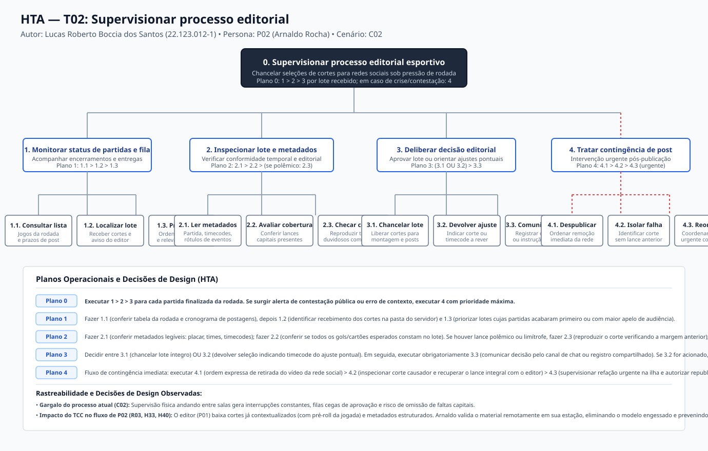
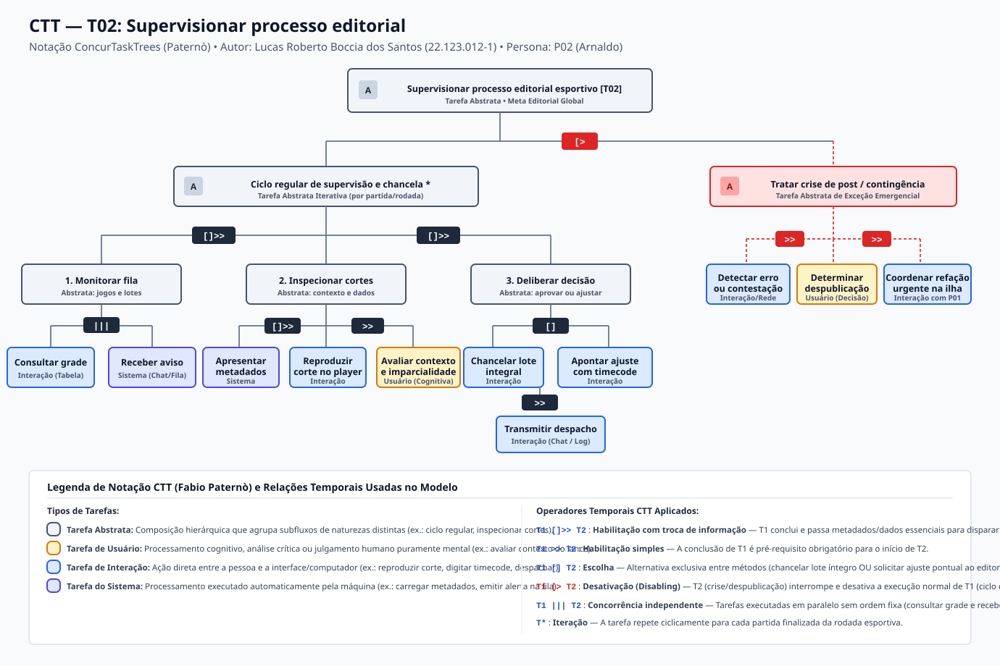

# Entrega 5 — Análise de tarefas: HTA, GOMS e CTT

**Data:** 07/10/2026  
**Status:** 🟨 em andamento; tarefa T02 (Lucas) concluída nas três técnicas (HTA, GOMS e CTT); tarefas T01 (Pedro) e T03 (Giovanni) aguardam elaboração por seus respectivos autores  
**Responsabilidade:** cada integrante modela pelo menos 1 HTA, 1 GOMS e 1 CTT. As três técnicas abordam a tarefa prioritária de cada membro da equipe, garantindo a cobertura dos três perfis identificados nas entregas anteriores.

---

## Objetivo da atividade

Modelar tarefas importantes sob perspectivas complementares: decomposição hierárquica de objetivos e planos ([HTA — Hierarchical Task Analysis](#hta--t02-supervisionar-processo-editorial)), estrutura cognitiva de metas, operadores, métodos e regras de seleção ([GOMS](#goms--t02-supervisionar-processo-editorial)) e relações temporais e lógicas entre tarefas de usuário, sistema e interação ([CTT — ConcurTaskTrees](#ctt--t02-supervisionar-processo-editorial)). Os diagramas são acompanhados de fundamentação conceitual, interpretação textual e rastreabilidade direta com os artefatos anteriores do projeto.

---

## Para projetos cujo TCC não previa interface

Em conformidade com as diretrizes da disciplina, a modelagem foca nas **tarefas humanas relacionadas ao uso da contribuição técnica**, e não no processamento algorítmico interno dos modelos de visão computacional.

O tema do TCC (*Identificação de Melhores Momentos em Partidas de Futebol Utilizando Sistemas Híbridos de Visão Computacional*, [Entrega 1, seção 0.2](01_conhecendo_o_problema.md#02-qual-é-o-tema-do-trabalho)) tem como saída computacional a detecção automatizada de eventos esportivos e a geração de cortes acompanhados de metadados ([RASTREABILIDADE.md, seção 1](../RASTREABILIDADE.md#1-derivação-do-escopo-de-ihc-a-partir-do-tcc)). As tarefas humanas analisadas descrevem:

- como o editor de vídeo esportivo submete vídeos brutos, gerencia a fila e revisa a pertinência dos trechos candidatos antes de baixá-los (T01);
- como o supervisor editorial / editor-chefe recebe, inspeciona e chancela esses resultados para publicação nas redes sociais da emissora, validando o contexto temporal dos lances capitais sob forte pressão de prazo (T02);
- como o criador amador decupa e compila lances específicos por jogador em estações de capacidade restrita (T03).

A análise não modela funções internas da rede neural ou etapas do pipeline de inferência, mas a **tomada de decisão, a inspeção de contexto, o fluxo de aprovação e o tratamento de contingências humanas**.

---

## Seleção das tarefas

A tabela abaixo consolida as tarefas prioritárias identificadas a partir dos cenários de problema ([Entrega 4](04_cenarios_problema.md)) e das necessidades registradas na matriz de rastreabilidade ([RASTREABILIDADE.md, seção 3](../RASTREABILIDADE.md#3-rastreabilidade-entre-contribuição-técnica-necessidades-e-artefatos)):

| ID | Tarefa | Persona / cenário de origem | Frequência / criticidade | Autor responsável | Status na entrega |
|---|---|---|---|---|---|
| **T01** | Localizar, selecionar e revisar lances de melhores momentos | [P01, Rafael](03_personas_contexto_jornada.md#persona-p01--rafael) / [C01](04_cenarios_problema.md#cenário-c01--seleção-manual-de-melhores-momentos-sob-pressão-de-prazo) | Alta frequência diária; alta criticidade (omissões involuntárias geram retrabalho na pós-produção) | Pedro Custódio — 22.123.016-2 | ⬜ Aguarda autor |
| **T02** | Supervisionar processo editorial e chancelar cortes esportivos | [P02, Arnaldo](03_personas_contexto_jornada.md#persona-p02--arnaldo) / [C02](04_cenarios_problema.md#cenário-c02--controle-do-processo-editorial-engessado) | Alta frequência em dias de rodada; altíssima criticidade editorial (portão final de controle antes do ar; risco de dano à reputação da emissora) | Lucas Roberto Boccia dos Santos — 22.123.012-1 | 🟩 Concluída (HTA, GOMS e CTT) |
| **T03** || [P03, Jorginho Jr.](03_personas_contexto_jornada.md#persona-p03--jorginho-jr) / [C03](04_cenarios_problema.md#cenário-c03--decupagem-manual-de-lances-por-jogador-sob-restrições-de-hardware) | | Giovanni Chahin Morassi — 22.123.025-3 | ⬜ Aguarda autor |

### Justificativa da prioridade de T02 (Supervisão Editorial)

A tarefa **T02 — Supervisionar processo editorial e chancelar cortes esportivos** foi priorizada para modelagem integral por Lucas Roberto por constituir o elo central de governança e qualidade entre a extração automatizada de cortes e o consumo público do conteúdo:

1. **Criticidade e risco editorial:** Arnaldo Rocha (P02, 46 anos, editor-chefe) responde legal e institucionalmente por todo o conteúdo que vai ao ar nas plataformas digitais da emissora. Um corte que isole o gol sem exibir a falta polêmica antecedente compromete a reputação de imparcialidade do canal, provocando contestação da audiência e crise com a diretoria ([C02](04_cenarios_problema.md#cenário-c02--controle-do-processo-editorial-engessado), [H10](../RASTREABILIDADE.md#2-registro-de-hipóteses-e-lacunas-da-entrega-1) e [H14](../RASTREABILIDADE.md#2-registro-de-hipóteses-e-lacunas-da-entrega-1)).
2. **Pressão temporal e paralelismo:** Em dias de rodada de futebol com múltiplos jogos simultâneos, os apitos finais ocorrem quase ao mesmo tempo, gerando uma fila concorrente de lotes de cortes entregues por diferentes editores. A supervisão precisa ser rápida sem incorrer em "aprovações às cegas" ([H22](../RASTREABILIDADE.md#2-registro-de-hipóteses-e-lacunas-da-entrega-1), [H23](../RASTREABILIDADE.md#2-registro-de-hipóteses-e-lacunas-da-entrega-1) e [H33](../RASTREABILIDADE.md#21-hipóteses-acrescentadas-na-entrega-3)).
3. **Consumo qualificado da contribuição do TCC:** Embora P02 atue formalmente como persona atendida fora da interface direta do produto ([H33](../RASTREABILIDADE.md#21-hipóteses-acrescentadas-na-entrega-3) e [R03](../RASTREABILIDADE.md#3-rastreabilidade-entre-contribuição-técnica-necessidades-e-artefatos)), seu trabalho depende criticamente de os cortes baixados pelo editor (atividade A04) virem acompanhados de metadados legíveis (timecode estruturado, identificação da partida e margem temporal pré/pós-lance). Isso viabiliza a inspeção contextualizada e elimina o modelo presencial engessado de circular fisicamente entre as bancadas ([H40](../RASTREABILIDADE.md#21-hipóteses-acrescentadas-na-entrega-3) e [H41](../RASTREABILIDADE.md#21-hipóteses-acrescentadas-na-entrega-3)).

---

## HTA — T02: Supervisionar processo editorial

**Autor(a):** Lucas Roberto Boccia dos Santos — 22.123.012-1  
**Persona relacionada:** [P02, Arnaldo Rocha](03_personas_contexto_jornada.md#persona-p02--arnaldo) (Editor-Chefe / Supervisor de Mídias Digitais)  
**Cenário de origem:** [Cenário C02 — Controle do Processo Editorial Engessado](04_cenarios_problema.md#cenário-c02--controle-do-processo-editorial-engessado)  
**Relação na rastreabilidade:** [R03](../RASTREABILIDADE.md#3-rastreabilidade-entre-contribuição-técnica-necessidades-e-artefatos)  
**Hipóteses relacionadas:** [H10](../RASTREABILIDADE.md#2-registro-de-hipóteses-e-lacunas-da-entrega-1), [H14](../RASTREABILIDADE.md#2-registro-de-hipóteses-e-lacunas-da-entrega-1), [H16](../RASTREABILIDADE.md#2-registro-de-hipóteses-e-lacunas-da-entrega-1), [H22](../RASTREABILIDADE.md#2-registro-de-hipóteses-e-lacunas-da-entrega-1), [H23](../RASTREABILIDADE.md#2-registro-de-hipóteses-e-lacunas-da-entrega-1), [H25](../RASTREABILIDADE.md#2-registro-de-hipóteses-e-lacunas-da-entrega-1), [H33](../RASTREABILIDADE.md#21-hipóteses-acrescentadas-na-entrega-3), [H34](../RASTREABILIDADE.md#21-hipóteses-acrescentadas-na-entrega-3), [H35](../RASTREABILIDADE.md#21-hipóteses-acrescentadas-na-entrega-3), [H40](../RASTREABILIDADE.md#21-hipóteses-acrescentadas-na-entrega-3) e [H41](../RASTREABILIDADE.md#21-hipóteses-acrescentadas-na-entrega-3)

### Descrição da tarefa

- **Objetivo central:** Assegurar que os cortes de melhores momentos esportivos gerados e selecionados atendam rigorosamente aos critérios de integridade, imparcialidade e qualidade jornalística da emissora, contendo o contexto temporal necessário antes de serem chancelados para montagem final e distribuição nas redes sociais.
- **Ponto de início:** Disponibilização de um lote de cortes e metadados estruturados pelo editor (P01) em pasta compartilhada da rede com aviso no chat corporativo ([H40](../RASTREABILIDADE.md#21-hipóteses-acrescentadas-na-entrega-3)), ou chamada direta do editor diante de dúvida de arbitragem.
- **Conclusão esperada:** Emissão e registro da deliberação editorial de chancela (aprovação integral liberando o lote para publicação imediata) ou devolução com solicitação pontual de ajuste referenciada por timecode; em regime excepcional, despublicação de emergência e supervisão da reedição imediata.
- **Contexto operacional:** Redação da emissora esportiva em dia de rodada intensa, com quatro a seis jogos terminando em horários próximos, equipes sob pressão severa por velocidade de publicação e alto risco de ruído comunicacional ([C02](04_cenarios_problema.md#cenário-c02--controle-do-processo-editorial-engessado)).

### Diagrama HTA

*Figura 1 — Diagrama de Análise Hierárquica de Tarefas (HTA) da tarefa T02: Supervisionar processo editorial esportivo. Autor: Lucas Roberto Boccia dos Santos. Arquivo vetorial editável em [assets/05_tarefas/hta_t02.svg](../assets/05_tarefas/hta_t02.svg).*

### Decomposição e planos

| ID | Objetivo / Operação | Plano / Ordem | Problema ou decisão de design observada |
|---|---|---|---|
| **0** | **Supervisionar processo editorial esportivo e chancelar cortes** | **Plano 0:** Executar 1 > 2 > 3 para cada lote de partida recebido. Se ocorrer alerta de contestação pública pós-publicação, executar 4 imediatamente em caráter prioritário. | No modelo presencial puramente físico (C02), o supervisor divide atenção de forma caótica; a estruturação de lotes permite acompanhamento sistemático por jogo. |
| **1** | **Monitorar status de partidas e fila de entregas dos editores** | **Plano 1:** Executar 1.1 > 1.2 > 1.3 continuamente ao longo do turno da rodada esportiva. | Editores terminam jogos simultaneamente; sem visibilidade da fila, criam-se gargalos de aprovação e chamados simultâneos (H40, H41). |
| 1.1 | Consultar cronograma de jogos da rodada e prazos de publicação | — | Falta de quadro integrado faz o supervisor depender de anotações manuais em prancheta de papel (C02). |
| 1.2 | Localizar e identificar lotes de cortes disponibilizados | — | Cortes sem identificação padronizada geram perda de tempo e risco de troca de arquivos de partidas distintas (H25, RC09). |
| 1.3 | Priorizar lote a inspecionar por urgência de rede e relevância | — | Jogos com finais apertados ou polêmicos exigem liberação prioritária para capturar o pico de engajamento da audiência. |
| **2** | **Inspecionar lote de cortes e metadados recebidos** | **Plano 2:** Executar 2.1 > 2.2; se houver lance duvidoso, polêmico ou gol contestado, executar 2.3; caso contrário, avançar para 3. | Assistir a 90 minutos de jogo é inviável para o editor-chefe; os metadados do TCC devem resumir a jogada para viabilizar inspeção rápida (H22, H33). |
| 2.1 | Verificar metadados de identificação (partida, placar, timecodes) | — | O supervisor precisa conferir se os nomes dos times e a minutagem oficial batem antes de validar o conteúdo em vídeo (H19, H25). |
| 2.2 | Avaliar cobertura editorial mínima (gols, cartões e faltas capitais) | — | Omissões involuntárias pelo cansaço do editor (H01, H09, H10) precisam ser detectadas antes da liberação pública. |
| 2.3 | Inspecionar integridade e contexto temporal dos lances polêmicos | — | **Decisão crítica:** O corte gerado pelo TCC deve conter margem pré-lance (5 a 10s antes do gol) para checar se houve falta ou impedimento na jogada (C02, H10, R03). |
| **3** | **Deliberar e registrar decisão editorial sobre a seleção** | **Plano 3:** Executar (3.1 OU 3.2) > 3.3. Se 3.2 for escolhido, aguardar reenvio do corte corrigido pelo editor e retornar ao Plano 2. | Aprovações puramente verbais sem registro formal geram desentendimentos sobre quem autorizou lances que geraram crises (H35). |
| 3.1 | Chancelar lote integralmente para montagem final e redes sociais | — | Libera o material para o fluxo de pós-produção externa sem novos entraves burocráticos (H23, H33). |
| 3.2 | Devolver seleção com apontamento de revisão pontual | — | Apontar objetivamente o timecode e a falha (ex.: "falta faltante no lance das 17:34") evita refações completas e desperdício de tempo. |
| 3.3 | Comunicar decisão ao editor responsável via canal corporativo | — | Registro no chat corporativo/sistema reduz a necessidade de deslocamento físico até a estação de edição (H40). |
| **4** | **Conduzir contingência e intervenção emergencial pós-publicação** | **Plano 4:** Em regime de urgência máxima, suspender atividades de rotina e executar 4.1 > 4.2 > 4.3 sequencialmente. | Quando um corte incompleto vai ao ar por aprovação às pressas, a crise institucional exige interrupção de outras tarefas (C02, H14, H16). |
| 4.1 | Ordenar despublicação imediata de conteúdo contestado na rede | — | Mitigar danos de imagem da emissora e evitar propagação de acusações de parcialidade por torcedores nas redes (C02). |
| 4.2 | Localizar corte original causador do erro e isolar falha de contexto | — | Diagnosticar com exatidão se o corte omitiu o antecedente da jogada ou se foi equívoco na minutagem do editor (H10, H16). |
| 4.3 | Coordenar refação urgente com o editor e aprovar versão corrigida | — | Retrabalho sob alta pressão; exige supervisão presencial direta ao lado da bancada do editor para republicação rápida (C02, H41). |

### Verificação do HTA

1. **O objetivo 0 representa uma meta do usuário?**  
   Sim. O objetivo `0. Supervisionar processo editorial esportivo e chancelar cortes` representa a meta essencial do cargo de Arnaldo Rocha no mundo real: garantir que nenhum vídeo vá a público sem conformidade com a linha editorial da emissora. Não descreve operações mecânicas de software nem rotinas do algoritmo, mas a responsabilidade humana substantiva do profissional.
2. **As subtarefas são necessárias e suficientes?**  
   Sim. As subtarefas 1 a 3 cobrem o ciclo regular de supervisão (receber/monitorar -> checar dados e contexto -> deliberar e chancelar), enquanto a subtarefa 4 cobre o fluxo indispensável de contingência documentado no cenário C02 (resposta a erros e crises de postagem). O conjunto é suficiente para esgotar o escopo da atividade.
3. **Os planos indicam ordem, alternativa, repetição ou condição?**  
   Sim. Os planos detalham:
   - Ordem estrita (`1 > 2 > 3` e `1.1 > 1.2 > 1.3`);
   - Condição (`se houver lance polêmico, executar 2.3; senão avançar para 3`);
   - Alternativa exclusiva (`3.1 OU 3.2`, seguido obrigatoriamente de `3.3`);
   - Repetição/ciclo (`retornar ao Plano 2 após correção em 3.2`);
   - Prioridade / interrupção de emergência (Plano 4 executado imediatamente mediante crise de publicação).
4. **A decomposição parou em nível útil para o projeto de interação?**  
   Sim. A decomposição atinge o nível de verificação de metadados, inspeção de pré-roll temporal de cortes e despacho comunicativo. Não desce ao nível de teclas individuais ou cliques mecânicos (que cabem à notação de operadores do GOMS), mantendo relevância semiótica e analítica para o projeto de IHC.

---

## GOMS — T02: Supervisionar processo editorial

**Autor(a):** Lucas Roberto Boccia dos Santos — 22.123.012-1  
**Abordagem adotada:** CMN-GOMS (Card, Moran e Newell, 1983) com operadores em nível funcional-cognitivo adaptados à análise de tomada de decisão sob pressão de tempo e consumo de metadados.

### Goals (Estrutura de Metas)

- `GOAL 0: SUPERVISIONAR-PROCESSO-EDITORIAL-E-CHANCELAR-CORTES`
  - `GOAL 1: OBTER-E-PRIORIZAR-LOTE-DA-FILA`
  - `GOAL 2: INSPECIONAR-CONFORMIDADE-E-CONTEXTO-DOS-LANCES`
  - `GOAL 3: EMITIR-E-REGISTRAR-DELIBERACAO-EDITORIAL`
  - `GOAL 4: CONDUZIR-CONTINGENCIA-DE-DESPUBLICACAO [CONDICIONAL]`

---

### Métodos, Operadores e Regras de Seleção

#### Métodos

- **Method M1: Inspeção estruturada e assíncrona baseada em metadados externos (Método principal de uso proposto)**
  - Operator: *Perceber* notificação de entrega do editor no chat corporativo
  - Operator: *Apontar* cursor para o link da pasta de rede compartilhada
  - Operator: *Clicar* para abrir o lote de cortes da partida
  - Operator: *Perceber* metadados consolidados (identificação da partida, placar e tabela de timecodes)
  - Operator: *Verificar* mentalmente se todos os lances capitais (gols e cartões) constam no índice
  - Operator: *Decidir* quais lances exigem conferência visual de contexto (ex.: lances de gol com reclamação)
  - Operator: *Apontar* cursor para o arquivo de vídeo do lance duvidoso
  - Operator: *Clicar* duas vezes para iniciar reprodução no player
  - Operator: *Perceber* construção da jogada nos segundos anteriores ao lance (margem pré-roll)
  - Operator: *Decidir* se o corte preservou o contexto fático (ex.: falta anterior que gerou reclamação)
  - Operator: *Fechar* janela do player de visualização
  - Operator: *Decidir* deliberação editorial (chancela total ou solicitação de ajuste)

- **Method M2: Inspeção presencial síncrona na bancada de edição (Método atual / Fallback de dúvida complexa)**
  - Operator: *Perceber* chamado verbal ou interrupção presencial do editor com dúvida sobre lance polêmico
  - Operator: *Mover-se* fisicamente da mesa de supervisão até a ilha de edição do profissional
  - Operator: *Perceber* linha do tempo do software NLE (Premiere/Resolve) na tela do editor
  - Operator: *Apontar* com o dedo na tela indicando o trecho sob dúvida de interpretação de arbitragem
  - Operator: *Decidir* verbalmente se o corte deve ser mantido, descartado ou alargado temporalmente
  - Operator: *Anotar* manualmente na prancheta/bloco de papel o status daquela partida
  - Operator: *Mover-se* de volta para a bancada de supervisão

- **Method M3: Intervenção corretiva de crise / Contingência pós-publicação**
  - Operator: *Perceber* alerta urgente da diretoria ou menções de contestação da audiência em redes sociais
  - Operator: *Perceber* que o vídeo postado apresenta falha grave de contexto (ex.: gol sem a falta anterior)
  - Operator: *Decidir* despublicação imediata para preservar a imagem da emissora
  - Operator: *Digitar* ordem emergencial de retirada do vídeo no canal corporativo das redes sociais
  - Operator: *Mover-se* até a ilha do editor responsável pela partida
  - Operator: *Apontar* na timeline o ponto exato da falta anterior a ser incorporado ao início do corte
  - Operator: *Verificar* em conjunto o novo recorte com contexto corrigido
  - Operator: *Decidir* autorização verbal de republicação

- **Method M-DELIB-1: Chancelar lote e liberar para publicação (Sub-método de deliberação)**
  - Operator: *Decidir* que o lote cumpre integralmente as diretrizes editoriais
  - Operator: *Apontar* para a janela do chat corporativo / sistema
  - Operator: *Digitar* mensagem padronizada de chancela: `"Partida [X] chancelada — liberada para montagem e redes"`
  - Operator: *Pressionar* tecla Enter para enviar confirmação

- **Method M-DELIB-2: Devolver seleção com apontamento de revisão pontual (Sub-método de deliberação)**
  - Operator: *Decidir* que um lance específico necessita de expansão temporal ou esclarecimento
  - Operator: *Recuperar* timecode exato da jogada nos metadados
  - Operator: *Apontar* para a janela do chat corporativo
  - Operator: *Digitar* instrução corretiva: `"Partida [X]: ajustar corte [Y] no timecode [TC] incluindo 5s anteriores da falta"`
  - Operator: *Pressionar* tecla Enter para notificar o editor

---

#### Operadores

Os operadores empregados na modelagem GOMS contemplam as seguintes categorias:

| Tipo | Operador | Descrição e uso na tarefa |
|---|---|---|
| **Perceptivo** | *Perceber [estímulo]* | Captação visual ou auditiva de notificações de entrega, avisos de crise, listas de metadados ou trechos em reprodução no player. |
| **Físico / Motor** | *Apontar [alvo]* | Deslocamento do cursor do mouse em direção a links, botões, arquivos de vídeo ou janelas. |
| **Físico / Motor** | *Clicar [alvo]* | Acionamento físico do botão do mouse para seleção de arquivo ou abertura de mídia. |
| **Físico / Motor** | *Digitar [texto]* | Inserção de caracteres de texto via teclado (redação de despacho de chancela ou ordem de despublicação). |
| **Físico / Motor** | *Pressionar [tecla]* | Acionamento de teclas de atalho ou envio (ex.: Enter, espaço para pausar). |
| **Físico / Deslocamento** | *Mover-se [destino]* | Deslocamento corporal do supervisor entre a bancada central e as ilhas de edição na redação. |
| **Cognitivo / Mental** | *Decidir [questão]* | Julgamento editorial complexo envolvendo conformidade de lance, pertinência de corte, risco institucional ou aprovação. |
| **Cognitivo / Mental** | *Verificar [critério]* | Conferência mental entre a lista de lances apresentada e os gols/cartões esperados na súmula da partida. |
| **Cognitivo / Mental** | *Recuperar [informação]* | Resgate de conhecimento prévio da memória de longo prazo (linha editorial da emissora, regras de arbitragem ou timecodes). |

---

#### Selection Rules (Regras de Seleção)

- **Selection Rule SR1 (Seleção do Método de Inspeção do Lote):**
  - **SE** o editor disponibilizou o lote com metadados estruturados (nomes legíveis, timecodes e identificação clara da partida gerados pelo fluxo do TCC), **ENTÃO usar Method M1** (*Inspeção estruturada assíncrona na mesa de supervisão*).
  - **SE** o editor sinalizou impasse editorial crítico não resolvido antes de exportar ou houve pane na rede compartilhada, **ENTÃO usar Method M2** (*Inspeção presencial síncrona na ilha de edição*).

- **Selection Rule SR2 (Seleção da Decisão Editorial):**
  - **SE** todos os lances capitais estiverem presentes com contexto temporal suficiente (construção fática da jogada preservada), **ENTÃO usar Method M-DELIB-1** (*Chancelar lote e liberar para publicação*).
  - **SE** houver omissão de lance importante ou corte truncado que deixe margem a dúvidas interpretativas, **ENTÃO usar Method M-DELIB-2** (*Devolver seleção com apontamento pontual*).

- **Selection Rule SR3 (Acionamento de Contingência Emergencial):**
  - **SE** for detectada repercussão pública negativa decorrente de vídeo publicado sem contexto (ou chamado urgente da direção), **ENTÃO interromper imediatamente qualquer outro método e usar Method M3** (*Intervenção corretiva de contingência*).

---

## CTT — T02: Supervisionar processo editorial

**Autor(a):** Lucas Roberto Boccia dos Santos — 22.123.012-1  
**Abordagem adotada:** Notação ConcurTaskTrees (Fabio Paternò, 1999), representando estruturação hierárquica e relações lógicas e temporais entre tarefas abstratas, de usuário, de sistema e de interação.

### Descrição do modelo CTT

A modelagem CTT expressa as dinâmicas temporais e concorrências que caracterizam a rotina editorial esportiva. A raiz do modelo é a tarefa abstrata `Supervisionar processo editorial esportivo [T02]`.

O fluxo divide-se em duas grandes ramificações unidas pelo operador de desativação (`[>`):

1. **Ciclo regular de supervisão e chancela (Iterativo `*`):** Executado ciclicamente para cada partida finalizada da rodada. Subdivide-se em três fases concatenadas pelo operador de habilitação com passagem de informação (`[]>>`):
   - `Monitorar fila de entregas`: O supervisor executa em concorrência (`|||`) a consulta à grade de jogos e o recebimento de avisos de conclusão de processamento emitidos pelo sistema, habilitando (`>>`) a seleção do lote prioritário;
   - `Inspecionar lote de cortes e metadados`: O sistema carrega os metadados e arquivos (`[]>>`), o supervisor inspeciona interativamente os timecodes (`>>`) e realiza o julgamento cognitivo humano da pertinência e do contexto fático do lance (`Tarefa de Usuário`);
   - `Deliberar decisão editorial`: O supervisor escolhe (`[]`) entre chancelar o lote íntegro ou apontar ajustes com timecode, o que habilita (`>>`) a transmissão formal do despacho no chat corporativo.
2. **Tratar crise de publicação / Contingência:** Representa a ruptura do fluxo de rotina provocada por eventos externos (postagem truncada ou contestação da audiência). Ao ser disparada, essa sequência desativa (`[>`) a rotina em andamento, forçando a despublicação emergencial, isolamento da falha e refação em tempo recorde.

### Diagrama CTT

*Figura 2 — Diagrama ConcurTaskTrees (CTT) da tarefa T02: Supervisionar processo editorial esportivo. Autor: Lucas Roberto Boccia dos Santos. Notação de Paternò. Arquivo vetorial editável em [assets/05_tarefas/ctt_t02.svg](../assets/05_tarefas/ctt_t02.svg).*

---

### Legenda e relações temporais usadas

| Operador / Relação CTT | Notação formal | Significado no modelo | Exemplo concreto na tarefa T02 |
|---|---|---|---|
| **Habilitação com troca de dados** | `T1 []>> T2` | T1 conclui com sucesso e transfere dados/informações necessárias para a execução de T2. | A inspeção de metadados (`T1`) gera o lote avaliado e o timecode específico que alimenta a deliberação editorial (`T2`). |
| **Habilitação simples** | `T1 >> T2` | A conclusão integral de T1 é pré-requisito indispensável para que T2 possa ser iniciada. | A seleção do lote de cortes habilita o carregamento dos metadados e arquivos de vídeo no visualizador. |
| **Escolha (Choice)** | `T1 [] T2` | Alternativa mutuamente exclusiva entre duas ações concorrentes; a escolha de uma impede a outra naquele ciclo. | O editor-chefe pode *Chancelar lote integralmente* (`T1`) **OU** *Apontar ajuste pontual com timecode* (`T2`). |
| **Desativação (Disabling)** | `T1 [> T2` | A ocorrência ou início da tarefa T2 encerra/interrompe abruptamente a execução de T1. | Uma contestação de post nas redes sociais ou chamado da diretoria (`T2`) interrompe e desativa a inspeção de rotina (`T1`). |
| **Concorrência independente** | `T1 ||| T2` | Tarefas executadas em paralelo de maneira intercalada ou simultânea, sem ordem pré-definida. | O supervisor consulta a grade de partidas na tela (`T1`) enquanto recebe notificações de lotes finalizados no chat (`T2`). |
| **Iteração** | `T*` | A tarefa repete ciclicamente até que uma condição de término da atividade seja atingida. | O ciclo de supervisão e chancela é repetido iterativamente para cada partida encerrada na rodada de futebol. |

---

### Tipos de tarefas na taxonomia CTT

A modelagem categoriza rigorosamente a natureza de cada nó segundo a taxonomia de Paternò:

| Ícone / Tipo CTT | Natureza da tarefa | Ocorrência no modelo T02 | Justificativa conceitual |
|---|---|---|---|
| **Tarefa Abstrata (Abstract)** | Agrupamento hierárquico conceitual | `Supervisionar processo editorial`, `Ciclo regular`, `Monitorar fila`, `Inspecionar cortes`, `Tratar crise` | Representa nós que não são realizados diretamente em uma única ação, mas agregam subtarefas de naturezas distintas. |
| **Tarefa de Usuário (User)** | Processamento exclusivamente mental / cognitivo humano | `Avaliar contexto e imparcialidade`, `Determinar despublicação emergencial` | Decisão baseada na linha editorial e no conhecimento de regras esportivas, realizada sem intervenção do computador. |
| **Tarefa de Interação (Interaction)** | Diálogo bidirecional entre pessoa e sistema | `Consultar grade`, `Reproduzir corte no player`, `Chancelar lote`, `Transmitir despacho`, `Detectar erro na rede` | Ações em que a pessoa fornece entradas e recebe respostas diretamente em telas de software (chat, visualizador ou sistema). |
| **Tarefa do Sistema (System)** | Execução totalmente automatizada pela máquina | `Receber aviso de lote concluído`, `Apresentar metadados estruturados e timecodes` | Operações realizadas pelo sistema computacional sem exigência de ação motora imediata do usuário no momento do disparo. |

---

## Síntese da equipe e implicações para o projeto

A modelagem de **T02 — Supervisionar processo editorial** sob as três perspectivas complementares (HTA, GOMS e CTT) trouxe aprendizados fundamentais que conectam o escopo de IHC à contribuição técnica do TCC:

1. **Eliminação do modelo presencial engessado:** A decomposição HTA evidenciou que a maior fonte de ineficiência e estresse no modelo atual (narrado no cenário C02) reside na necessidade de Arnaldo circular fisicamente entre as bancadas de edição e consultar pranchetas manuais. A geração de metadados legíveis pelo TCC permite que o editor-chefe faça a inspeção estruturada em sua própria estação, preservando sua concentração e reduzindo interrupções no trabalho dos editores.
2. **Importância crítica da margem temporal (pré-roll):** O método GOMS M1 e a tarefa de usuário no CTT comprovaram que um corte esportivo isolado apenas na finalização é inútil para a supervisão editorial. Se o gol não incluir de 5 a 10 segundos da jogada anterior (para atestar ausência de falta ou impedimento), o editor-chefe não pode chancelar o material com segurança. Isso define um requisito direto para a parametrização do gerador de cortes do TCC: a preservação de margem de contexto temporal é requisito de usabilidade e integridade jornalística, e não mero detalhe técnico.
3. **Tratamento de exceções e contingências:** Tanto o plano 4 do HTA quanto o operador `[>` no CTT formalizam que a interface e o fluxo de trabalho devem prever despublicação e contingência. Mesmo com alta automação, falhas pontuais de interpretação podem ocorrer; o fluxo deve permitir localizar rapidamente o corte e seu timecode na gravação integral para viabilizar refação imediata sem desespero.
4. **Alinhamento com o protótipo e teste de usabilidade:** No recorte de IHC adotado ([RASTREABILIDADE.md, seção 1](../RASTREABILIDADE.md#1-derivação-do-escopo-de-ihc-a-partir-do-tcc)), P02 permanece formalmente como persona atendida sem tela privativa de administração. No entanto, o protótipo da interface de Rafael (P01) deve projetar a tela de revisão e download de forma que os metadados baixados (títulos, timecodes, rótulos de eventos) sejam diretamente consumíveis por Arnaldo no chat corporativo e nas pastas compartilhadas, garantindo que o teste de usabilidade avalie se o editor consegue extrair essas informações com clareza imediata.

---

## Checklist da Entrega 5

- [x] Cada integrante possui tarefa associada na tabela de seleção (T01: Pedro, T02: Lucas, T03: Giovanni).
- [x] Cada artefato identifica autor e tarefa (T02 modelada integralmente por Lucas Roberto Boccia dos Santos — 22.123.012-1).
- [x] Diagramas são legíveis, possuem padrão visual profissional e arquivos vetoriais SVG editáveis preservados em `assets/05_tarefas/` (`hta_t02.svg` e `ctt_t02.svg`).
- [x] HTA contém planos operacionais explícitos (Planos 0, 1, 2, 3 e 4), indicando ordem, condição, alternativa, repetição e critério de parada, e não apenas lista de tópicos.
- [x] GOMS distingue rigorosamente Goals, Operators (perceptivos, motores e cognitivos), Methods e Selection Rules fundamentadas.
- [x] CTT usa a taxonomia de Paternò com tipos de tarefas corretos (Abstrata, Usuário, Interação e Sistema) e operadores temporais formais (`>>`, `[]>>`, `[]`, `[>`, `|||`, `*`).
- [x] Há texto detalhado explicando e interpretando cada diagrama.
- [x] As tarefas estão estritamente vinculadas às personas (P02), cenários (C02) e hipóteses (H10, H14, H22, H23, H33, H40, H41) na matriz de rastreabilidade.
- [x] As tarefas descrevem o que a pessoa humana faz no mundo real com o resultado da contribuição técnica, evitando modelar passos internos do algoritmo de visão computacional.
- [x] Síntese da equipe explicita como os achados da modelagem impactam os requisitos, o protótipo e o futuro teste de usabilidade.

---

## Histórico de revisões

| Data | Versão | Descrição da alteração | Autor(es) |
|---|---|---|---|
| 29/09/2026 | 0.1 | Criação do esqueleto base da Entrega 5 a partir do template da disciplina. | Equipe 16 |
| 07/10/2026 | 1.0 | Elaboração completa da tarefa T02 (*Supervisionar processo editorial*): contextualização no escopo do TCC, tabela de seleção de tarefas, modelagem HTA com planos 0 a 4 e decisões de design, modelagem CMN-GOMS com métodos e regras de seleção, modelagem CTT com operadores formais e tipos de tarefas de Paternò, síntese de requisitos e criação dos diagramas vetoriais `hta_t02.svg` e `ctt_t02.svg`. T01 e T03 permanecem engatilhadas para seus respectivos autores. | Lucas Roberto Boccia dos Santos |
