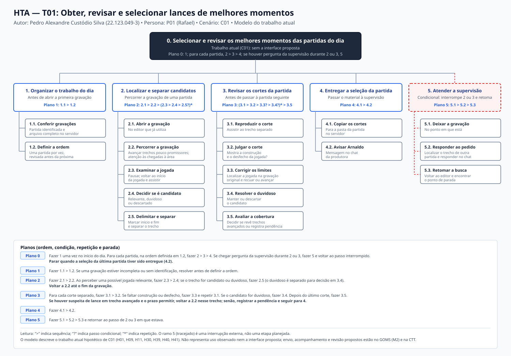
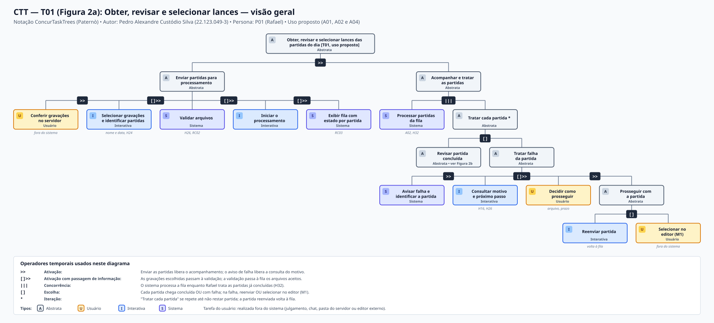

# Entrega 5 — Análise de tarefas: HTA, GOMS e CTT

**Data:** 08/10/2026  
**Status:** 🟨 em andamento; tarefas T01 (Pedro) e T02 (Lucas) concluídas nas três técnicas (HTA, GOMS e CTT); tarefa T03 (Giovanni) aguarda elaboração por seu autor  
**Responsabilidade:** cada integrante modela pelo menos 1 HTA, 1 GOMS e 1 CTT. As três técnicas abordam a tarefa prioritária de cada membro da equipe, garantindo a cobertura dos três perfis identificados nas entregas anteriores.

---

## Objetivo da atividade

Modelar tarefas importantes sob perspectivas complementares: decomposição hierárquica de objetivos e planos ([HTA — Hierarchical Task Analysis](#hta--t02-supervisionar-processo-editorial)), estrutura cognitiva de metas, operadores, métodos e regras de seleção ([GOMS](#goms--t02-supervisionar-processo-editorial)) e relações temporais e lógicas entre tarefas de usuário, sistema e interação ([CTT — ConcurTaskTrees](#ctt--t02-supervisionar-processo-editorial)). Os diagramas são acompanhados de fundamentação conceitual, interpretação textual e rastreabilidade direta com os artefatos anteriores do projeto.

---

## Para projetos cujo TCC não previa interface

Em conformidade com as diretrizes da disciplina, a modelagem foca nas **tarefas humanas relacionadas ao uso da contribuição técnica**, e não no processamento algorítmico interno dos modelos de visão computacional.

O tema do TCC (*Identificação de Melhores Momentos em Partidas de Futebol Utilizando Sistemas Híbridos de Visão Computacional*, [Entrega 1, seção 0.2](01_conhecendo_o_problema.md#02-qual-é-o-tema-do-trabalho)) tem como saída computacional a detecção automatizada de eventos esportivos e a geração de cortes acompanhados de metadados ([RASTREABILIDADE.md, seção 1](../RASTREABILIDADE.md#1-derivação-do-escopo-de-ihc-a-partir-do-tcc)). As tarefas humanas analisadas descrevem:

- como o editor de vídeo esportivo submete vídeos brutos, gerencia a fila e revisa a pertinência dos trechos candidatos antes de baixá-los (T01);
- como o supervisor editorial / editor-chefe recebe, inspeciona e chancela esses resultados para publicação nas redes sociais da emissora, validando o contexto temporal dos lances capitais sob forte pressão de prazo (T02);
- como o criador amador decupa e compila lances específicos por jogador em estações de capacidade restrita (T03).

A análise não modela funções internas da rede neural ou etapas do pipeline de inferência, mas a **tomada de decisão, a inspeção de contexto, o fluxo de aprovação e o tratamento de contingências humanas**.

---

## Seleção das tarefas

A tabela abaixo consolida as tarefas prioritárias identificadas a partir dos cenários de problema ([Entrega 4](04_cenarios_problema.md)) e das necessidades registradas na matriz de rastreabilidade ([RASTREABILIDADE.md, seção 3](../RASTREABILIDADE.md#3-rastreabilidade-entre-contribuição-técnica-necessidades-e-artefatos)):

| ID | Tarefa | Persona / cenário de origem | Frequência / criticidade | Autor responsável | Status na entrega |
|---|---|---|---|---|---|
| **T01** | Localizar, selecionar e revisar lances de melhores momentos | [P01, Rafael](03_personas_contexto_jornada.md#persona-p01--rafael) / [C01](04_cenarios_problema.md#cenário-c01--seleção-manual-de-melhores-momentos-sob-pressão-de-prazo) | Alta frequência diária; alta criticidade (omissões involuntárias geram retrabalho na pós-produção) | Pedro Alexandre Custódio Silva — 22.123.049-3 | 🟩 Concluída (HTA, GOMS e CTT) |
| **T02** | Supervisionar processo editorial e chancelar cortes esportivos | [P02, Arnaldo](03_personas_contexto_jornada.md#persona-p02--arnaldo) / [C02](04_cenarios_problema.md#cenário-c02--controle-do-processo-editorial-engessado) | Alta frequência em dias de rodada; altíssima criticidade editorial (portão final de controle antes do ar; risco de dano à reputação da emissora) | Lucas Roberto Boccia dos Santos — 22.123.012-1 | 🟩 Concluída (HTA, GOMS e CTT) |
| **T03** || [P03, Jorginho Jr.](03_personas_contexto_jornada.md#persona-p03--jorginho-jr) / [C03](04_cenarios_problema.md#cenário-c03--decupagem-manual-de-lances-por-jogador-sob-restrições-de-hardware) | | Giovanni Chahin Morassi — 22.123.025-3 | ⬜ Aguarda autor |

### Justificativa da prioridade de T01 (Seleção e revisão de lances)

A tarefa **T01 — Localizar, selecionar e revisar lances de melhores momentos** é a origem indicada pelo [cenário C01, seção 5](04_cenarios_problema.md#5-implicações-para-as-próximas-entregas) e corresponde ao objetivo central do recorte de IHC ([H28](../RASTREABILIDADE.md#2-registro-de-hipóteses-e-lacunas-da-entrega-1)). Foi escolhida por três motivos:

1. **É onde a contribuição do TCC atua.** A identificação automática de melhores momentos substitui, no uso proposto, justamente a busca manual na gravação ([R01](../RASTREABILIDADE.md#3-rastreabilidade-entre-contribuição-técnica-necessidades-e-artefatos)). Modelar a tarefa permite ver o que essa substituição muda e o que continua com o editor.
2. **Repete-se várias vezes no mesmo dia.** Rafael trata de quatro a seis partidas por dia de rodada, uma por vez, e o desgaste cresce de uma partida para outra ([H39](../RASTREABILIDADE.md#21-hipóteses-acrescentadas-na-entrega-3) e [H09](../RASTREABILIDADE.md#2-registro-de-hipóteses-e-lacunas-da-entrega-1)). Pequenas diferenças de esforço por partida se acumulam.
3. **A seleção alimenta a decisão de outra pessoa.** O que Rafael entrega é o material que Arnaldo inspeciona em T02 ([H40](../RASTREABILIDADE.md#21-hipóteses-acrescentadas-na-entrega-3)). Omissões e cortes sem construção da jogada em T01 reaparecem como problemas em T02.

### Justificativa da prioridade de T02 (Supervisão Editorial)

A tarefa **T02 — Supervisionar processo editorial e chancelar cortes esportivos** foi priorizada para modelagem integral por Lucas Roberto por constituir o elo central de governança e qualidade entre a extração automatizada de cortes e o consumo público do conteúdo:

1. **Criticidade e risco editorial:** Arnaldo Rocha (P02, 46 anos, editor-chefe) responde legal e institucionalmente por todo o conteúdo que vai ao ar nas plataformas digitais da emissora. Um corte que isole o gol sem exibir a falta polêmica antecedente compromete a reputação de imparcialidade do canal, provocando contestação da audiência e crise com a diretoria ([C02](04_cenarios_problema.md#cenário-c02--controle-do-processo-editorial-engessado), [H10](../RASTREABILIDADE.md#2-registro-de-hipóteses-e-lacunas-da-entrega-1) e [H14](../RASTREABILIDADE.md#2-registro-de-hipóteses-e-lacunas-da-entrega-1)).
2. **Pressão temporal e paralelismo:** Em dias de rodada de futebol com múltiplos jogos simultâneos, os apitos finais ocorrem quase ao mesmo tempo, gerando uma fila concorrente de lotes de cortes entregues por diferentes editores. A supervisão precisa ser rápida sem incorrer em "aprovações às cegas" ([H22](../RASTREABILIDADE.md#2-registro-de-hipóteses-e-lacunas-da-entrega-1), [H23](../RASTREABILIDADE.md#2-registro-de-hipóteses-e-lacunas-da-entrega-1) e [H33](../RASTREABILIDADE.md#21-hipóteses-acrescentadas-na-entrega-3)).
3. **Consumo qualificado da contribuição do TCC:** Embora P02 atue formalmente como persona atendida fora da interface direta do produto ([H33](../RASTREABILIDADE.md#21-hipóteses-acrescentadas-na-entrega-3) e [R03](../RASTREABILIDADE.md#3-rastreabilidade-entre-contribuição-técnica-necessidades-e-artefatos)), seu trabalho depende criticamente de os cortes baixados pelo editor (atividade A04) virem acompanhados de metadados legíveis (timecode estruturado, identificação da partida e margem temporal pré/pós-lance). Isso viabiliza a inspeção contextualizada e elimina o modelo presencial engessado de circular fisicamente entre as bancadas ([H40](../RASTREABILIDADE.md#21-hipóteses-acrescentadas-na-entrega-3) e [H41](../RASTREABILIDADE.md#21-hipóteses-acrescentadas-na-entrega-3)).

---

## HTA — T01: Localizar, selecionar e revisar lances

**Autor:** Pedro Alexandre Custódio Silva — 22.123.049-3  
**Persona relacionada:** [P01, Rafael](03_personas_contexto_jornada.md#persona-p01--rafael) (editor de vídeo esportivo)  
**Cenário de origem:** [Cenário C01 — Seleção manual de melhores momentos sob pressão de prazo](04_cenarios_problema.md#cenário-c01--seleção-manual-de-melhores-momentos-sob-pressão-de-prazo)  
**Relação na rastreabilidade:** [R01](../RASTREABILIDADE.md#3-rastreabilidade-entre-contribuição-técnica-necessidades-e-artefatos)  
**Hipóteses relacionadas:** [H01](../RASTREABILIDADE.md#2-registro-de-hipóteses-e-lacunas-da-entrega-1), [H06](../RASTREABILIDADE.md#2-registro-de-hipóteses-e-lacunas-da-entrega-1), [H09](../RASTREABILIDADE.md#2-registro-de-hipóteses-e-lacunas-da-entrega-1), [H10](../RASTREABILIDADE.md#2-registro-de-hipóteses-e-lacunas-da-entrega-1), [H11](../RASTREABILIDADE.md#2-registro-de-hipóteses-e-lacunas-da-entrega-1), [H16](../RASTREABILIDADE.md#2-registro-de-hipóteses-e-lacunas-da-entrega-1), [H28](../RASTREABILIDADE.md#2-registro-de-hipóteses-e-lacunas-da-entrega-1), [H30](../RASTREABILIDADE.md#21-hipóteses-acrescentadas-na-entrega-3), [H32](../RASTREABILIDADE.md#21-hipóteses-acrescentadas-na-entrega-3), [H39](../RASTREABILIDADE.md#21-hipóteses-acrescentadas-na-entrega-3), [H40](../RASTREABILIDADE.md#21-hipóteses-acrescentadas-na-entrega-3) e [H41](../RASTREABILIDADE.md#21-hipóteses-acrescentadas-na-entrega-3)

**O que cada modelo de T01 representa.** O C01 pede que cada modelo declare se descreve o trabalho atual ou o uso proposto. Nesta tarefa, o **HTA descreve o trabalho atual** narrado em C01, sem a interface; o **GOMS compara os dois**, com um método para a seleção manual (M1) e outro para a revisão dos cortes gerados (M2); e a **CTT descreve o uso proposto** na atividade A04, onde aparecem tarefas do sistema. Os três modelos partem de hipóteses e de escolhas narrativas do cenário. Nenhum descreve uso observado, e o uso proposto não serve de evidência a favor da própria solução.

### Descrição da tarefa

- **Objetivo:** entregar, no mesmo dia, a seleção revista de cada partida recebida. A seleção reúne gols, defesas, finalizações perigosas e ocorrências disciplinares, e cada corte mostra como a jogada surgiu e como terminou ([C01, questão 3](04_cenarios_problema.md#2-questões-de-refinamento)).
- **Ponto de início:** as gravações integrais das partidas encerradas do dia estão no servidor da produtora ([H39](../RASTREABILIDADE.md#21-hipóteses-acrescentadas-na-entrega-3)).
- **Conclusão esperada:** os cortes de cada partida estão na pasta do servidor e Arnaldo foi avisado pelo chat ([H40](../RASTREABILIDADE.md#21-hipóteses-acrescentadas-na-entrega-3)). Ao final, Rafael sabe o que revisou e o que ficou pendente, como os trechos avançados que não conferiu ([C01, questão 7](04_cenarios_problema.md#2-questões-de-refinamento)).
- **Contexto:** sala de edição com pouca luz, dividida com outros dois editores, computador com tela ampla e o editor de vídeo que Rafael já usa. O prazo é o fim do dia, a atenção cai nas últimas partidas e a supervisão interrompe com perguntas pelo chat ([C01, questões 1, 2 e 6](04_cenarios_problema.md#2-questões-de-refinamento); [H41](../RASTREABILIDADE.md#21-hipóteses-acrescentadas-na-entrega-3)).
- **Fora da tarefa:** a montagem do compacto e a edição detalhada continuam no editor externo ([jornada de P01, etapa 7](03_personas_contexto_jornada.md#persona-p01--rafael-2)). A decisão de seguir para a montagem é de Arnaldo e está modelada em [T02](#hta--t02-supervisionar-processo-editorial).

Quantidades e durações citadas vêm da narrativa de C01 e da biografia de P01. São parâmetros hipotéticos, não medições.

### Diagrama HTA

*Figura 1 — HTA da tarefa T01 no trabalho atual (C01). Autor: Pedro Alexandre Custódio Silva. Arquivo vetorial editável em [assets/05_tarefas/hta_t01.svg](../assets/05_tarefas/hta_t01.svg).*

### Decomposição e planos

A coluna da direita registra o problema que C01 mostra em cada passo e, quando houver, a necessidade derivada. As necessidades são as três de [C01, seção 5](04_cenarios_problema.md#5-implicações-para-as-próximas-entregas): localizar candidatos com menos esforço de busca, preservar a construção e o desfecho de cada lance e saber quanto da partida foi de fato conferido. Nenhuma delas presume uma tela.

| ID | Objetivo / operação | Plano / ordem | Problema ou decisão de design observada |
|---|---|---|---|
| **0** | **Selecionar e revisar os melhores momentos das partidas do dia** | **Plano 0:** fazer 1 uma vez. Para cada partida, na ordem definida em 1.2, fazer 2 > 3 > 4. Se chegar pergunta da supervisão durante 2 ou 3, fazer 5 e voltar ao passo interrompido. Parar quando a seleção da última partida tiver sido entregue. | O esforço vem da repetição de 2 e 3 em quatro a seis partidas, e não de operar a ferramenta (H39, C01 questão 2). |
| **1** | **Organizar o trabalho do dia** | **Plano 1:** 1.1 > 1.2. Se uma gravação estiver incompleta ou sem identificação, resolver antes de definir a ordem. | — |
| 1.1 | Conferir as gravações recebidas no servidor | — | Um arquivo errado ou incompleto só apareceria horas depois, no meio da busca (jornada de P01, etapa 1; H24). |
| 1.2 | Definir a ordem das partidas | — | Rafael decide tratar uma partida por vez e revisá-la antes da seguinte para não acumular dúvidas no fim do dia (C01 questão 4). |
| **2** | **Localizar e separar candidatos na gravação** | **Plano 2:** 2.1 > 2.2. Ao perceber uma possível jogada relevante, 2.3 > 2.4; se o trecho for candidato ou duvidoso, 2.5. Voltar a 2.2 até o fim da gravação. | Concentra a maior parte do tempo do dia (H01, H11). Necessidade: localizar candidatos com menos esforço de busca. |
| 2.1 | Abrir a gravação no editor | — | — |
| 2.2 | Percorrer a gravação, avançando trechos pouco promissores | — | Avançar torna o prazo viável e é também a origem do risco de omissão: um lance pode estar num trecho avançado (H09, C01 questões 4 e 7). |
| 2.3 | Examinar a jogada: pausar, voltar ao início e assistir | — | Rafael volta ao início porque precisa ver como a jogada surgiu (C01 questão 3). |
| 2.4 | Decidir se o trecho é candidato, duvidoso ou descartado | — | Decisão mental. O duvidoso é separado, e não descartado, porque Rafael prefere descartar depois a perder um lance (H30). |
| 2.5 | Delimitar início e fim e separar o trecho | — | É na marca de início que a construção se perde quando há pressa ou interrupção (C01 questão 6). |
| **3** | **Revisar os cortes da partida** | **Plano 3:** para cada corte, 3.1 > 3.2. Se faltar construção ou desfecho, 3.3 e repetir 3.1. Se o candidato for duvidoso, 3.4. Depois do último corte, 3.5. Se houver suspeita de lance num trecho avançado e o prazo permitir, voltar a 2.2 nesse trecho; senão, registrar a pendência e seguir para 4. | A seleção só está pronta depois que todos os cortes foram revistos (C01 questão 3). |
| 3.1 | Reproduzir o corte | — | — |
| 3.2 | Julgar se o corte mostra construção e desfecho | — | Critério de corte aceitável. Julgamento do editor; nenhuma ferramenta o faz por ele (C01 questão 3). |
| 3.3 | Corrigir os limites a partir da gravação original | — | Exige localizar de novo a jogada na gravação, o que é uma nova busca (episódio do corte que começa no chute, C01 questões 6 e 7). Necessidade: preservar a construção e o desfecho de cada lance. |
| 3.4 | Manter ou descartar o candidato duvidoso | — | H30. |
| 3.5 | Avaliar a cobertura e decidir se revê trechos avançados | — | Rafael não tem como saber quanto da partida conferiu de fato, e rever a gravação inteira não cabe no prazo (C01 questão 7; H09, H10). Necessidade: saber quanto da partida foi conferido. |
| **4** | **Entregar a seleção da partida** | **Plano 4:** 4.1 > 4.2. | A entrega é o ponto de início de T02 (H40). |
| 4.1 | Copiar os cortes para a pasta da partida no servidor | — | — |
| 4.2 | Avisar Arnaldo pelo chat | — | — |
| **5** | **Atender a pergunta da supervisão e retomar** | **Plano 5:** 5.1 > 5.2 > 5.3 e retornar ao passo de 2 ou 3 em que estava. Não é uma etapa planejada: é disparada por um evento externo. | A pergunta vem do trabalho de Arnaldo em T02 sobre uma partida já entregue (H41, C01 questão 6). |
| 5.1 | Deixar a gravação no ponto em que está | — | Nada registra o ponto de parada; ele fica na memória de Rafael. |
| 5.2 | Localizar o trecho pedido de outra partida e responder no chat | — | É uma segunda busca, em outra gravação. |
| 5.3 | Voltar ao editor e retomar a busca no ponto de parada | — | Em C01, Rafael retoma "pouco antes de uma finalização" e marca o corte às pressas; é esse o corte que depois aparece sem construção. |

### Verificação do HTA

1. **O objetivo 0 representa uma meta do usuário?**  
   Sim. Entregar no prazo a seleção revista de cada partida é o objetivo de Rafael descrito em P01 e em C01. Não menciona a ferramenta nem a interface proposta.
2. **As subtarefas são necessárias e suficientes?**  
   Para o trabalho descrito em C01, sim. 1 a 4 cobrem o ciclo de cada partida (preparar, localizar, revisar, entregar) e 5 cobre a interrupção narrada no cenário. Ficam de fora a montagem do compacto e a recuperação de omissões depois da resposta de Arnaldo, que acontecem na etapa 7 da jornada e fora desta tarefa. Se a coleta da Entrega 7 mostrar outras etapas, como anotações de tempo de jogo ou uso de súmula, a decomposição deverá mudar.
3. **Os planos indicam ordem, alternativa, repetição ou condição?**  
   Sim:
   - ordem: `1.1 > 1.2`, `4.1 > 4.2`, `5.1 > 5.2 > 5.3`;
   - repetição: 2 > 3 > 4 por partida no plano 0; 2.2 até o fim da gravação no plano 2; 3.1 > 3.2 por corte no plano 3;
   - condição: 2.5 só para candidato ou duvidoso; 3.3 só se faltar construção ou desfecho; 3.4 só para duvidoso; volta a 2.2 só se houver suspeita e prazo;
   - interrupção: 5 é disparado por um evento externo durante 2 ou 3 e devolve o controle ao passo interrompido;
   - parada: entrega da última partida no plano 0; fim da gravação no plano 2; último corte no plano 3.
4. **A decomposição parou em nível útil para o projeto de interação?**  
   Sim. Parou nas decisões (2.4, 3.2, 3.4, 3.5) e nas ações observáveis no editor (pausar, marcar início e fim, reproduzir). Descer a teclas e cliques dependeria de qual editor Rafael usa, e P01 não define a ferramenta. Esse nível fica no GOMS, que também trata a interface proposta.

---

## GOMS — T01: Localizar, selecionar e revisar lances

**Autor:** Pedro Alexandre Custódio Silva — 22.123.049-3  
**Abordagem adotada:** CMN-GOMS (Card, Moran e Newell, 1983), com operadores em nível funcional. A meta é a mesma nos dois métodos principais; o que muda é como os candidatos chegam até Rafael. **M1 descreve o trabalho atual** (C01). **M2 descreve o uso proposto** (A04). A interface de M2 ainda não foi projetada: seus operadores seguem as decisões de design de P01 (prévia com contexto temporal, inclusão e exclusão da seleção para download) e serão revistos com o protótipo das Entregas 6 e 11.

### Goals (estrutura de metas)

A unidade de análise é uma partida. O plano 0 do HTA repete essa meta para cada partida do dia.

- `GOAL 0: OBTER-SELECAO-REVISTA-DE-UMA-PARTIDA`
  - `GOAL 1: OBTER-E-REVISAR-CANDIDATOS` (M1 ou M2, conforme SR1)
    - `GOAL 1.1: CORRIGIR-CORTE-SEM-CONSTRUCAO` (conforme SR3)
    - `GOAL 1.2: RECUPERAR-LANCE-OMITIDO` (conforme SR4)
  - `GOAL 2: ENTREGAR-SELECAO-A-SUPERVISAO`
  - `GOAL 3: RETOMAR-APOS-INTERRUPCAO [CONDICIONAL]`

---

### Métodos, operadores e regras de seleção

#### Métodos

- **Method M1: Percorrer a gravação no editor (trabalho atual, C01)**
  - Operator: *Apontar* e *Clicar* para abrir a gravação da partida no editor
  - Operator: *Pressionar* tecla para reproduzir em velocidade acelerada
  - Repetir até o fim da gravação:
    - Operator: *Perceber* a jogada em andamento
    - Operator: *Decidir* se o trecho é pouco promissor (seguir avançando) ou se há jogada chegando à área
    - Operator: *Pressionar* tecla para pausar
    - Operator: *Arrastar* o cursor de reprodução até antes do início da jogada
    - Operator: *Pressionar* tecla para reproduzir em velocidade normal
    - Operator: *Perceber* a construção e o desfecho
    - Operator: *Decidir* se o trecho é candidato, duvidoso ou descartado (SR2)
    - Operator: *Pressionar* tecla de marca de início onde a jogada começa a se formar
    - Operator: *Pressionar* tecla de marca de fim logo após o desfecho
    - Operator: *Clicar* para separar o trecho
  - Para cada corte separado:
    - Operator: *Clicar* no corte e *Perceber* sua reprodução
    - Operator: *Verificar* se o corte mostra construção e desfecho (SR3)
    - Operator: *Decidir* manter ou descartar, se for duvidoso (SR2)
  - Operator: *Recuperar* da memória quais trechos foram avançados
  - Operator: *Decidir* se vale rever algum trecho (SR4)

- **Method M2: Revisar os cortes gerados (uso proposto, A04)**
  - Operator: *Perceber* o aviso de conclusão da partida
  - Operator: *Apontar* e *Clicar* na partida concluída
  - Operator: *Perceber* a lista de cortes com o tipo de lance e o tempo de jogo
  - Para cada corte da lista:
    - Operator: *Clicar* no corte
    - Operator: *Perceber* a prévia, com alguns segundos antes e depois do lance
    - Operator: *Verificar* se o corte mostra construção e desfecho (SR3)
    - Operator: *Decidir* manter ou excluir (SR2)
    - Operator: *Clicar* para manter ou excluir da seleção
  - Operator: *Verificar* se os gols e os lances lembrados da partida aparecem na seleção
  - Operator: *Decidir* se algum lance ficou de fora (SR4)
  - Operator: *Clicar* para baixar a seleção e *Perceber* a confirmação

- **Method M-CORR-1: Corrigir os limites no editor (sub-método de GOAL 1.1 em M1)**
  - Operator: *Perceber* que o corte começa com o jogador já chutando
  - Operator: *Recuperar* em que parte da gravação a jogada aconteceu
  - Operator: *Arrastar* o cursor da gravação original até antes da troca de passes
  - Operator: *Perceber* a construção da jogada
  - Operator: *Pressionar* tecla de marca de início no novo ponto
  - Operator: *Clicar* para atualizar o corte
  - Operator: *Perceber* o corte corrigido e *Verificar* se ficou claro

- **Method M-CORR-2: Manter o corte e anotar o ajuste para o editor externo (sub-método de GOAL 1.1 em M2)**
  - Operator: *Decidir* que o lance é relevante, embora o corte omita parte da construção
  - Operator: *Clicar* para manter o corte na seleção
  - Operator: *Recuperar* o tempo de jogo do lance exibido na lista
  - Operator: *Digitar* uma nota com o tempo de jogo e o ajuste necessário (onde a nota fica ainda não foi definido)

- **Method M-OMIS: Recuperar um lance omitido na gravação original (sub-método de GOAL 1.2, fora da interface)**
  - Operator: *Recuperar* o tempo de jogo aproximado do lance
  - Operator: *Apontar* e *Clicar* para abrir a gravação original no editor externo
  - Operator: *Arrastar* o cursor até o tempo aproximado
  - Operator: *Perceber* a jogada e *Decidir* seus limites
  - Operator: *Pressionar* teclas de marca de início e de fim
  - Operator: *Clicar* para separar e exportar o corte

- **Method M-ENT: Entregar a seleção (GOAL 2)**
  - Operator: *Arrastar* os cortes da partida (separados em M1 ou baixados em M2) para a pasta da partida no servidor
  - Operator: *Apontar* para a janela do chat da produtora
  - Operator: *Digitar* o aviso: `"Seleção da partida [X] na pasta"`
  - Operator: *Pressionar* Enter

- **Method M-INT: Atender a pergunta da supervisão e retomar (GOAL 3)**
  - Operator: *Perceber* a mensagem de Arnaldo no chat
  - Operator: *Memorizar* o ponto em que estava (em M1, a posição na gravação; em M2, o corte da lista)
  - Operator: *Recuperar* em que parte da outra partida está o lance perguntado
  - Operator: *Apontar* e *Clicar* para abrir a gravação ou o corte dessa partida
  - Operator: *Perceber* o lance, *Digitar* a resposta e *Pressionar* Enter
  - Operator: *Recuperar* o ponto memorizado
  - Operator: *Arrastar* o cursor até esse ponto (M1) ou *Clicar* no corte em que parou (M2)

---

#### Operadores

| Tipo | Operador | Uso na tarefa |
|---|---|---|
| **Perceptivo** | *Perceber [estímulo]* | Ver a jogada em reprodução, a prévia de um corte, o aviso de conclusão, a lista de cortes ou uma mensagem no chat. |
| **Motor** | *Apontar [alvo]* | Levar o cursor até uma gravação, um corte, uma partida ou a janela do chat. |
| **Motor** | *Clicar [alvo]* | Abrir uma gravação ou partida, separar um trecho, manter ou excluir um corte, baixar a seleção. |
| **Motor** | *Arrastar [alvo]* | Mover o cursor de reprodução na linha do tempo ou mover arquivos para a pasta do servidor. |
| **Motor** | *Pressionar [tecla]* | Reproduzir, pausar, marcar início e fim, enviar mensagem. |
| **Motor** | *Digitar [texto]* | Escrever o aviso ou a resposta a Arnaldo e a nota de ajuste em M-CORR-2. |
| **Cognitivo** | *Decidir [questão]* | Julgar se um trecho merece atenção, se é candidato, se um corte fica na seleção e se vale rever a gravação. |
| **Cognitivo** | *Verificar [critério]* | Conferir se o corte mostra construção e desfecho e se os lances lembrados estão na seleção. |
| **Cognitivo** | *Recuperar [informação]* | Trazer da memória os trechos avançados, o tempo de jogo de um lance ou o ponto de parada. |
| **Cognitivo** | *Memorizar [informação]* | Guardar o ponto de parada antes de atender a supervisão. |

---

#### Selection Rules (regras de seleção)

- **Selection Rule SR1 (como obter os candidatos de uma partida):**
  - **SE** a partida foi processada e o aviso de conclusão chegou, **ENTÃO usar Method M2**.
  - **SE** o processamento da partida falhou e não há tempo para reenviar antes do prazo, ou a gravação não passou pelo processamento, **ENTÃO usar Method M1**. Os resultados das outras partidas continuam disponíveis em M2 (H16, H26).
- **Selection Rule SR2 (candidato duvidoso):**
  - **SE** o trecho ou corte é duvidoso, **ENTÃO mantê-lo** e decidir na revisão final da partida, porque Rafael prefere descartar depois a perder um lance (H30).
  - **SE** o trecho ou corte não tem interesse para contar o jogo, **ENTÃO descartar** (M1) ou **excluir da seleção** (M2).
- **Selection Rule SR3 (corte sem construção ou sem desfecho):**
  - **SE** está em M1, **ENTÃO usar M-CORR-1** na hora, porque a gravação já está aberta no editor.
  - **SE** está em M2 e o lance é relevante, **ENTÃO usar M-CORR-2**: no recorte adotado a interface não faz edição detalhada, e o ajuste é feito no editor externo depois do download.
  - **SE** está em M2 e o corte não permite reconhecer o lance, **ENTÃO excluí-lo e usar M-OMIS**.
- **Selection Rule SR4 (suspeita de omissão):**
  - **SE** Rafael suspeita que um lance ficou de fora (num trecho avançado em M1 ou ausente da lista em M2) **E** o prazo permite, **ENTÃO usar M-OMIS** (em M1, alternativamente, voltar a percorrer o trecho).
  - **SE** o prazo não permite, **ENTÃO registrar a pendência** e entregar a seleção.

---

### Comparação entre M1 e M2

Não foram estimados tempos (KLM). As quantidades de C01 são parâmetros narrativos, e uma estimativa feita sobre elas pareceria uma medição sem ser. A comparação abaixo é qualitativa e aponta o que precisa ser verificado.

| Aspecto | M1, trabalho atual | M2, uso proposto | O que isso indica para o projeto |
|---|---|---|---|
| O que se repete | O ciclo perceber > decidir > pausar > voltar > marcar, ao longo de toda a gravação | O ciclo clicar > perceber > verificar > decidir, uma vez por corte gerado | M2 troca a busca na gravação pela revisão de uma lista. O esforço passa a depender de quantos cortes o modelo gera, inclusive os sem interesse que H30 tolera. |
| Onde está o risco de omissão | Nos trechos avançados, quando a atenção cai (H09) | Nos lances que o modelo não detectou e que, por isso, não aparecem na lista | Em M2 a omissão fica menos visível. M-OMIS continua necessário, e a conferência de cobertura continua sendo julgamento de Rafael (H10). |
| Quem define os limites do corte | Rafael, com marcas de início e fim | O processamento; Rafael só avalia | A margem antes e depois do lance passa a ser condição para Rafael julgar o corte (SR3). |
| Retomada depois de uma interrupção | Posição numa gravação longa, guardada na memória | Posição numa lista de cortes | Mostrar quais cortes já foram revistos reduziria o *Memorizar* de M-INT. É uma hipótese a testar, ligada a H41. |
| Operadores que não mudam | *Verificar* construção e desfecho; *Decidir* manter ou descartar; *Decidir* sobre cobertura | Os mesmos | M2 reduz operadores perceptivos e motores de busca, mas não remove o julgamento editorial, como prevê o recorte da Entrega 1. |

---

## CTT — T01: Revisar, selecionar e baixar os cortes de uma partida

**Autor:** Pedro Alexandre Custódio Silva — 22.123.049-3  
**Abordagem adotada:** ConcurTaskTrees (Paternò, 1999), com tarefas abstratas, de usuário, de interação e de sistema e operadores temporais.  
**Modelo representado:** uso proposto, atividade A04, a partir do aviso de conclusão de A02. Algumas tarefas acontecem fora da interface (chat, pasta do servidor e editor externo) e estão marcadas no diagrama, porque fazem parte da mesma tarefa de Rafael.

### Descrição do modelo CTT

A raiz é a tarefa abstrata `Revisar e baixar os cortes das partidas do dia [T01]`. No primeiro nível, `Tratar cada partida concluída *` corre em **concorrência independente** (`|||`) com a tarefa de sistema `Processar partidas restantes da fila`: enquanto o sistema processa as outras partidas, Rafael revisa a que terminou (H32). O `*` indica que o tratamento se repete a cada partida.

Para cada partida, a sequência é:

1. `Avisar conclusão da partida` (sistema) **habilita** (`>>`) `Abrir resultados da partida` (interação).
2. A abertura passa à revisão a partida escolhida (`[]>>`). `Revisar cortes da partida` é abstrata e contém o ciclo `Revisar um corte *`, que se repete até ser **desativado** (`[>`) por `Encerrar revisão da partida`.
3. Cada `Revisar um corte` encadeia, com passagem de informação (`[]>>`), `Escolher corte na lista` (interação), `Exibir prévia com margem antes e depois` (sistema) e `Avaliar construção e desfecho` (usuário). A avaliação habilita `Decidir sobre o corte`, uma **escolha** (`[]`) entre `Manter na seleção` e `Excluir da seleção`.
4. A revisão pode ser **suspensa e retomada** (`|>`) por `Atender pergunta da supervisão`, que acontece no chat. Esse operador representa a exigência de H41: a revisão volta ao ponto em que parou, e não ao começo.
5. Encerrada a revisão, `Conferir cobertura da partida` é uma tarefa de usuário. Rafael compara a seleção com o que sabe do jogo, sem apoio do sistema nesse modelo.
6. `Baixar seleção` encadeia `Conferir resumo da seleção`, `Solicitar download` e `Gerar arquivos de cortes e metadados` (sistema).
7. `[Recuperar lance omitido]` é **opcional** e acontece no editor externo, quando a conferência de cobertura aponta uma ausência. `Entregar seleção (pasta e chat)` fecha a tarefa e é o ponto de início de T02.

### Diagrama CTT

*Figura 2 — CTT da tarefa T01 no uso proposto (A04). Autor: Pedro Alexandre Custódio Silva. Notação de Paternò. Arquivo vetorial editável em [assets/05_tarefas/ctt_t01.svg](../assets/05_tarefas/ctt_t01.svg).*

---

### Legenda e relações temporais usadas

| Operador / relação | Notação | Significado no modelo | Exemplo em T01 |
|---|---|---|---|
| **Concorrência independente** | `T1 \|\|\| T2` | As tarefas ocorrem em paralelo, sem ordem definida. | O sistema processa as partidas restantes enquanto Rafael revisa a partida concluída. |
| **Habilitação** | `T1 >> T2` | T2 só começa quando T1 termina. | O aviso de conclusão habilita a abertura da partida; conferir o resumo habilita o pedido de download. |
| **Habilitação com passagem de informação** | `T1 []>> T2` | T1 termina e passa a T2 a informação de que ela precisa. | O corte escolhido determina a prévia exibida; a prévia é o que Rafael avalia. |
| **Escolha** | `T1 [] T2` | Só uma das alternativas é executada. | Manter ou excluir o corte da seleção. |
| **Desativação** | `T1 [> T2` | O início de T2 encerra T1. | Encerrar a revisão interrompe o ciclo `Revisar um corte *`. |
| **Suspensão e retomada** | `T1 \|> T2` | T2 interrompe T1, que depois continua do ponto em que parou. | A pergunta de Arnaldo suspende a revisão, que é retomada no mesmo corte. |
| **Iteração** | `T*` | A tarefa se repete até ser desativada ou até acabar o que tratar. | Um corte de cada vez; uma partida de cada vez. |
| **Opcional** | `[T]` | A tarefa pode não ocorrer. | Recuperar um lance omitido, só quando a conferência aponta uma ausência. |

---

### Tipos de tarefas na taxonomia CTT

| Tipo | Natureza | Ocorrência em T01 | Por que esse tipo |
|---|---|---|---|
| **Abstrata** | Agrupa subtarefas de tipos diferentes | `Revisar e baixar os cortes das partidas do dia`, `Tratar cada partida concluída`, `Revisar cortes da partida`, `Revisar um corte`, `Decidir sobre o corte`, `Baixar seleção` | Não são executadas por uma única ação; reúnem tarefas de usuário, interação e sistema. |
| **Usuário** | Atividade mental, sem interação no momento | `Avaliar construção e desfecho`, `Conferir cobertura da partida` | São os julgamentos editoriais que o recorte mantém com Rafael. O sistema exibe o corte, mas não decide se ele se entende. |
| **Interação** | Rafael age e o sistema (ou outra ferramenta) responde | `Abrir resultados`, `Escolher corte`, `Manter` / `Excluir`, `Encerrar revisão`, `Conferir resumo`, `Solicitar download`, `Atender pergunta da supervisão`, `Recuperar lance omitido`, `Entregar seleção` | As três últimas usam ferramentas externas (chat, editor e pasta do servidor). |
| **Sistema** | Executada pela aplicação, sem ação de Rafael | `Processar partidas restantes da fila`, `Avisar conclusão da partida`, `Exibir prévia com margem antes e depois`, `Gerar arquivos de cortes e metadados` | Correspondem ao que o TCC produz (cortes e metadados) e ao acompanhamento de A02. |

### O que a CTT mostra sobre o uso proposto

- As duas tarefas de usuário (`Avaliar construção e desfecho` e `Conferir cobertura`) continuam com Rafael. A contribuição do TCC muda o que chega até ele, mas não substitui esses julgamentos.
- `Conferir cobertura` não tem nenhuma tarefa de sistema que a apoie. É a necessidade de C01 que o modelo ainda deixa sem resposta. Se a interface deve oferecer algo aqui, e o quê, é pergunta para a coleta da Entrega 7, não requisito.
- O `|>` só funciona se a interface preservar a posição da revisão. Isso vira critério para o protótipo e para o teste: depois de uma interrupção, Rafael consegue saber em que corte estava?
- `[Recuperar lance omitido]` fica fora da interface. Os metadados baixados precisam trazer o tempo de jogo e a partida de origem, para que Rafael encontre o lance na gravação original (RC09). O mesmo vale para Arnaldo em T02.

---

## HTA — T02: Supervisionar processo editorial

**Autor(a):** Lucas Roberto Boccia dos Santos — 22.123.012-1  
**Persona relacionada:** [P02, Arnaldo Rocha](03_personas_contexto_jornada.md#persona-p02--arnaldo) (Editor-Chefe / Supervisor de Mídias Digitais)  
**Cenário de origem:** [Cenário C02 — Controle do Processo Editorial Engessado](04_cenarios_problema.md#cenário-c02--controle-do-processo-editorial-engessado)  
**Relação na rastreabilidade:** [R03](../RASTREABILIDADE.md#3-rastreabilidade-entre-contribuição-técnica-necessidades-e-artefatos)  
**Hipóteses relacionadas:** [H10](../RASTREABILIDADE.md#2-registro-de-hipóteses-e-lacunas-da-entrega-1), [H14](../RASTREABILIDADE.md#2-registro-de-hipóteses-e-lacunas-da-entrega-1), [H16](../RASTREABILIDADE.md#2-registro-de-hipóteses-e-lacunas-da-entrega-1), [H22](../RASTREABILIDADE.md#2-registro-de-hipóteses-e-lacunas-da-entrega-1), [H23](../RASTREABILIDADE.md#2-registro-de-hipóteses-e-lacunas-da-entrega-1), [H25](../RASTREABILIDADE.md#2-registro-de-hipóteses-e-lacunas-da-entrega-1), [H33](../RASTREABILIDADE.md#21-hipóteses-acrescentadas-na-entrega-3), [H34](../RASTREABILIDADE.md#21-hipóteses-acrescentadas-na-entrega-3), [H35](../RASTREABILIDADE.md#21-hipóteses-acrescentadas-na-entrega-3), [H40](../RASTREABILIDADE.md#21-hipóteses-acrescentadas-na-entrega-3) e [H41](../RASTREABILIDADE.md#21-hipóteses-acrescentadas-na-entrega-3)

### Descrição da tarefa

- **Objetivo central:** Assegurar que os cortes de melhores momentos esportivos gerados e selecionados atendam rigorosamente aos critérios de integridade, imparcialidade e qualidade jornalística da emissora, contendo o contexto temporal necessário antes de serem chancelados para montagem final e distribuição nas redes sociais.
- **Ponto de início:** Disponibilização de um lote de cortes e metadados estruturados pelo editor (P01) em pasta compartilhada da rede com aviso no chat corporativo ([H40](../RASTREABILIDADE.md#21-hipóteses-acrescentadas-na-entrega-3)), ou chamada direta do editor diante de dúvida de arbitragem.
- **Conclusão esperada:** Emissão e registro da deliberação editorial de chancela (aprovação integral liberando o lote para publicação imediata) ou devolução com solicitação pontual de ajuste referenciada por timecode; em regime excepcional, despublicação de emergência e supervisão da reedição imediata.
- **Contexto operacional:** Redação da emissora esportiva em dia de rodada intensa, com quatro a seis jogos terminando em horários próximos, equipes sob pressão severa por velocidade de publicação e alto risco de ruído comunicacional ([C02](04_cenarios_problema.md#cenário-c02--controle-do-processo-editorial-engessado)).

### Diagrama HTA

*Figura 3 — Diagrama de Análise Hierárquica de Tarefas (HTA) da tarefa T02: Supervisionar processo editorial esportivo. Autor: Lucas Roberto Boccia dos Santos. Arquivo vetorial editável em [assets/05_tarefas/hta_t02.svg](../assets/05_tarefas/hta_t02.svg).*

### Decomposição e planos

| ID | Objetivo / Operação | Plano / Ordem | Problema ou decisão de design observada |
|---|---|---|---|
| **0** | **Supervisionar processo editorial esportivo e chancelar cortes** | **Plano 0:** Executar 1 > 2 > 3 para cada lote de partida recebido. Se ocorrer alerta de contestação pública pós-publicação, executar 4 imediatamente em caráter prioritário. | No modelo presencial puramente físico (C02), o supervisor divide atenção de forma caótica; a estruturação de lotes permite acompanhamento sistemático por jogo. |
| **1** | **Monitorar status de partidas e fila de entregas dos editores** | **Plano 1:** Executar 1.1 > 1.2 > 1.3 continuamente ao longo do turno da rodada esportiva. | Editores terminam jogos simultaneamente; sem visibilidade da fila, criam-se gargalos de aprovação e chamados simultâneos (H40, H41). |
| 1.1 | Consultar cronograma de jogos da rodada e prazos de publicação | — | Falta de quadro integrado faz o supervisor depender de anotações manuais em prancheta de papel (C02). |
| 1.2 | Localizar e identificar lotes de cortes disponibilizados | — | Cortes sem identificação padronizada geram perda de tempo e risco de troca de arquivos de partidas distintas (H25, RC09). |
| 1.3 | Priorizar lote a inspecionar por urgência de rede e relevância | — | Jogos com finais apertados ou polêmicos exigem liberação prioritária para capturar o pico de engajamento da audiência. |
| **2** | **Inspecionar lote de cortes e metadados recebidos** | **Plano 2:** Executar 2.1 > 2.2; se houver lance duvidoso, polêmico ou gol contestado, executar 2.3; caso contrário, avançar para 3. | Assistir a 90 minutos de jogo é inviável para o editor-chefe; os metadados do TCC devem resumir a jogada para viabilizar inspeção rápida (H22, H33). |
| 2.1 | Verificar metadados de identificação (partida, placar, timecodes) | — | O supervisor precisa conferir se os nomes dos times e a minutagem oficial batem antes de validar o conteúdo em vídeo (H19, H25). |
| 2.2 | Avaliar cobertura editorial mínima (gols, cartões e faltas capitais) | — | Omissões involuntárias pelo cansaço do editor (H01, H09, H10) precisam ser detectadas antes da liberação pública. |
| 2.3 | Inspecionar integridade e contexto temporal dos lances polêmicos | — | **Decisão crítica:** O corte gerado pelo TCC deve conter margem pré-lance (5 a 10s antes do gol) para checar se houve falta ou impedimento na jogada (C02, H10, R03). |
| **3** | **Deliberar e registrar decisão editorial sobre a seleção** | **Plano 3:** Executar (3.1 OU 3.2) > 3.3. Se 3.2 for escolhido, aguardar reenvio do corte corrigido pelo editor e retornar ao Plano 2. | Aprovações puramente verbais sem registro formal geram desentendimentos sobre quem autorizou lances que geraram crises (H35). |
| 3.1 | Chancelar lote integralmente para montagem final e redes sociais | — | Libera o material para o fluxo de pós-produção externa sem novos entraves burocráticos (H23, H33). |
| 3.2 | Devolver seleção com apontamento de revisão pontual | — | Apontar objetivamente o timecode e a falha (ex.: "falta faltante no lance das 17:34") evita refações completas e desperdício de tempo. |
| 3.3 | Comunicar decisão ao editor responsável via canal corporativo | — | Registro no chat corporativo/sistema reduz a necessidade de deslocamento físico até a estação de edição (H40). |
| **4** | **Conduzir contingência e intervenção emergencial pós-publicação** | **Plano 4:** Em regime de urgência máxima, suspender atividades de rotina e executar 4.1 > 4.2 > 4.3 sequencialmente. | Quando um corte incompleto vai ao ar por aprovação às pressas, a crise institucional exige interrupção de outras tarefas (C02, H14, H16). |
| 4.1 | Ordenar despublicação imediata de conteúdo contestado na rede | — | Mitigar danos de imagem da emissora e evitar propagação de acusações de parcialidade por torcedores nas redes (C02). |
| 4.2 | Localizar corte original causador do erro e isolar falha de contexto | — | Diagnosticar com exatidão se o corte omitiu o antecedente da jogada ou se foi equívoco na minutagem do editor (H10, H16). |
| 4.3 | Coordenar refação urgente com o editor e aprovar versão corrigida | — | Retrabalho sob alta pressão; exige supervisão presencial direta ao lado da bancada do editor para republicação rápida (C02, H41). |

### Verificação do HTA

1. **O objetivo 0 representa uma meta do usuário?**  
   Sim. O objetivo `0. Supervisionar processo editorial esportivo e chancelar cortes` representa a meta essencial do cargo de Arnaldo Rocha no mundo real: garantir que nenhum vídeo vá a público sem conformidade com a linha editorial da emissora. Não descreve operações mecânicas de software nem rotinas do algoritmo, mas a responsabilidade humana substantiva do profissional.
2. **As subtarefas são necessárias e suficientes?**  
   Sim. As subtarefas 1 a 3 cobrem o ciclo regular de supervisão (receber/monitorar -> checar dados e contexto -> deliberar e chancelar), enquanto a subtarefa 4 cobre o fluxo indispensável de contingência documentado no cenário C02 (resposta a erros e crises de postagem). O conjunto é suficiente para esgotar o escopo da atividade.
3. **Os planos indicam ordem, alternativa, repetição ou condição?**  
   Sim. Os planos detalham:
   - Ordem estrita (`1 > 2 > 3` e `1.1 > 1.2 > 1.3`);
   - Condição (`se houver lance polêmico, executar 2.3; senão avançar para 3`);
   - Alternativa exclusiva (`3.1 OU 3.2`, seguido obrigatoriamente de `3.3`);
   - Repetição/ciclo (`retornar ao Plano 2 após correção em 3.2`);
   - Prioridade / interrupção de emergência (Plano 4 executado imediatamente mediante crise de publicação).
4. **A decomposição parou em nível útil para o projeto de interação?**  
   Sim. A decomposição atinge o nível de verificação de metadados, inspeção de pré-roll temporal de cortes e despacho comunicativo. Não desce ao nível de teclas individuais ou cliques mecânicos (que cabem à notação de operadores do GOMS), mantendo relevância semiótica e analítica para o projeto de IHC.

---

## GOMS — T02: Supervisionar processo editorial

**Autor(a):** Lucas Roberto Boccia dos Santos — 22.123.012-1  
**Abordagem adotada:** CMN-GOMS (Card, Moran e Newell, 1983) com operadores em nível funcional-cognitivo adaptados à análise de tomada de decisão sob pressão de tempo e consumo de metadados.

### Goals (Estrutura de Metas)

- `GOAL 0: SUPERVISIONAR-PROCESSO-EDITORIAL-E-CHANCELAR-CORTES`
  - `GOAL 1: OBTER-E-PRIORIZAR-LOTE-DA-FILA`
  - `GOAL 2: INSPECIONAR-CONFORMIDADE-E-CONTEXTO-DOS-LANCES`
  - `GOAL 3: EMITIR-E-REGISTRAR-DELIBERACAO-EDITORIAL`
  - `GOAL 4: CONDUZIR-CONTINGENCIA-DE-DESPUBLICACAO [CONDICIONAL]`

---

### Métodos, Operadores e Regras de Seleção

#### Métodos

- **Method M1: Inspeção estruturada e assíncrona baseada em metadados externos (Método principal de uso proposto)**
  - Operator: *Perceber* notificação de entrega do editor no chat corporativo
  - Operator: *Apontar* cursor para o link da pasta de rede compartilhada
  - Operator: *Clicar* para abrir o lote de cortes da partida
  - Operator: *Perceber* metadados consolidados (identificação da partida, placar e tabela de timecodes)
  - Operator: *Verificar* mentalmente se todos os lances capitais (gols e cartões) constam no índice
  - Operator: *Decidir* quais lances exigem conferência visual de contexto (ex.: lances de gol com reclamação)
  - Operator: *Apontar* cursor para o arquivo de vídeo do lance duvidoso
  - Operator: *Clicar* duas vezes para iniciar reprodução no player
  - Operator: *Perceber* construção da jogada nos segundos anteriores ao lance (margem pré-roll)
  - Operator: *Decidir* se o corte preservou o contexto fático (ex.: falta anterior que gerou reclamação)
  - Operator: *Fechar* janela do player de visualização
  - Operator: *Decidir* deliberação editorial (chancela total ou solicitação de ajuste)

- **Method M2: Inspeção presencial síncrona na bancada de edição (Método atual / Fallback de dúvida complexa)**
  - Operator: *Perceber* chamado verbal ou interrupção presencial do editor com dúvida sobre lance polêmico
  - Operator: *Mover-se* fisicamente da mesa de supervisão até a ilha de edição do profissional
  - Operator: *Perceber* linha do tempo do software NLE (Premiere/Resolve) na tela do editor
  - Operator: *Apontar* com o dedo na tela indicando o trecho sob dúvida de interpretação de arbitragem
  - Operator: *Decidir* verbalmente se o corte deve ser mantido, descartado ou alargado temporalmente
  - Operator: *Anotar* manualmente na prancheta/bloco de papel o status daquela partida
  - Operator: *Mover-se* de volta para a bancada de supervisão

- **Method M3: Intervenção corretiva de crise / Contingência pós-publicação**
  - Operator: *Perceber* alerta urgente da diretoria ou menções de contestação da audiência em redes sociais
  - Operator: *Perceber* que o vídeo postado apresenta falha grave de contexto (ex.: gol sem a falta anterior)
  - Operator: *Decidir* despublicação imediata para preservar a imagem da emissora
  - Operator: *Digitar* ordem emergencial de retirada do vídeo no canal corporativo das redes sociais
  - Operator: *Mover-se* até a ilha do editor responsável pela partida
  - Operator: *Apontar* na timeline o ponto exato da falta anterior a ser incorporado ao início do corte
  - Operator: *Verificar* em conjunto o novo recorte com contexto corrigido
  - Operator: *Decidir* autorização verbal de republicação

- **Method M-DELIB-1: Chancelar lote e liberar para publicação (Sub-método de deliberação)**
  - Operator: *Decidir* que o lote cumpre integralmente as diretrizes editoriais
  - Operator: *Apontar* para a janela do chat corporativo / sistema
  - Operator: *Digitar* mensagem padronizada de chancela: `"Partida [X] chancelada — liberada para montagem e redes"`
  - Operator: *Pressionar* tecla Enter para enviar confirmação

- **Method M-DELIB-2: Devolver seleção com apontamento de revisão pontual (Sub-método de deliberação)**
  - Operator: *Decidir* que um lance específico necessita de expansão temporal ou esclarecimento
  - Operator: *Recuperar* timecode exato da jogada nos metadados
  - Operator: *Apontar* para a janela do chat corporativo
  - Operator: *Digitar* instrução corretiva: `"Partida [X]: ajustar corte [Y] no timecode [TC] incluindo 5s anteriores da falta"`
  - Operator: *Pressionar* tecla Enter para notificar o editor

---

#### Operadores

Os operadores empregados na modelagem GOMS contemplam as seguintes categorias:

| Tipo | Operador | Descrição e uso na tarefa |
|---|---|---|
| **Perceptivo** | *Perceber [estímulo]* | Captação visual ou auditiva de notificações de entrega, avisos de crise, listas de metadados ou trechos em reprodução no player. |
| **Físico / Motor** | *Apontar [alvo]* | Deslocamento do cursor do mouse em direção a links, botões, arquivos de vídeo ou janelas. |
| **Físico / Motor** | *Clicar [alvo]* | Acionamento físico do botão do mouse para seleção de arquivo ou abertura de mídia. |
| **Físico / Motor** | *Digitar [texto]* | Inserção de caracteres de texto via teclado (redação de despacho de chancela ou ordem de despublicação). |
| **Físico / Motor** | *Pressionar [tecla]* | Acionamento de teclas de atalho ou envio (ex.: Enter, espaço para pausar). |
| **Físico / Deslocamento** | *Mover-se [destino]* | Deslocamento corporal do supervisor entre a bancada central e as ilhas de edição na redação. |
| **Cognitivo / Mental** | *Decidir [questão]* | Julgamento editorial complexo envolvendo conformidade de lance, pertinência de corte, risco institucional ou aprovação. |
| **Cognitivo / Mental** | *Verificar [critério]* | Conferência mental entre a lista de lances apresentada e os gols/cartões esperados na súmula da partida. |
| **Cognitivo / Mental** | *Recuperar [informação]* | Resgate de conhecimento prévio da memória de longo prazo (linha editorial da emissora, regras de arbitragem ou timecodes). |

---

#### Selection Rules (Regras de Seleção)

- **Selection Rule SR1 (Seleção do Método de Inspeção do Lote):**
  - **SE** o editor disponibilizou o lote com metadados estruturados (nomes legíveis, timecodes e identificação clara da partida gerados pelo fluxo do TCC), **ENTÃO usar Method M1** (*Inspeção estruturada assíncrona na mesa de supervisão*).
  - **SE** o editor sinalizou impasse editorial crítico não resolvido antes de exportar ou houve pane na rede compartilhada, **ENTÃO usar Method M2** (*Inspeção presencial síncrona na ilha de edição*).

- **Selection Rule SR2 (Seleção da Decisão Editorial):**
  - **SE** todos os lances capitais estiverem presentes com contexto temporal suficiente (construção fática da jogada preservada), **ENTÃO usar Method M-DELIB-1** (*Chancelar lote e liberar para publicação*).
  - **SE** houver omissão de lance importante ou corte truncado que deixe margem a dúvidas interpretativas, **ENTÃO usar Method M-DELIB-2** (*Devolver seleção com apontamento pontual*).

- **Selection Rule SR3 (Acionamento de Contingência Emergencial):**
  - **SE** for detectada repercussão pública negativa decorrente de vídeo publicado sem contexto (ou chamado urgente da direção), **ENTÃO interromper imediatamente qualquer outro método e usar Method M3** (*Intervenção corretiva de contingência*).

---

## CTT — T02: Supervisionar processo editorial

**Autor(a):** Lucas Roberto Boccia dos Santos — 22.123.012-1  
**Abordagem adotada:** Notação ConcurTaskTrees (Fabio Paternò, 1999), representando estruturação hierárquica e relações lógicas e temporais entre tarefas abstratas, de usuário, de sistema e de interação.

### Descrição do modelo CTT

A modelagem CTT expressa as dinâmicas temporais e concorrências que caracterizam a rotina editorial esportiva. A raiz do modelo é a tarefa abstrata `Supervisionar processo editorial esportivo [T02]`.

O fluxo divide-se em duas grandes ramificações unidas pelo operador de desativação (`[>`):

1. **Ciclo regular de supervisão e chancela (Iterativo `*`):** Executado ciclicamente para cada partida finalizada da rodada. Subdivide-se em três fases concatenadas pelo operador de habilitação com passagem de informação (`[]>>`):
   - `Monitorar fila de entregas`: O supervisor executa em concorrência (`|||`) a consulta à grade de jogos e o recebimento de avisos de conclusão de processamento emitidos pelo sistema, habilitando (`>>`) a seleção do lote prioritário;
   - `Inspecionar lote de cortes e metadados`: O sistema carrega os metadados e arquivos (`[]>>`), o supervisor inspeciona interativamente os timecodes (`>>`) e realiza o julgamento cognitivo humano da pertinência e do contexto fático do lance (`Tarefa de Usuário`);
   - `Deliberar decisão editorial`: O supervisor escolhe (`[]`) entre chancelar o lote íntegro ou apontar ajustes com timecode, o que habilita (`>>`) a transmissão formal do despacho no chat corporativo.
2. **Tratar crise de publicação / Contingência:** Representa a ruptura do fluxo de rotina provocada por eventos externos (postagem truncada ou contestação da audiência). Ao ser disparada, essa sequência desativa (`[>`) a rotina em andamento, forçando a despublicação emergencial, isolamento da falha e refação em tempo recorde.

### Diagrama CTT

*Figura 4 — Diagrama ConcurTaskTrees (CTT) da tarefa T02: Supervisionar processo editorial esportivo. Autor: Lucas Roberto Boccia dos Santos. Notação de Paternò. Arquivo vetorial editável em [assets/05_tarefas/ctt_t02.svg](../assets/05_tarefas/ctt_t02.svg).*

---

### Legenda e relações temporais usadas

| Operador / Relação CTT | Notação formal | Significado no modelo | Exemplo concreto na tarefa T02 |
|---|---|---|---|
| **Habilitação com troca de dados** | `T1 []>> T2` | T1 conclui com sucesso e transfere dados/informações necessárias para a execução de T2. | A inspeção de metadados (`T1`) gera o lote avaliado e o timecode específico que alimenta a deliberação editorial (`T2`). |
| **Habilitação simples** | `T1 >> T2` | A conclusão integral de T1 é pré-requisito indispensável para que T2 possa ser iniciada. | A seleção do lote de cortes habilita o carregamento dos metadados e arquivos de vídeo no visualizador. |
| **Escolha (Choice)** | `T1 [] T2` | Alternativa mutuamente exclusiva entre duas ações concorrentes; a escolha de uma impede a outra naquele ciclo. | O editor-chefe pode *Chancelar lote integralmente* (`T1`) **OU** *Apontar ajuste pontual com timecode* (`T2`). |
| **Desativação (Disabling)** | `T1 [> T2` | A ocorrência ou início da tarefa T2 encerra/interrompe abruptamente a execução de T1. | Uma contestação de post nas redes sociais ou chamado da diretoria (`T2`) interrompe e desativa a inspeção de rotina (`T1`). |
| **Concorrência independente** | `T1 ||| T2` | Tarefas executadas em paralelo de maneira intercalada ou simultânea, sem ordem pré-definida. | O supervisor consulta a grade de partidas na tela (`T1`) enquanto recebe notificações de lotes finalizados no chat (`T2`). |
| **Iteração** | `T*` | A tarefa repete ciclicamente até que uma condição de término da atividade seja atingida. | O ciclo de supervisão e chancela é repetido iterativamente para cada partida encerrada na rodada de futebol. |

---

### Tipos de tarefas na taxonomia CTT

A modelagem categoriza rigorosamente a natureza de cada nó segundo a taxonomia de Paternò:

| Ícone / Tipo CTT | Natureza da tarefa | Ocorrência no modelo T02 | Justificativa conceitual |
|---|---|---|---|
| **Tarefa Abstrata (Abstract)** | Agrupamento hierárquico conceitual | `Supervisionar processo editorial`, `Ciclo regular`, `Monitorar fila`, `Inspecionar cortes`, `Tratar crise` | Representa nós que não são realizados diretamente em uma única ação, mas agregam subtarefas de naturezas distintas. |
| **Tarefa de Usuário (User)** | Processamento exclusivamente mental / cognitivo humano | `Avaliar contexto e imparcialidade`, `Determinar despublicação emergencial` | Decisão baseada na linha editorial e no conhecimento de regras esportivas, realizada sem intervenção do computador. |
| **Tarefa de Interação (Interaction)** | Diálogo bidirecional entre pessoa e sistema | `Consultar grade`, `Reproduzir corte no player`, `Chancelar lote`, `Transmitir despacho`, `Detectar erro na rede` | Ações em que a pessoa fornece entradas e recebe respostas diretamente em telas de software (chat, visualizador ou sistema). |
| **Tarefa do Sistema (System)** | Execução totalmente automatizada pela máquina | `Receber aviso de lote concluído`, `Apresentar metadados estruturados e timecodes` | Operações realizadas pelo sistema computacional sem exigência de ação motora imediata do usuário no momento do disparo. |

---

## Síntese da equipe e implicações para o projeto

### T01 — Localizar, selecionar e revisar lances (Pedro)

A modelagem de T01 compara o trabalho atual (HTA e M1) com o uso proposto (M2 e CTT). Os achados abaixo são implicações a validar, e não requisitos confirmados:

1. **A contribuição do TCC troca a busca pela revisão, mas não elimina o julgamento.** Em M2 somem os operadores de percorrer a gravação, pausar, voltar e marcar. Continuam `Avaliar construção e desfecho` e `Conferir cobertura`, que são tarefas de usuário na CTT. O esforço de M2 depende de quantos cortes são gerados, o que torna H30 (tolerância a candidatos sem interesse) uma pergunta central para a Entrega 7.
2. **A margem antes e depois do lance é condição para revisar.** Em C01, o corte que começa no chute exige uma nova busca (HTA 3.3). No uso proposto, Rafael não define os limites; só consegue julgar o corte se a prévia mostrar a construção da jogada (SR3). É o mesmo requisito que T02 identifica para Arnaldo.
3. **A omissão muda de lugar.** Hoje o risco está nos trechos avançados; no uso proposto, está nos lances que o modelo não detecta e que não aparecem na lista. `Conferir cobertura` não tem apoio do sistema em nenhum dos modelos. Fica como questão para a coleta: o que ajudaria Rafael a saber quanto da partida está coberto?
4. **A revisão precisa sobreviver a interrupções.** O plano 5 do HTA, o método M-INT e o operador `|>` da CTT apontam para o mesmo critério: depois de responder a Arnaldo, Rafael deve saber em que corte estava, sem depender da memória (H41).
5. **O que vai para o protótipo e o teste.** O caminho da CTT (abrir a partida concluída, revisar cortes com prévia, manter ou excluir, retomar depois de uma interrupção, conferir o resumo e baixar) é a base para o cenário de interação, o MoLIC e as telas de A04. Uma tarefa de teste candidata é revisar uma partida com um corte sem construção e uma interrupção no meio, observando se o participante percebe o problema e retoma no ponto certo.

### T02 — Supervisionar processo editorial (Lucas)

A modelagem de **T02 — Supervisionar processo editorial** sob as três perspectivas complementares (HTA, GOMS e CTT) trouxe aprendizados fundamentais que conectam o escopo de IHC à contribuição técnica do TCC:

1. **Eliminação do modelo presencial engessado:** A decomposição HTA evidenciou que a maior fonte de ineficiência e estresse no modelo atual (narrado no cenário C02) reside na necessidade de Arnaldo circular fisicamente entre as bancadas de edição e consultar pranchetas manuais. A geração de metadados legíveis pelo TCC permite que o editor-chefe faça a inspeção estruturada em sua própria estação, preservando sua concentração e reduzindo interrupções no trabalho dos editores.
2. **Importância crítica da margem temporal (pré-roll):** O método GOMS M1 e a tarefa de usuário no CTT comprovaram que um corte esportivo isolado apenas na finalização é inútil para a supervisão editorial. Se o gol não incluir de 5 a 10 segundos da jogada anterior (para atestar ausência de falta ou impedimento), o editor-chefe não pode chancelar o material com segurança. Isso define um requisito direto para a parametrização do gerador de cortes do TCC: a preservação de margem de contexto temporal é requisito de usabilidade e integridade jornalística, e não mero detalhe técnico.
3. **Tratamento de exceções e contingências:** Tanto o plano 4 do HTA quanto o operador `[>` no CTT formalizam que a interface e o fluxo de trabalho devem prever despublicação e contingência. Mesmo com alta automação, falhas pontuais de interpretação podem ocorrer; o fluxo deve permitir localizar rapidamente o corte e seu timecode na gravação integral para viabilizar refação imediata sem desespero.
4. **Alinhamento com o protótipo e teste de usabilidade:** No recorte de IHC adotado ([RASTREABILIDADE.md, seção 1](../RASTREABILIDADE.md#1-derivação-do-escopo-de-ihc-a-partir-do-tcc)), P02 permanece formalmente como persona atendida sem tela privativa de administração. No entanto, o protótipo da interface de Rafael (P01) deve projetar a tela de revisão e download de forma que os metadados baixados (títulos, timecodes, rótulos de eventos) sejam diretamente consumíveis por Arnaldo no chat corporativo e nas pastas compartilhadas, garantindo que o teste de usabilidade avalie se o editor consegue extrair essas informações com clareza imediata.

### Pontos comuns entre T01 e T02

As duas tarefas se encontram na entrega da seleção: o fim de T01 (4.2) é o início de T02, e a pergunta de Arnaldo em T02 é a interrupção do plano 5 de T01. Os dois modelos pedem o mesmo do material baixado: margem de contexto em cada corte, partida de origem identificável e tempo de jogo ou timecode legível fora da interface (RC05 e RC09). Esses três itens servem a P01, que revisa e recupera omissões, e a P02, que inspeciona e devolve ajustes.

---

## Checklist da Entrega 5

- [x] Cada integrante possui tarefa associada na tabela de seleção (T01: Pedro, T02: Lucas, T03: Giovanni).
- [ ] Cada integrante produziu ao menos 1 HTA, 1 GOMS e 1 CTT (T01 e T02 concluídas; T03 aguarda Giovanni).
- [x] Cada artefato identifica autor e tarefa (T01 por Pedro Alexandre Custódio Silva — 22.123.049-3; T02 por Lucas Roberto Boccia dos Santos — 22.123.012-1).
- [x] Diagramas são legíveis, possuem padrão visual profissional e arquivos vetoriais SVG editáveis preservados em `assets/05_tarefas/` (`hta_t01.svg`, `ctt_t01.svg`, `hta_t02.svg` e `ctt_t02.svg`).
- [x] HTA contém planos operacionais explícitos (T01: planos 0 a 5; T02: planos 0 a 4), indicando ordem, condição, alternativa, repetição e critério de parada, e não apenas lista de tópicos.
- [x] GOMS distingue rigorosamente Goals, Operators (perceptivos, motores e cognitivos), Methods e Selection Rules fundamentadas. Em T01, M1 (trabalho atual) e M2 (uso proposto) são métodos alternativos para a mesma meta.
- [x] CTT usa a taxonomia de Paternò com tipos de tarefas corretos (Abstrata, Usuário, Interação e Sistema) e operadores temporais formais (`>>`, `[]>>`, `[]`, `[>`, `|>`, `|||`, `*`, `[T]`).
- [x] Cada modelo declara se representa o trabalho atual ou o uso proposto (exigência de C01).
- [x] Há texto detalhado explicando e interpretando cada diagrama.
- [x] As tarefas estão estritamente vinculadas às personas (P01, P02), cenários (C01, C02) e hipóteses na matriz de rastreabilidade (R01 e R03).
- [x] As tarefas descrevem o que a pessoa humana faz no mundo real com o resultado da contribuição técnica, evitando modelar passos internos do algoritmo de visão computacional.
- [x] Síntese da equipe explicita como os achados da modelagem impactam os requisitos, o protótipo e o futuro teste de usabilidade.

---

## Histórico de revisões

| Data | Versão | Descrição da alteração | Autor(es) |
|---|---|---|---|
| 29/09/2026 | 0.1 | Criação do esqueleto base da Entrega 5 a partir do template da disciplina. | Equipe 16 |
| 07/10/2026 | 1.0 | Elaboração completa da tarefa T02 (*Supervisionar processo editorial*): contextualização no escopo do TCC, tabela de seleção de tarefas, modelagem HTA com planos 0 a 4 e decisões de design, modelagem CMN-GOMS com métodos e regras de seleção, modelagem CTT com operadores formais e tipos de tarefas de Paternò, síntese de requisitos e criação dos diagramas vetoriais `hta_t02.svg` e `ctt_t02.svg`. T01 e T03 permanecem engatilhadas para seus respectivos autores. | Lucas Roberto Boccia dos Santos |
| 08/10/2026 | 1.1 | Elaboração da tarefa T01 (*Localizar, selecionar e revisar lances*) a partir de C01: HTA do trabalho atual com planos 0 a 5, CMN-GOMS com métodos do trabalho atual (M1) e do uso proposto (M2), sub-métodos e regras de seleção SR1 a SR4, comparação qualitativa entre M1 e M2, CTT do uso proposto (A04) e diagramas `hta_t01.svg` e `ctt_t01.svg`. Síntese dividida por tarefa, com pontos comuns entre T01 e T02; checklist atualizado; matrícula de Pedro corrigida na tabela de seleção; figuras de T02 renumeradas para 3 e 4. | Pedro Alexandre Custódio Silva |
