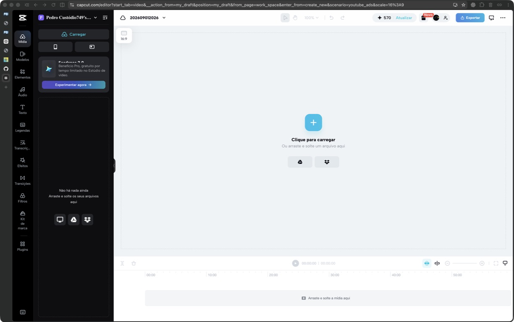
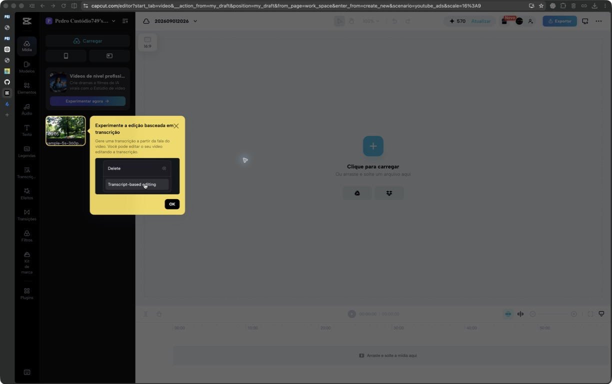
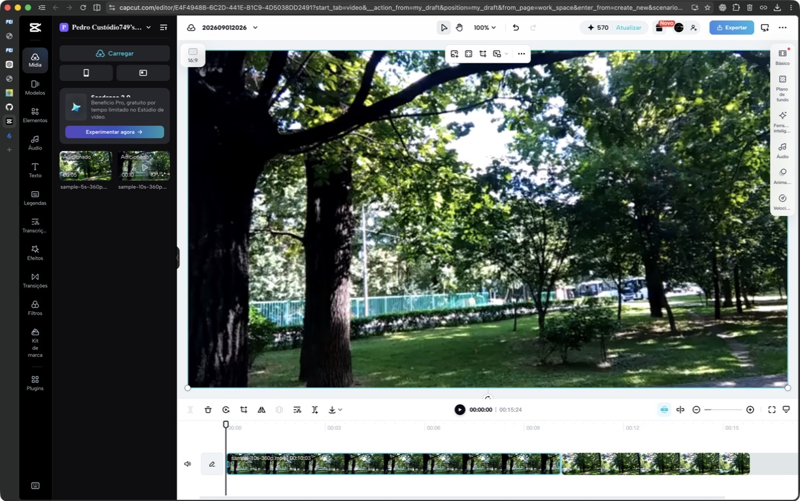

# Análise C03 — CapCut

**Autor(a):** Pedro Alexandre Custodio Silva — 22.123.049-3  
**Tipo:** concorrente indireto / ferramenta cotidiana  
**Link oficial:** https://www.capcut.com/  
**Data de acesso:** 01/09/2026

## Contexto e proposta

Analisar como o CapCut, ferramenta cotidiana e concorrente indireto na [Entrega 2](../docs/02_analise_concorrencia.md), apoia a edição manual de vídeos na pós-produção de partidas. A análise parte do problema registrado na [Entrega 1](../docs/01_conhecendo_o_problema.md): localizar melhores momentos em gravações extensas exige tempo e atenção, com risco de omissões e recortes inadequados (H01, H09 e H11).

Serão observados importação, seleção, recorte, organização e exportação, além de padrões familiares como player, linha do tempo e marcadores. Esses achados apoiarão o recorte de IHC do projeto: enviar vídeos, acompanhar o processamento, consultar e baixar cortes e metadados (H17–H19 e H27–H28).

## Funcionalidades relevantes

| Funcionalidade | Como é realizada | Evidência/print | Observação de IHC |
| -------------- | ---------------- | --------------- | ----------------- |
| Importação local | O usuário pode clicar em "Carregar" no painel de mídia ou na área central. A interface também aceita arrastar e soltar e oferece Google Drive e Dropbox. | [Figura 1](../assets/02_concorrencia/capcut/01-editor-vazio.png) | Há mais de uma entrada para a mesma tarefa, o que ajuda o usuário a começar. A área vazia comunica a ação esperada sem exigir que ele procure em menus. |
| Biblioteca de mídia | Após o envio, cada vídeo aparece como miniatura com nome e duração. O estado "Adicionado" confirma quais arquivos já entraram na edição. | [Figura 2](../assets/02_concorrencia/capcut/02-midias-importadas.png) e [Figura 3](../assets/02_concorrencia/capcut/03-clipes-na-linha-do-tempo.png) | Miniatura, nome, duração e estado dão visibilidade ao resultado da importação. O painel estreito, porém, corta nomes longos e reduz a diferenciação entre arquivos parecidos. |
| Montagem na linha do tempo | Os clipes são arrastados da biblioteca para a faixa inferior. Neste teste, dois vídeos de 5 e 10 segundos foram posicionados em sequência. | [Figura 3](../assets/02_concorrencia/capcut/03-clipes-na-linha-do-tempo.png) | A manipulação direta aproxima a ação do modelo mental de ordenar trechos. As miniaturas contínuas ajudam a reconhecer o conteúdo e a extensão de cada clipe. |
| Pré-visualização e controles contextuais | Ao selecionar um clipe, o quadro atual aparece no player. Controles de transformação ficam sobre o vídeo, e propriedades como "Básico", "Áudio", "Animação" e "Velocidade" aparecem à direita. | [Figura 3](../assets/02_concorrencia/capcut/03-clipes-na-linha-do-tempo.png) | A interface mantém objeto, resultado e ajustes próximos. Isso reduz a troca de contexto, mas aumenta a densidade visual e depende bastante de ícones. |
| Exportação | O botão "Exportar" permanece no canto superior direito durante a edição. | [Figura 3](../assets/02_concorrencia/capcut/03-clipes-na-linha-do-tempo.png) | A ação de conclusão tem posição estável e rótulo textual. Isso favorece reconhecimento e previsibilidade. |

Os vídeos usados no teste foram `sample-5s-360p.mp4` e `sample-10s-360p.mp4`, baixados da página [Sample MP4 video files](https://samplelib.com/sample-mp4.html), que os apresenta como arquivos de amostra sem restrições de licença.

## Evidências de interface

*Figura 1. Estado inicial do editor. "Carregar" aparece no painel lateral e no centro da área de pré-visualização.*

*Figura 2. Biblioteca após a importação. Um balão de onboarding sobre edição por transcrição ocupa parte do painel e exige dispensa antes de continuar.*

*Figura 3. Projeto com os dois vídeos na linha do tempo. O editor reúne biblioteca, player, propriedades e faixa temporal na mesma tela.*

## Experiência do usuário e opiniões

As avaliações públicas indicam que o CapCut é fácil de aprender, principalmente por causa da interface simples e dos templates prontos. Usuários iniciantes relatam que conseguem produzir vídeos sem experiência prévia e que os recursos disponíveis ajudam a obter bons resultados rapidamente. [App Store](https://apps.apple.com/us/app/capcut-photo-video-editor/id1500855883?platform=iphone&see-all=reviews)

Também aparecem críticas recorrentes:

- parte dos efeitos e recursos passou a exigir a assinatura Pro, reduzindo a experiência gratuita;
- usuários relatam travamentos na reprodução, problemas na busca de efeitos e dificuldade para importar vídeos longos;
- alguns usuários apontam templates ou resultados de busca inadequados e limitações de comentários ou templates conforme a região;
- quando funciona bem, a combinação de templates, efeitos e controles simples é vista como uma forma rápida de editar vídeos para redes sociais.

Esses pontos foram resumidos a partir de avaliações públicas da [App Store](https://apps.apple.com/us/app/capcut-photo-video-editor/id1500855883?platform=iphone&see-all=reviews) e do [Google Play](https://play.google.com/store/apps/details/CapCut?hl=en_AU&id=com.lemon.lvoverseas), consultadas em 01/09/2026. São opiniões de usuários das lojas, não entrevistas realizadas para este projeto.

## Padrões e tendências percebidos

- **Manipulação direta:** arrastar uma miniatura para a linha do tempo produz uma relação espacial clara entre origem e destino. O resultado aparece imediatamente no player e na faixa.
- **Reconhecimento em vez de memorização:** miniaturas, durações, nomes de arquivos e rótulos de categorias deixam as opções visíveis. O usuário não precisa lembrar comandos para começar.
- **Divulgação progressiva:** a tela vazia apresenta poucas decisões. Depois que um clipe entra na linha do tempo, surgem controles contextuais e o painel de propriedades.
- **Feedback de estado:** o rótulo "Adicionado", a mudança da duração total e a atualização do player confirmam o resultado das ações. Durante o segundo arraste, a faixa mostrou "Carregando...", sinalizando que o sistema ainda processava o vídeo.
- **Consistência com editores conhecidos:** biblioteca à esquerda, player no centro, propriedades à direita e linha do tempo embaixo seguem uma convenção já difundida em ferramentas de vídeo.
- **Atenção disputada:** anúncios de recursos de IA e um balão de onboarding aparecem dentro do fluxo de importação. Eles promovem descoberta de funções, mas competem com a tarefa principal e cobrem parte da biblioteca.
- **Acessibilidade incompleta:** vários controles e objetos da linha do tempo aparecem sem nome na árvore de acessibilidade do navegador. A operação por leitor de tela ou automação baseada em rótulos tende a ser mais difícil que a operação visual por arraste.

## Pontos positivos, limitações e lições

| Ponto | Evidência | Implicação para nosso projeto |
| ----- | --------- | ----------------------------- |
| Entrada clara para a tarefa | O estado vazio repete "Carregar" e explica que também é possível arrastar e soltar. | Na tela de envio, oferecer um botão principal e uma área de soltura ampla, com formatos e limites visíveis. |
| Feedback após o envio | A biblioteca mostra miniatura, duração, nome e depois o estado "Adicionado". | Exibir progresso por arquivo e estados inequívocos, como "enviando", "processando", "pronto" e "erro". Não depender apenas de cor. |
| Relação entre conteúdo e tempo | A linha do tempo usa quadros do próprio vídeo e mostra os clipes em sequência. | Na consulta de melhores momentos, combinar miniatura, instante inicial, duração e posição na gravação original. Isso ajuda a conferir o corte antes do download. |
| Boa correspondência com o modelo mental | Arrastar, ordenar e visualizar clipes reproduz ações físicas de organizar trechos. | Permitir reordenar resultados quando houver uma montagem, mas manter um fluxo mais simples para quem só precisa consultar e baixar cortes. |
| Controles contextuais densos | A seleção de um clipe abre ferramentas sobre o player e categorias no painel direito. | Mostrar primeiro as ações frequentes. Colocar ajustes avançados em uma camada secundária para evitar uma tela carregada. |
| Interrupção promocional | O balão de edição por transcrição cobre parte da biblioteca logo após a importação. | Não interromper a primeira tarefa com dicas ou ofertas. Se houver onboarding, usar uma dica discreta, adiável e que não bloqueie o conteúdo. |
| Dependência de ícones e arraste | Muitos botões não têm rótulo visível, e objetos importantes não receberam nomes úteis na árvore de acessibilidade. | Dar nome acessível a todos os controles, manter foco de teclado visível e oferecer alternativas a arrastar, como "Adicionar à seleção" ou "Mover para depois". |
| Conclusão previsível | "Exportar" fica sempre no canto superior direito. | Manter a ação final estável e nomeá-la conforme o objetivo do usuário, por exemplo "Baixar cortes", evitando termos genéricos quando o resultado já está definido. |

O CapCut funciona bem como referência de edição por manipulação direta, mas o nosso projeto não precisa copiar sua densidade. Para consultar melhores momentos, a interface deve preservar a clareza do carregamento, o feedback por arquivo e a relação entre miniatura e tempo, reduzindo ferramentas laterais, publicidade e ações que só fazem sentido em uma edição completa.
