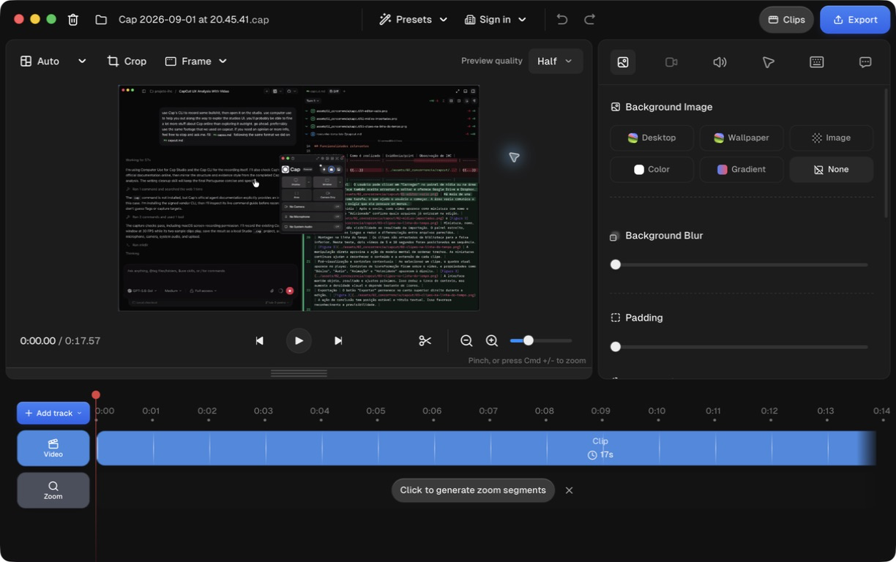
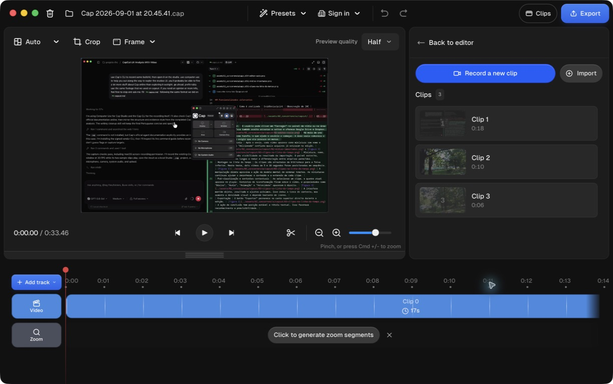
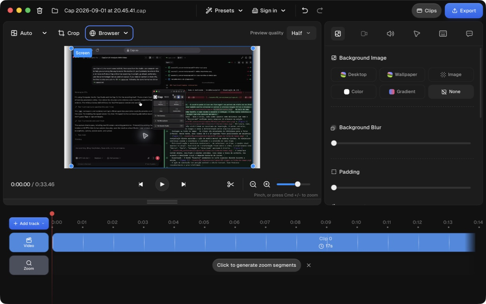
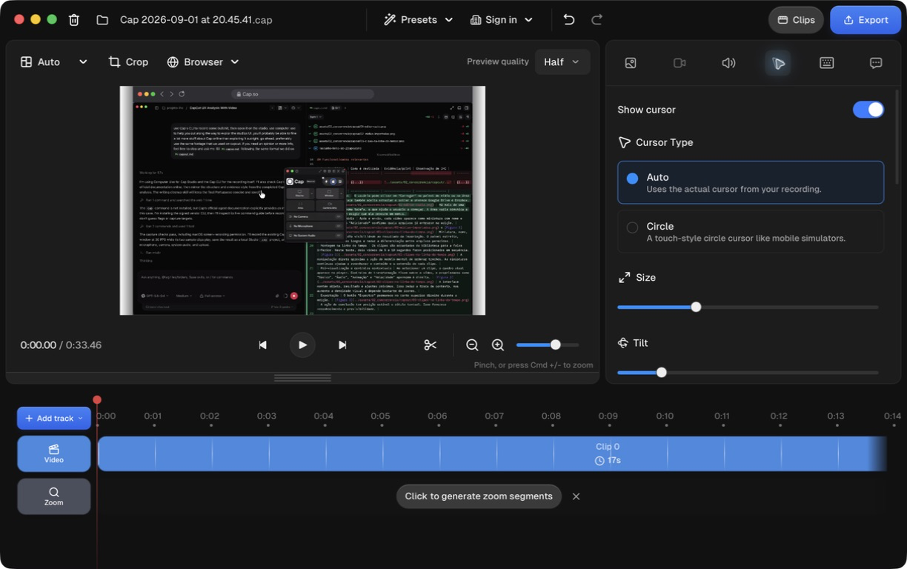
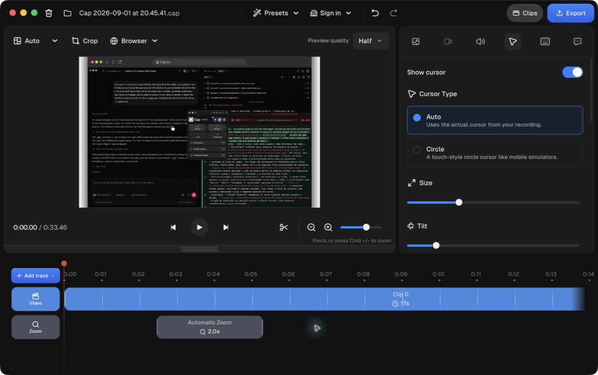
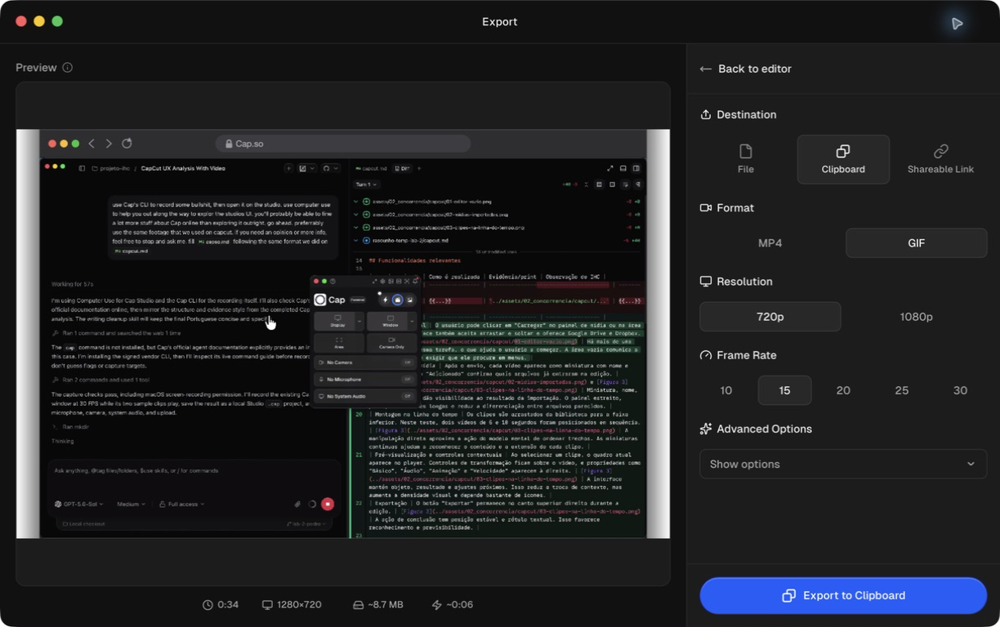

# Análise C05 — cap.so

**Autor(a):** Pedro Alexandre Custodio Silva — 22.123.049-3  
**Tipo:** concorrente indireto / ferramenta cotidiana  
**Link oficial:** https://cap.so/  
**Data de acesso:** 01/09/2026

## Contexto e proposta

Analisar como o Cap apoia a gravação e a edição de vídeos curtos. A ferramenta é um concorrente indireto porque seu foco principal é registrar telas, demonstrações e mensagens assíncronas, enquanto nosso projeto localiza melhores momentos em gravações de partidas.

O teste cobriu o fluxo entre captura, projeto local, importação de outros vídeos, organização de clipes, enquadramento, zoom, cursor e exportação. Esses pontos interessam ao projeto porque tratam de tarefas próximas às descritas na [Entrega 1](../docs/01_conhecendo_o_problema.md): enviar vídeos, acompanhar o processamento, reconhecer trechos e obter um arquivo final sem perder a relação com a gravação original.

Foi usada a [CLI oficial do Cap](https://cap.so/docs/agents) na versão 0.1.0, distribuída com o Cap Desktop 0.5.9. A gravação ocorreu em modo Studio, sem câmera, microfone, áudio do sistema ou envio para a nuvem. O projeto local resultante passou pela validação da própria CLI. Depois, os arquivos `sample-10s-360p.mp4` e `sample-5s-360p.mp4`, já usados no teste do CapCut, foram importados no Studio.

## Funcionalidades relevantes

| Funcionalidade | Como é realizada | Evidência/print | Observação de IHC |
| -------------- | ---------------- | --------------- | ----------------- |
| Gravação pela CLI | `cap doctor --json` verifica permissões e dispositivos. `cap targets --json` lista telas, janelas, câmeras e microfones. A captura foi iniciada com `cap record start` em modo Studio e duração definida. | [Figura 1](../assets/02_concorrencia/cap-so/01-editor-studio.png) | O fluxo é verificável e adequado à automação, mas depende de identificadores numéricos e conhecimento de linha de comando. A CLI reduz ambiguidade técnica, não a semântica: neste teste, o projeto foi validado, mas a imagem capturada não correspondeu à janela Helium pretendida. |
| Projeto Studio local | Ao abrir o arquivo `.cap`, o editor mostra player, duração total, faixa de vídeo, faixa de zoom e controles de aparência. | [Figura 1](../assets/02_concorrencia/cap-so/01-editor-studio.png) | A divisão entre player, propriedades e linha do tempo segue o modelo de editores conhecidos. O botão azul "Export" deixa clara a saída do fluxo. |
| Importação e gestão de clipes | O painel "Clips" permite gravar outro trecho ou importar um MP4 ou projeto Cap. Cada item recebe miniatura, número e duração. | [Figura 2](../assets/02_concorrencia/cap-so/02-clipes-importados.png) | A lista torna a composição visível sem sobrecarregar a linha do tempo. Os nomes automáticos "Clip 1", "Clip 2" e "Clip 3" são pouco informativos, embora exista uma ação de renomear. |
| Enquadramento da gravação | O menu de moldura oferece nenhuma moldura, janela do macOS, janela do Windows, navegador ou MacBook. A opção de navegador adiciona tema e URL editável. | [Figura 3](../assets/02_concorrencia/cap-so/03-editor-com-moldura.png) | Uma escolha de alto nível produz uma mudança visual grande e imediata. O recurso é fácil de testar e desfazer, mas ocupa espaço que pode reduzir a legibilidade do conteúdo gravado. |
| Tratamento do cursor | O painel permite mostrar ou ocultar o cursor, usar o cursor original ou um círculo, mudar tamanho e inclinação, ocultá-lo quando parado e escolher estilos de movimento. | [Figura 4](../assets/02_concorrencia/cap-so/04-controles-do-cursor.png) | As opções usam exemplos curtos, como "Slow", "Smooth", "Mellow" e "Fast". Isso ajuda na escolha, embora os ajustes avançados de tensão, atrito e massa exijam experimentação. |
| Zoom automático | A faixa "Zoom" oferece "Click to generate zoom segments" quando a gravação contém dados de cursor e cliques. O teste gerou um segmento automático de 2x. | [Figura 5](../assets/02_concorrencia/cap-so/05-zoom-automatico.png) | Uma ação transforma metadados da captura em edição visível na linha do tempo. O segmento pode ser localizado e removido, o que mantém o usuário no controle. MP4s importados não recebem esses metadados retroativamente. |
| Exportação | A tela reúne destino, formato, resolução, taxa de quadros, estimativa de tamanho e estimativa de tempo. Os destinos incluem arquivo, área de transferência e link compartilhável. | [Figura 6](../assets/02_concorrencia/cap-so/06-opcoes-de-exportacao.png) | O resumo antes da ação reduz surpresa. As opções mudam conforme o formato. Na configuração registrada, 34 segundos em GIF, 720p e 15 FPS foram estimados em 8,7 MB e cerca de 6 segundos de processamento. |

O projeto bruto gravado pela CLI está em [`capcut-footage.cap`](../assets/02_concorrencia/cap-so/capcut-footage.cap/). A CLI informou `recordingType: studio`, duração de aproximadamente 18 segundos e presença dos arquivos obrigatórios de metadados e vídeo.

## Evidências de interface

*Figura 1. Projeto local aberto no Studio. O editor concentra prévia, propriedades, faixa de vídeo e zoom na mesma janela.*

*Figura 2. Painel com três clipes. Os dois últimos usam a mesma filmagem de parque do teste do CapCut.*

*Figura 3. Moldura de navegador aplicada por um menu de presets. A mudança aparece imediatamente no player.*

*Figura 4. Controles do cursor com tipo, tamanho, inclinação e suavização de movimento.*

*Figura 5. Segmento "Automatic Zoom" de 2x gerado a partir dos dados de clique da captura.*

*Figura 6. Exportação com prévia, destino, formato, resolução, taxa de quadros, tamanho e tempo estimados.*

## Experiência do usuário e opiniões

A documentação oficial distingue dois modelos de uso. O modo Instant prioriza um link rápido, enquanto o [modo Studio](https://cap.so/docs/recording/studio-mode) mantém um projeto local editável e só envia o conteúdo quando o usuário escolhe um link compartilhável. Essa separação é boa para privacidade, mas obriga o usuário a entender a diferença antes de gravar.

No teste, o Studio foi mais simples que o CapCut para produzir uma apresentação visual. Presets de moldura, fundo, cursor e zoom evitam tarefas manuais comuns. O painel "Clips" também aceita MP4s sem exigir que o usuário organize uma biblioteca complexa. Em contrapartida, o fluxo espalha decisões entre o seletor de gravação, o painel de clipes, os ícones de propriedades e a tela separada de exportação.

Na [página do Cap no Product Hunt](https://www.producthunt.com/products/cap-3), a nota registrada é 3,9 de 5 com oito avaliações. Os elogios citam inicialização e compartilhamento rápidos, edição após a captura, páginas de visualização e código aberto. As críticas concentram-se em travamentos, falhas de abertura, câmera instável, captura com múltiplas telas e exportação lenta no Studio. A amostra é pequena e mistura versões diferentes, por isso indica temas de uso, não uma medida representativa.

O próprio repositório público expõe problemas recentes. Um [relato de crescimento contínuo de memória no macOS](https://github.com/CapSoftware/Cap/issues/2023) descreveu lentidão do sistema após sessões do Studio. Outro [relato sobre importação de projetos `.cap` no Windows](https://github.com/CapSoftware/Cap/issues/2018) mostrou conflito entre o modelo de pasta usado pelo projeto e o seletor de arquivos. Esses registros ajudam a explicar por que usuários elogiam a proposta, mas ainda questionam a estabilidade.

A página de [depoimentos do próprio Cap](https://cap.so/testimonials) reúne comentários positivos sobre código aberto, controle dos dados, zoom e interface. Como a empresa seleciona esses relatos, eles mostram os atributos valorizados pela marca, não substituem avaliações independentes.

## Padrões e tendências percebidos

- **Dois níveis de uso:** o seletor inicial atende quem quer gravar sem editar; o Studio atende quem quer revisar e preparar a apresentação.
- **Edição orientada a propriedades:** o usuário seleciona categorias no painel direito e ajusta o resultado com botões, escolhas exclusivas e controles deslizantes. Há menos ferramentas soltas sobre o canvas que no CapCut.
- **Metadados como recurso de edição:** cursor, cliques e teclado são gravados à parte do vídeo. O Studio usa esses dados para suavizar movimento, criar zooms e exibir teclas. A captura preserva mais possibilidades que um MP4 pronto.
- **Manipulação direta com apoio de presets:** a linha do tempo permite localizar segmentos, enquanto molduras e estilos resolvem mudanças visuais inteiras com uma escolha.
- **Feedback antes da saída:** a exportação mostra duração, resolução, tamanho estimado e tempo aproximado antes de iniciar o processamento.
- **Privacidade por decisão explícita:** o projeto Studio permanece local. O envio só ocorre quando o usuário escolhe "Shareable Link". Arquivo e área de transferência continuam disponíveis sem conta.
- **Vocabulário misto:** termos simples, como "Clips" e "Export", convivem com tensão, atrito, massa, BPP e outras opções técnicas. A divulgação progressiva reduz o impacto, mas não elimina a curva de aprendizado.
- **Acessibilidade melhor nos painéis que no canvas:** botões, campos, estados e controles deslizantes receberam nomes úteis na árvore de acessibilidade. Alguns ícones principais e elementos da linha do tempo ainda aparecem sem rótulo.

## Pontos positivos, limitações e lições

| Ponto | Evidência | Implicação para nosso projeto |
| ----- | --------- | ----------------------------- |
| Projeto local editável | O modo Studio cria um `.cap` e não envia o vídeo durante a gravação ou edição. | Informar claramente quando um vídeo está apenas no dispositivo, quando está sendo enviado e quando ficou disponível no servidor. |
| Verificação do fluxo automatizado | A CLI separa diagnóstico, descoberta de alvos, gravação e validação em comandos com saída JSON. | Fornecer estados verificáveis para envio e processamento, com identificadores estáveis e mensagens que permitam automação sem depender da tela. |
| Validação técnica não garante conteúdo correto | O projeto passou na validação, mas a prévia revelou uma captura diferente da janela pedida. | Incluir uma miniatura ou confirmação visual do vídeo recebido antes de iniciar um processamento longo. Validar formato não basta. |
| Importação recuperável | Dois MP4s foram adicionados ao projeto após a captura inicial. O painel atualizou a contagem e a duração total. | Permitir substituir ou acrescentar arquivos sem reiniciar toda a tarefa. Mostrar o efeito da mudança no total processado. |
| Metadados enriquecem a edição | A gravação nativa preservou cursor e cliques, usados para gerar um zoom de 2x. Os MP4s importados não ganharam esses dados. | Preservar metadados dos melhores momentos, como instante, origem e confiança. Deixar claro quais recursos dependem desses dados. |
| Presets reduzem trabalho | Uma escolha aplicou moldura de navegador, e um botão gerou zoom automático. | Oferecer boas configurações iniciais para download e apresentação. Manter ajustes avançados disponíveis sem colocá-los no caminho principal. |
| Exportação previsível | A tela apresentou estimativas de tamanho e tempo antes de processar. | Mostrar formato, duração, tamanho aproximado e custo de espera antes do download dos cortes. |
| Separação entre arquivo e compartilhamento | "File", "Clipboard" e "Shareable Link" são destinos distintos. | Separar "Baixar" de "Compartilhar". Cada ação deve explicar onde o conteúdo ficará e quem poderá acessá-lo. |
| Nomes genéricos dos clipes | Os itens importados aparecem como "Clip 2" e "Clip 3", apesar de terem arquivos de origem distintos. | Usar nomes reconhecíveis, miniaturas, duração e instante de origem. Evitar depender de números sequenciais. |
| Estabilidade ainda pesa na confiança | Avaliações e issues citam travamentos, exportação lenta e problemas de importação. | Salvar progresso, permitir retomada e mostrar falhas por etapa. Em processamento de partidas longas, perder o trabalho é um risco central. |

O Cap é uma referência mais próxima do nosso problema que um editor tradicional quando o objetivo é transformar uma captura em um resultado revisável. Sua melhor contribuição é separar captura, projeto local e saída, mantendo metadados úteis no caminho. Para nosso projeto, vale copiar a clareza dos estados e da exportação. A edição visual completa, os controles físicos do cursor e a quantidade de opções de apresentação seriam excesso para quem só quer encontrar e baixar melhores momentos.
