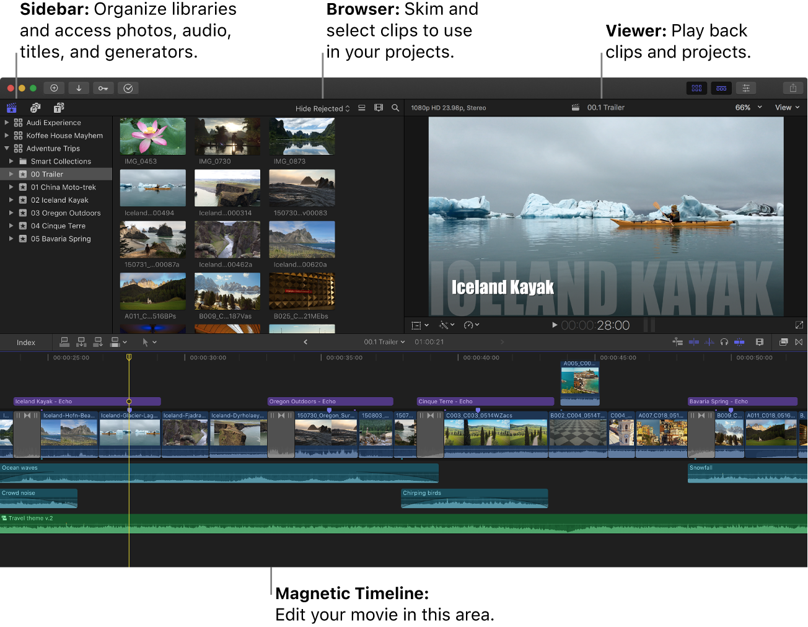
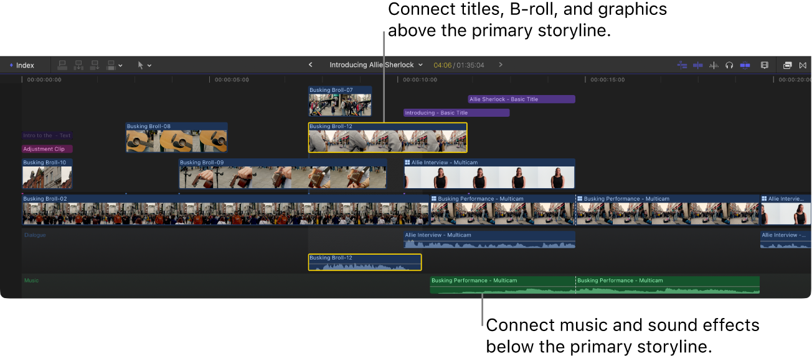
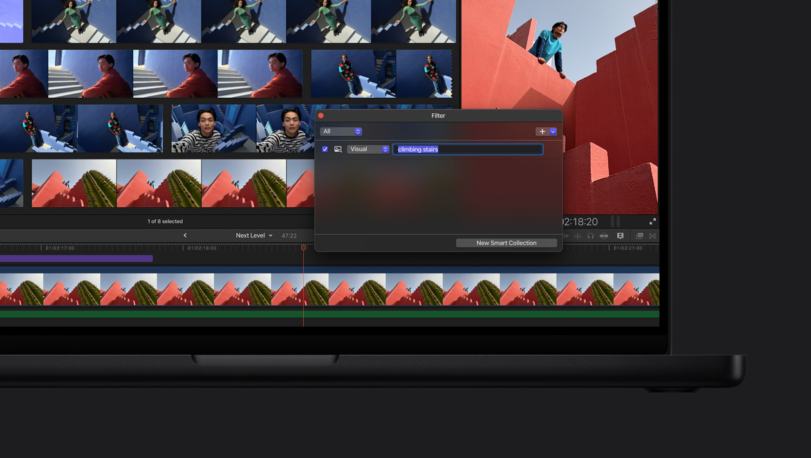
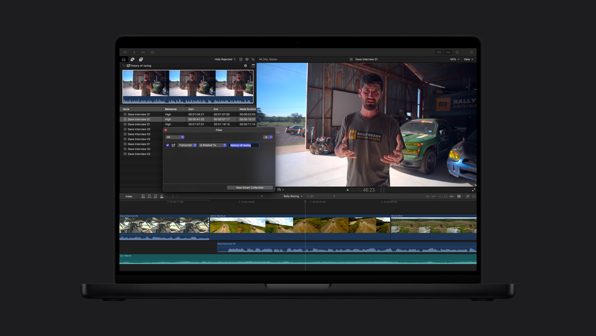
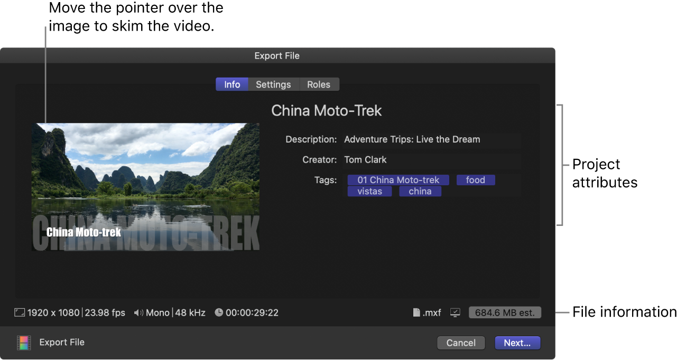

# Análise C04 — Final Cut Pro

**Autor(a):** Pedro Alexandre Custodio Silva — 22.123.049-3  
**Tipo:** concorrente indireto / ferramenta cotidiana  
**Link oficial:** https://www.apple.com/final-cut-pro/  
**Data de acesso:** 01/09/2026

## Contexto e proposta

Analisar como o Final Cut Pro apoia a seleção, a organização e a edição manual de vídeos na pós-produção. A ferramenta é um concorrente indireto: resolve uma tarefa mais ampla e profissional que o nosso projeto, mas trabalha com o mesmo material de origem e com problemas próximos aos registrados na [Entrega 1](../docs/01_conhecendo_o_problema.md), como localizar acontecimentos em gravações extensas, conferir o instante correto e transformar trechos dispersos em um resultado utilizável.

Como o aplicativo não estava disponível no computador usado nesta análise, não houve teste prático nem importação dos vídeos usados no CapCut e no Cap. O levantamento é documental, baseado no [guia atual do Final Cut Pro para Mac](https://support.apple.com/guide/final-cut-pro/welcome/mac), nas imagens oficiais da Apple, em uma avaliação editorial e em opiniões públicas de usuários. As figuras, portanto, demonstram a interface divulgada pela Apple; não são capturas de uma sessão realizada para o projeto.

O foco recai sobre importação, organização, busca, seleção, linha do tempo e exportação. Esses pontos informam diretamente o nosso recorte de IHC: enviar partidas, acompanhar o processamento, encontrar melhores momentos, conferir sua relação com a gravação e baixar os cortes.

## Funcionalidades relevantes

| Funcionalidade | Como é realizada | Evidência/print | Observação de IHC |
| -------------- | ---------------- | --------------- | ----------------- |
| Estrutura do espaço de trabalho | A janela reúne bibliotecas e eventos à esquerda, navegador de mídia, viewer central, inspector de propriedades e linha do tempo na parte inferior. | [Figura 1](../assets/02_concorrencia/final-cut-pro/01-interface-geral.png) | A disposição mantém fonte, resultado e sequência temporal visíveis. A separação é estável e favorece aprendizado por reconhecimento, mas a densidade de painéis, ícones e faixas pode intimidar quem quer apenas obter alguns cortes. |
| Importação e preparação de mídia | Na janela de importação, o usuário escolhe copiar arquivos para a biblioteca ou mantê-los no local original. Também pode criar mídia otimizada ou proxy, aplicar palavras-chave e iniciar análises de vídeo e áudio. A importação continua em segundo plano. | [Guia de importação](https://support.apple.com/guide/final-cut-pro/organize-files-during-import-ver392f50c2/mac) | As decisões antecipam desempenho e organização de projetos grandes, mas expõem conceitos técnicos antes de o usuário editar. A possibilidade de continuar trabalhando reduz espera; o progresso precisa continuar visível para evitar a impressão de que o processo terminou. |
| Organização e pré-seleção | O conteúdo é organizado em bibliotecas, eventos e projetos. No navegador, o usuário percorre filmstrips, seleciona intervalos e marca trechos como favoritos ou rejeitados, além de atribuir palavras-chave e notas. | [Figura 1](../assets/02_concorrencia/final-cut-pro/01-interface-geral.png) | Avaliar intervalos, e não apenas arquivos inteiros, aproxima a organização do problema de melhores momentos. Miniaturas e filmstrips reduzem memorização, enquanto a hierarquia biblioteca–evento–projeto acrescenta vocabulário próprio. |
| Linha do tempo magnética | Clipes entram na história principal por arraste ou comandos de inserção. Ao mover, aparar ou remover um item, os vizinhos se ajustam para evitar lacunas e colisões. B-roll, títulos e áudio ficam conectados ao trecho correspondente. | [Figura 2](../assets/02_concorrencia/final-cut-pro/02-timeline-magnetica.png) | O sistema aplica restrições úteis e preserva sincronização, prevenindo erros mecânicos. Em contrapartida, diverge do modelo mental de pistas fixas: uma ação sobre o clipe principal pode deslocar também elementos conectados. |
| Busca visual | O usuário descreve objetos ou ações em linguagem natural; o filtro retorna os momentos visuais considerados relacionados. Na demonstração, a consulta “climbing stairs” reduz a coleção aos planos correspondentes. | [Figura 3](../assets/02_concorrencia/final-cut-pro/03-busca-visual.jpg) | A busca troca inspeção sequencial por recuperação orientada ao objetivo. É uma referência direta para nosso projeto, desde que o resultado mostre por que cada trecho foi retornado e permita conferi-lo no vídeo original. |
| Busca por transcrição | O sistema analisa a fala e encontra ocorrências exatas ou semanticamente relacionadas. Os resultados incluem nome, relevância, início, fim e duração do trecho. | [Figura 4](../assets/02_concorrencia/final-cut-pro/04-busca-transcricao.jpg) | A lista combina conteúdo semântico e coordenadas temporais, diminuindo o custo de percorrer horas de material. Segundo o [guia de busca](https://support.apple.com/en-euro/guide/final-cut-pro/ver65764b45/mac), a busca por fala é limitada ao inglês e alguns tipos de clipe não são analisados; limites desse tipo devem aparecer antes de o usuário depender do recurso. |
| Processamento em segundo plano | Importação, transcodificação, análise, renderização e compartilhamento aparecem como tarefas com percentuais. Algumas pausam durante o uso intenso e retomam quando o sistema fica ocioso. | [Guia de tarefas em segundo plano](https://support.apple.com/en-ae/guide/final-cut-pro/ver64e71609/mac) | O usuário pode continuar editando, mas “pausado”, “em fila” e “processando” precisam ser distinguíveis. Um único indicador genérico esconderia a causa da demora. |
| Exportação | A janela de compartilhamento oferece prévia navegável, metadados, configurações e papéis. Antes de salvar, mostra resolução, taxa de quadros, canais de áudio, duração, formato e tamanho estimado. A transcodificação continua em segundo plano. | [Figura 5](../assets/02_concorrencia/final-cut-pro/05-exportacao.png) | O resumo sustenta uma decisão informada e reduz surpresa sobre o arquivo final. Para nosso projeto, a mesma lógica pode ser simplificada para duração, formato, tamanho aproximado e origem do corte. |

## Evidências de interface

*Figura 1. Visão geral da interface para Mac. A imagem oficial identifica a divisão entre biblioteca, navegador, viewer e linha do tempo. Fonte: [Apple — interface do Final Cut Pro](https://support.apple.com/guide/final-cut-pro/final-cut-pro-interface-ver92bd100a/mac).*

*Figura 2. História principal em azul, elementos conectados acima e áudio organizado abaixo. Fonte: [Apple — introdução à Magnetic Timeline](https://support.apple.com/guide/final-cut-pro/intro-to-the-magnetic-timeline-verb8fcfc133/mac).*

*Figura 3. Busca visual por “climbing stairs”. O filtro e o resultado permanecem no contexto do navegador e da linha do tempo. Fonte: [Apple — Final Cut Pro](https://www.apple.com/final-cut-pro/).*

*Figura 4. Busca por um assunto falado. A tabela associa o texto encontrado aos intervalos temporais. Fonte: [Apple — Final Cut Pro](https://www.apple.com/final-cut-pro/).*

*Figura 5. Confirmação de exportação com prévia, atributos e estimativa de tamanho. Fonte: [Apple — exportar arquivos finais](https://support.apple.com/en-ca/guide/final-cut-pro/ver0192a47b8/mac).*

## Experiência do usuário e opiniões

A avaliação do [TechRadar](https://www.techradar.com/pro/apple-final-cut-pro-review) descreve a interface como rígida: os painéis podem ser redimensionados, mas não rearranjados livremente. Isso reduz personalização, porém torna a configuração reconhecível entre computadores. A análise também registra a ambivalência da linha do tempo magnética: exige adaptação, principalmente quando elementos conectados se movem junto com o clipe principal, mas acelera muito a edição depois que o modelo é compreendido. O texto elogia a fluidez, a organização e as ferramentas recentes, ao mesmo tempo que aponta a exclusividade do Mac e a dependência de hardware mais novo para alguns recursos.

As avaliações públicas da [Mac App Store](https://apps.apple.com/us/app/final-cut-pro/id424389933?mt=12&platform=mac&see-all=reviews) mostram os mesmos dois lados. Há relatos de navegação clara, boa otimização, exportação rápida e economia de tempo em comparação com outros editores. Críticas, por outro lado, descrevem a linha do tempo como contraintuitiva para profissionais acostumados a pistas, reclamam de pouco espaço vertical para a edição, dificuldade para separar áudio e vídeo, travamentos e perda de compatibilidade com fluxos antigos. São experiências individuais e de versões diferentes, não testes controlados.

Em discussões recentes da comunidade, iniciantes relatam que a quantidade de controles causa desorientação na primeira abertura. Usuários mais experientes apontam dois obstáculos principais: entender onde a mídia é armazenada e abandonar o paradigma de pistas fixas. Depois de um ou dois projetos, parte deles considera o fluxo simples e mais rápido. [Discussão sobre aprendizado](https://www.reddit.com/r/finalcutpro/comments/1qxosq3/i_just_started_using_final_cut_pro_and_im_lowkey/) e [discussão sobre primeiros passos](https://www.reddit.com/r/finalcutpro/comments/1vzpys3/what_would_you_recommend_based_on_your_experience/)

## Padrões e tendências percebidos

- **Interface profissional estável:** biblioteca, navegador, viewer, inspector e linha do tempo mantêm posições previsíveis. A consistência favorece transferência de aprendizado, mas limita personalização e concentra muita informação na primeira tela.
- **Manipulação direta com restrições:** o usuário move e apara representações do próprio vídeo. A Magnetic Timeline reage para impedir lacunas e conservar relações, transformando prevenção de erros em comportamento do espaço de trabalho.
- **Organização antes da montagem:** favoritos, rejeitados, palavras-chave, notas, intervalos e coleções inteligentes apoiam uma fase explícita de triagem. O sistema reconhece que encontrar material é uma tarefa diferente de montá-lo.
- **Busca semântica próxima do conteúdo:** Visual Search e Transcript Search retornam trechos dentro do navegador, com acesso imediato ao contexto temporal. A IA funciona como filtro; a decisão final permanece com o editor.
- **Metadados visíveis e reutilizáveis:** nome, relevância, início, fim, duração, papéis e palavras-chave ajudam a localizar, agrupar e exportar material. A interface trata metadados como parte da edição, não como detalhe técnico oculto.
- **Trabalho assíncrono:** operações demoradas acontecem em segundo plano e têm uma janela própria. Isso preserva continuidade, mas distribui o feedback entre a área principal e um painel de tarefas.
- **Divulgação progressiva parcial:** o inspector e os painéis contextuais mostram parâmetros do objeto selecionado, porém a janela inicial ainda apresenta muitos ícones e conceitos. A complexidade é organizada, não eliminada.
- **Atalhos para usuários frequentes:** arraste e menus coexistem com muitos comandos de teclado. Essa redundância atende iniciantes e especialistas, desde que os comandos continuem descobríveis nos menus e na ajuda.
- **Acessibilidade não verificada:** sem o aplicativo, não foi possível testar navegação por teclado, VoiceOver, foco ou nomes acessíveis. Pelas imagens, há controles compactos, dependência de ícones e uso de cor para diferenciar papéis; essas observações visuais não substituem uma auditoria de acessibilidade.

## Pontos positivos, limitações e lições

| Ponto | Evidência | Implicação para nosso projeto |
| ----- | --------- | ----------------------------- |
| Triagem separada da edição | O navegador permite selecionar intervalos, classificar e buscar antes de inserir qualquer coisa na linha do tempo. | Tratar a consulta de melhores momentos como tarefa principal. O usuário deve poder revisar e aceitar trechos sem construir uma edição completa. |
| Busca retorna coordenadas temporais | A busca por transcrição mostra relevância, início, fim e duração ao lado do conteúdo encontrado. | Cada resultado deve indicar evento detectado, instante inicial, duração e confiança, com acesso ao contexto anterior e posterior. |
| Resultado permanece verificável | Buscas filtram a biblioteca, mas preservam viewer e linha do tempo para inspeção. | Nunca apresentar um “melhor momento” como caixa-preta. Incluir miniatura, player e ligação com a gravação original. |
| Restrições previnem erros | A Magnetic Timeline fecha lacunas e mantém elementos conectados sincronizados. | Se houver montagem de cortes, preservar relações automaticamente e sinalizar qualquer alteração de ordem ou duração causada pelo sistema. |
| Hierarquia atende escala, mas cobra aprendizado | Bibliotecas contêm eventos; eventos reúnem clipes e projetos. Usuários citam gestão de mídia como dificuldade inicial. | Para uma partida, usar uma hierarquia mais próxima do domínio, como partida → vídeo enviado → melhores momentos, evitando vocabulário genérico de editor. |
| Processos demorados não bloqueiam tudo | Importação, análise e exportação continuam em segundo plano e expõem progresso. | Permitir que o usuário saia e retorne. Mostrar estado por vídeo, porcentagem quando confiável, etapa atual e uma previsão apenas quando houver base para calculá-la. |
| Estados assíncronos podem ser ambíguos | A própria documentação informa que certas tarefas pausam durante uso intenso e retomam quando o sistema fica ocioso. | Diferenciar “aguardando”, “pausado”, “processando”, “pronto” e “erro”, explicando o que o usuário pode fazer em cada estado. |
| Exportação antecipa o resultado | A janela mostra prévia e características do arquivo antes de salvar. | Antes do download, exibir duração total, formato, tamanho estimado e quais momentos serão incluídos. |
| Modelo novo acelera especialistas, mas rompe hábitos | Avaliações elogiam a velocidade depois da adaptação e criticam a divergência em relação a editores baseados em pistas. | Aproveitar convenções já conhecidas de player e miniaturas. Introduzir qualquer comportamento novo com exemplo curto, feedback imediato e forma clara de desfazer. |
| Recursos inteligentes têm limites | A busca por fala depende do idioma e a análise não cobre todos os tipos de clipe. | Exibir cobertura, idioma aceito e falhas de análise junto ao resultado. Ausência de detecção não deve parecer ausência de acontecimentos. |
| Ecossistema fechado | O aplicativo para desktop exige macOS; recursos recentes privilegiam Apple silicon. | Manter o fluxo principal acessível pelo navegador e não condicionar consulta ou download a um dispositivo específico. |

O Final Cut Pro oferece a referência mais forte entre os três concorrentes para organização e recuperação de trechos em grande volume. Seu principal aprendizado não é copiar um editor profissional, mas separar triagem, busca, verificação e saída. Para nosso projeto, Visual Search e Transcript Search mostram como reduzir a procura manual, enquanto filmstrips, intervalos e metadados mostram como manter o usuário no controle. A hierarquia profunda, o inspector e a linha do tempo completa seriam excesso; devem ceder lugar a um fluxo curto, com estados claros e cada corte ligado ao instante original.
